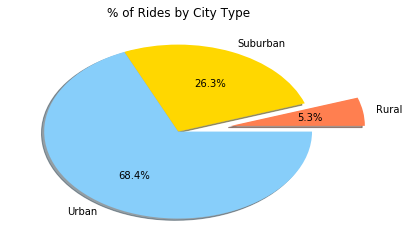

## Observable Trends
### Bubble Chart
1. You can notice that in Urban Cities, there are more drivers than in Suburban and even more so in Rural Cities. This is shown by the size of the bubbles

2. It is also Observable that Urban rides are typically lower in fare but occur more often. This makes sense as the rides are in the cities and won't have far to drive, bringing the fare down, but they have more rides because they are more populated compared to the other city types. The correlation appears to be somewhat strong here, probably in a r<sup>2</sup> = .6 to r<sup>2</sup> = .8 range. Points for rural cities are more scattered and do not appear to have any correlation between # of rides and average fare as Urban (and even suburban) cities do.

### Pie Charts

1. For as few rides that rural cities have (about 5.3% of rides), they seem to generate a decent amount of $ (17.6% of fares). This makes sense because in the bubble chart, even though there isn't a highly correlated trend between the dependent and independent variables, we can still see that a decent amount of rural cities make much higher fares on average than Urban cities.
2. Similar to above, even though rural drivers only make up 3.1% of drivers, they seem to generate higher fares, on average. Again probably due to the fact that the drives are longer in distance than they are in urban/suburban cities.

### Suggestions
I would be interested to see if the demand is being met in each city, particularly rural cities. Given that rural areas have less drivers as urban areas, there may be a shortage of drivers in these areas and could give a boost in fares if more drivers sign up for these areas.


```python
# dependencies
import pandas as pd
import matplotlib.pyplot as plt
import os
```


```python
# grab file paths
city_data_path = os.path.join('Data', 'city_data.csv')
ride_data_path = os.path.join('Data', 'ride_data.csv')
```


```python
# read csvs
city_data = pd.read_csv(city_data_path)
ride_data = pd.read_csv(ride_data_path)
```


```python
# create dataframes
city_df = pd.DataFrame(city_data)
ride_df = pd.DataFrame(ride_data)
```


```python
# get total number of rides per city
city_group_df = ride_df.groupby('city').count()
```


```python
# get average fare per city
city_avg_df = ride_df.groupby('city').mean()
```


```python
# remove unecessary columns
city_avg_df = city_avg_df.iloc[:, 0]
```


```python
# convert back to dataframe
city_avg_df = pd.DataFrame(city_avg_df)
```


```python
# add average fare column to grouped city dataframe
city_group_df['Average Fare'] = city_avg_df['fare']
```


```python
# rename columns to reflect count
city_group_df = city_group_df.rename(columns={'date' : 'Total Number of Rides'})
```


```python
# delete unneeded columns
del city_group_df['fare']
del city_group_df['ride_id']
```


```python
# remove duplicate city and keep the first occurance
city_df = city_df.drop_duplicates(subset='city',keep='first')
```


```python
# set index to city
city_df.set_index('city', inplace=True)
```


```python
# add driver count row to grouped df
city_group_df['Driver Count'] = city_df['driver_count']
city_group_df.head()
```


<div>
<style scoped>
    .dataframe tbody tr th:only-of-type {
        vertical-align: middle;
    }

    .dataframe tbody tr th {
        vertical-align: top;
    }

    .dataframe thead th {
        text-align: right;
    }
</style>
<table border="1" class="dataframe">
  <thead>
    <tr style="text-align: right;">
      <th></th>
      <th>Total Number of Rides</th>
      <th>Average Fare</th>
      <th>Driver Count</th>
    </tr>
    <tr>
      <th>city</th>
      <th></th>
      <th></th>
      <th></th>
    </tr>
  </thead>
  <tbody>
    <tr>
      <th>Alvarezhaven</th>
      <td>31</td>
      <td>23.928710</td>
      <td>21</td>
    </tr>
    <tr>
      <th>Alyssaberg</th>
      <td>26</td>
      <td>20.609615</td>
      <td>67</td>
    </tr>
    <tr>
      <th>Anitamouth</th>
      <td>9</td>
      <td>37.315556</td>
      <td>16</td>
    </tr>
    <tr>
      <th>Antoniomouth</th>
      <td>22</td>
      <td>23.625000</td>
      <td>21</td>
    </tr>
    <tr>
      <th>Aprilchester</th>
      <td>19</td>
      <td>21.981579</td>
      <td>49</td>
    </tr>
  </tbody>
</table>
</div>


```python
# add city type to grouped df
city_group_df['Type'] = city_df['type']
```


```python
# initialize lists
urban_x = []
urban_y = []
urban_drivers = []
suburban_x = []
suburban_y = []
suburban_drivers = []
rural_x = []
rural_y = []
rural_drivers = []
```


```python
# fill lists with data
for index, row in city_group_df.iterrows():
    if row['Type'] == 'Suburban':
        suburban_x.append(row['Total Number of Rides'])
        suburban_y.append(row['Average Fare'])
        suburban_drivers.append(row['Driver Count'])
    elif row['Type'] == 'Urban':
        urban_x.append(row['Total Number of Rides'])
        urban_y.append(row['Average Fare'])
        urban_drivers.append(row['Driver Count'])
    elif row['Type'] == 'Rural':
        rural_x.append(row['Total Number of Rides'])
        rural_y.append(row['Average Fare'])
        rural_drivers.append(row['Driver Count'])
```


```python
# make bubble chart
plt.scatter(suburban_x, suburban_y, s=suburban_drivers, label='Suburban', color='#FFD700', edgecolor='black')
plt.scatter(urban_x, urban_y, s=urban_drivers, label='Urban', color='#87CEFA', edgecolor='blue')
plt.scatter(rural_x, rural_y, s=rural_drivers, label='Rural', color='#FF7F50')
plt.title('Pyber Ride Sharing Data (2016)')
plt.xlabel("Total Number of Rides (Per City)")
plt.ylabel("Average Fare ($)")
plt.legend(title='City Type', loc='best')
plt.show()
```


```python
city_type_group = city_group_df.groupby('Type').sum()
city_type_group.head()
```


<div>
<style scoped>
    .dataframe tbody tr th:only-of-type {
        vertical-align: middle;
    }

    .dataframe tbody tr th {
        vertical-align: top;
    }

    .dataframe thead th {
        text-align: right;
    }
</style>
<table border="1" class="dataframe">
  <thead>
    <tr style="text-align: right;">
      <th></th>
      <th>Total Number of Rides</th>
      <th>Average Fare</th>
      <th>Driver Count</th>
    </tr>
    <tr>
      <th>Type</th>
      <th></th>
      <th></th>
      <th></th>
    </tr>
  </thead>
  <tbody>
    <tr>
      <th>Rural</th>
      <td>125</td>
      <td>615.728572</td>
      <td>104</td>
    </tr>
    <tr>
      <th>Suburban</th>
      <td>625</td>
      <td>1268.627391</td>
      <td>635</td>
    </tr>
    <tr>
      <th>Urban</th>
      <td>1625</td>
      <td>1623.863390</td>
      <td>2607</td>
    </tr>
  </tbody>
</table>
</div>


```python
total_rides = city_type_group['Total Number of Rides'].sum()
total_fares = city_type_group['Average Fare'].sum()
total_drivers = city_type_group['Driver Count'].sum()
```


```python
city_type_group['% of Rides'] = (city_type_group['Total Number of Rides'] / total_rides) * 100
city_type_group['% of Fares'] = (city_type_group['Average Fare'] / total_fares) * 100
city_type_group['% of Drivers'] = (city_type_group['Driver Count'] / total_drivers) * 100
```


```python
# get index as labels
labels = city_type_group.index.tolist()
colors = ['#FF7F50', '#FFD700', '#87CEFA']
# initalize lists
ride_pieces = []
fare_pieces = []
driver_pieces = []
```


```python
# fill lists with data
for index, row in city_type_group.iterrows():
    ride_pieces.append(row['% of Rides'])
    fare_pieces.append(row['% of Fares'])
    driver_pieces.append(row['% of Drivers'])
```


```python
# create pie chart based on fares
plt.pie(fare_pieces, labels=labels, autopct='%1.1f%%', shadow=True, colors=colors, explode=(0.1,0,0))
plt.show()
```


```python
# create pie chart based on rides
plt.pie(ride_pieces, labels=labels, autopct='%1.1f%%', shadow=True, colors=colors, explode=(0.4,0,0))
plt.show()
```





```python
# create pie chart based on drivers
plt.pie(driver_pieces, labels=labels, autopct='%1.1f%%', shadow=True, colors=colors, explode=(0.4,0,0))
plt.show()
```


