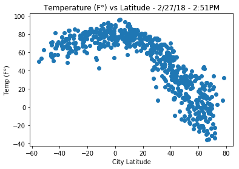
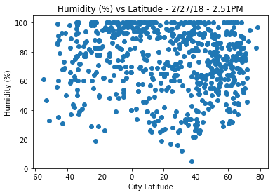
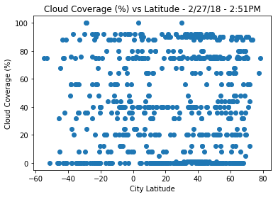
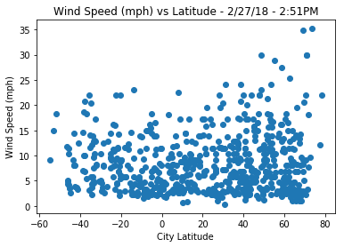

# Trends

## Temperature vs Latitude Scatter Plot
1. In this graph you can easily see a trend that as  latitude goes up (farter north) the temperature decreases. This makes sense because the citites at this latitude do not recieve as much direct sunlight and therefore as much heat as the cities closer to the equator (Lat = 0).
2. Of course, then the inverse is true as well, the closer to the eqator (lat = 0) you get, the higher you can expect the temp to be, because they recieve more direct sunlight.
3. We would expect the full shape of this graph to look like an upside down Parabola. But since we did not generate any cities at the other end (lat = -80), we cannot see that trend. These cities would be around the south pole. Not many cities are there and is probably why we did not generate any of these cities.

## Humidity vs Latitude Scatter Plot
1. No trends can really be seen here and that makes sense, because latitude does not have a great (if any) affect on humidity. This has more to do with how close a decent sized body of water is. For example: I lived in Erie, PA for 5 years and it was very humid there, we got a ton of rain and a ton of snow because we were on Lake Erie, a decent sized body of water. Now, Casper, Wyoming is at about the same lat as Erie and not near a large lake like Erie, so the Humidity will (on average) not be as high. 56% to Erie's average 72%.

## Cloud Coverage vs Latitude
1. Similar situation here. In order for clouds to form there needs to be a high enough humidity. So this again depends more on being near a body of water than it does latitude. Almost looks like straight lines at some points, probably just from how the API reports this data. They're giving a rounded amount rather than something like 43%.

## Wind Speed vs Latitude
1. This graph also looks like a mess, but you can kind of see that there are higher winds near the ends of the graph than the middle (near lat = 0). Hard to see from the graph, but from a previous gen ed in meteorology I learned that wind speeds tend to be faster near the poles. If we had more data points near -80 I think this would be seen a little more clearly.

```python
# install CitiPy
!pip install citipy
# wanted to use this to get an ETA on the data collecting for loop because it takes a while
!pip install progressbar2
```

    Requirement already satisfied: citipy in /Users/ddrossi93/anaconda/envs/PythonData/lib/python3.6/site-packages
    Requirement already satisfied: kdtree>=0.12 in /Users/ddrossi93/anaconda/envs/PythonData/lib/python3.6/site-packages (from citipy)
    Requirement already satisfied: progressbar2 in /Users/ddrossi93/anaconda/envs/PythonData/lib/python3.6/site-packages
    Requirement already satisfied: python-utils>=2.3.0 in /Users/ddrossi93/anaconda/envs/PythonData/lib/python3.6/site-packages (from progressbar2)
    Requirement already satisfied: six in /Users/ddrossi93/anaconda/envs/PythonData/lib/python3.6/site-packages (from progressbar2)


```python
# dependencies
from citipy import citipy
import matplotlib.pyplot as plt
import requests as req
import pandas as pd
import numpy as np
import time
import progressbar
```


```python
cities = []
# loop until there are over 500 unique cities
while (len(cities) < 500):
    # get list of random lat and lng
    lats = np.random.randint(low=-90, high=90, size=1000)
    lons = np.random.randint(low=-180, high=180, size=1000)

    # convert to list
    lats = lats.tolist()
    lons = lons.tolist()

    # get list of cities
    for i in range(len(lats)):
        city = citipy.nearest_city(lats[i], lons[i])
        cities.append(city.city_name)

    # remove duplicates
    print('Before: ' + str(len(cities)))
    before = len(cities)
    cities = list(set(cities))
    print('After: ' + str(len(cities)))
    after = len(cities)
    print('Removed ' + str(before - after) + ' duplicates')

print(str(len(cities)) + ' unique cities found!')
```

    Before: 1000
    After: 462
    Removed 538 duplicates
    Before: 1462
    After: 739
    Removed 723 duplicates
    739 unique cities found!


```python
# set key
open_weather_key = '25bc90a1196e6f153eece0bc0b0fc9eb'

# initalize lists
temps = []
humidity = []
clouds = []
wind = []
city_lat = []
city_lng = []
completed_cities = []

# initalize progress bar
bar = progressbar.ProgressBar()


while(len(temps) < 500 or len(humidity) < 500 or len(clouds) < 500 or len(wind) < 500 or len(city_lat) < 500):
    # set error count
    count = 0

    # get city weather data
    for j in bar(range(len(cities))):
        # TODO: Include a print log of each city as it's being processed with the city number, city name, and requested URL.
        time.sleep(0.02)
        city = cities[j]
        url = "http://api.openweathermap.org/data/2.5/weather?"
        print('Working on city: ' + city)
        try:
            # Build query URL
            query_url = url + "appid=" + open_weather_key + "&q=" + city + '&units=imperial'
            print(' - ' + query_url)
            test = req.get(query_url).json()

            temps.append(test['main']['temp'])
            humidity.append(test['main']['humidity'])
            clouds.append(test['clouds']['all'])
            wind.append(test['wind']['speed'])
            city_lat.append(test['coord']['lat'])
            city_lng.append(test['coord']['lon'])
            completed_cities.append(city)
        except:
            count += 1

    print('No data found for ' + str(count) + ' cities')

    if(len(temps) < 500 or len(humidity) < 500 or len(clouds) < 500 or len(wind) < 500 or len(city_lat) < 500):
        print('Not enough data. Running script again.')
```

    N/A% (0 of 739) |                        | Elapsed Time: 0:00:00 ETA:  --:--:--

    Working on city: calama
     - http://api.openweathermap.org/data/2.5/weather?appid=25bc90a1196e6f153eece0bc0b0fc9eb&q=calama&units=imperial


      0% (1 of 739) |                         | Elapsed Time: 0:00:00 ETA:  0:05:36

    Working on city: road town
     - http://api.openweathermap.org/data/2.5/weather?appid=25bc90a1196e6f153eece0bc0b0fc9eb&q=road town&units=imperial


      0% (2 of 739) |                         | Elapsed Time: 0:00:00 ETA:  0:05:16

    Working on city: misratah
     - http://api.openweathermap.org/data/2.5/weather?appid=25bc90a1196e6f153eece0bc0b0fc9eb&q=misratah&units=imperial


      0% (3 of 739) |                         | Elapsed Time: 0:00:01 ETA:  0:04:57

    Working on city: key largo
     - http://api.openweathermap.org/data/2.5/weather?appid=25bc90a1196e6f153eece0bc0b0fc9eb&q=key largo&units=imperial


      0% (4 of 739) |                         | Elapsed Time: 0:00:01 ETA:  0:04:54

    Working on city: porto velho
     - http://api.openweathermap.org/data/2.5/weather?appid=25bc90a1196e6f153eece0bc0b0fc9eb&q=porto velho&units=imperial


      0% (5 of 739) |                         | Elapsed Time: 0:00:01 ETA:  0:04:43

    Working on city: kiruna
     - http://api.openweathermap.org/data/2.5/weather?appid=25bc90a1196e6f153eece0bc0b0fc9eb&q=kiruna&units=imperial


      0% (6 of 739) |                         | Elapsed Time: 0:00:02 ETA:  0:04:40

    Working on city: zomin
     - http://api.openweathermap.org/data/2.5/weather?appid=25bc90a1196e6f153eece0bc0b0fc9eb&q=zomin&units=imperial


      0% (7 of 739) |                         | Elapsed Time: 0:00:02 ETA:  0:04:40

    Working on city: krasnoselkup
     - http://api.openweathermap.org/data/2.5/weather?appid=25bc90a1196e6f153eece0bc0b0fc9eb&q=krasnoselkup&units=imperial


      1% (9 of 739) |                         | Elapsed Time: 0:00:03 ETA:  0:04:19

    Working on city: qaanaaq
     - http://api.openweathermap.org/data/2.5/weather?appid=25bc90a1196e6f153eece0bc0b0fc9eb&q=qaanaaq&units=imperial
    Working on city: aklavik
     - http://api.openweathermap.org/data/2.5/weather?appid=25bc90a1196e6f153eece0bc0b0fc9eb&q=aklavik&units=imperial


      1% (11 of 739) |                        | Elapsed Time: 0:00:03 ETA:  0:03:53

    Working on city: bluff
     - http://api.openweathermap.org/data/2.5/weather?appid=25bc90a1196e6f153eece0bc0b0fc9eb&q=bluff&units=imperial
    Working on city: sibolga
     - http://api.openweathermap.org/data/2.5/weather?appid=25bc90a1196e6f153eece0bc0b0fc9eb&q=sibolga&units=imperial


      1% (12 of 739) |                        | Elapsed Time: 0:00:04 ETA:  0:03:53

    Working on city: galdar
     - http://api.openweathermap.org/data/2.5/weather?appid=25bc90a1196e6f153eece0bc0b0fc9eb&q=galdar&units=imperial


      1% (13 of 739) |                        | Elapsed Time: 0:00:04 ETA:  0:03:57

    Working on city: proti
     - http://api.openweathermap.org/data/2.5/weather?appid=25bc90a1196e6f153eece0bc0b0fc9eb&q=proti&units=imperial


      1% (14 of 739) |                        | Elapsed Time: 0:00:05 ETA:  0:04:12

    Working on city: lavrentiya
     - http://api.openweathermap.org/data/2.5/weather?appid=25bc90a1196e6f153eece0bc0b0fc9eb&q=lavrentiya&units=imperial


      2% (15 of 739) |                        | Elapsed Time: 0:00:05 ETA:  0:04:10

    Working on city: kapoeta
     - http://api.openweathermap.org/data/2.5/weather?appid=25bc90a1196e6f153eece0bc0b0fc9eb&q=kapoeta&units=imperial


      2% (16 of 739) |                        | Elapsed Time: 0:00:05 ETA:  0:04:01

    Working on city: alabaster
     - http://api.openweathermap.org/data/2.5/weather?appid=25bc90a1196e6f153eece0bc0b0fc9eb&q=alabaster&units=imperial


      2% (17 of 739) |                        | Elapsed Time: 0:00:06 ETA:  0:03:58

    Working on city: malakal
     - http://api.openweathermap.org/data/2.5/weather?appid=25bc90a1196e6f153eece0bc0b0fc9eb&q=malakal&units=imperial


      2% (18 of 739) |                        | Elapsed Time: 0:00:06 ETA:  0:04:06

    Working on city: joshimath
     - http://api.openweathermap.org/data/2.5/weather?appid=25bc90a1196e6f153eece0bc0b0fc9eb&q=joshimath&units=imperial


      2% (19 of 739) |                        | Elapsed Time: 0:00:06 ETA:  0:04:15

    Working on city: tigil
     - http://api.openweathermap.org/data/2.5/weather?appid=25bc90a1196e6f153eece0bc0b0fc9eb&q=tigil&units=imperial


      2% (20 of 739) |                        | Elapsed Time: 0:00:07 ETA:  0:04:41

    Working on city: lebu
     - http://api.openweathermap.org/data/2.5/weather?appid=25bc90a1196e6f153eece0bc0b0fc9eb&q=lebu&units=imperial


      2% (21 of 739) |                        | Elapsed Time: 0:00:07 ETA:  0:04:49

    Working on city: nyurba
     - http://api.openweathermap.org/data/2.5/weather?appid=25bc90a1196e6f153eece0bc0b0fc9eb&q=nyurba&units=imperial


      2% (22 of 739) |                        | Elapsed Time: 0:00:08 ETA:  0:04:53

    Working on city: chicla
     - http://api.openweathermap.org/data/2.5/weather?appid=25bc90a1196e6f153eece0bc0b0fc9eb&q=chicla&units=imperial


      3% (23 of 739) |                        | Elapsed Time: 0:00:08 ETA:  0:04:45

    Working on city: strezhevoy
     - http://api.openweathermap.org/data/2.5/weather?appid=25bc90a1196e6f153eece0bc0b0fc9eb&q=strezhevoy&units=imperial


      3% (24 of 739) |                        | Elapsed Time: 0:00:08 ETA:  0:04:44

    Working on city: nizhniy kuranakh
     - http://api.openweathermap.org/data/2.5/weather?appid=25bc90a1196e6f153eece0bc0b0fc9eb&q=nizhniy kuranakh&units=imperial


      3% (26 of 739) |                        | Elapsed Time: 0:00:09 ETA:  0:04:48

    Working on city: cape town
     - http://api.openweathermap.org/data/2.5/weather?appid=25bc90a1196e6f153eece0bc0b0fc9eb&q=cape town&units=imperial
    Working on city: hithadhoo
     - http://api.openweathermap.org/data/2.5/weather?appid=25bc90a1196e6f153eece0bc0b0fc9eb&q=hithadhoo&units=imperial


      3% (27 of 739) |                        | Elapsed Time: 0:00:09 ETA:  0:04:39

    Working on city: cidreira
     - http://api.openweathermap.org/data/2.5/weather?appid=25bc90a1196e6f153eece0bc0b0fc9eb&q=cidreira&units=imperial


      3% (28 of 739) |                        | Elapsed Time: 0:00:10 ETA:  0:04:27

    Working on city: lawrenceburg
     - http://api.openweathermap.org/data/2.5/weather?appid=25bc90a1196e6f153eece0bc0b0fc9eb&q=lawrenceburg&units=imperial


      4% (30 of 739) |                        | Elapsed Time: 0:00:10 ETA:  0:03:44

    Working on city: te anau
     - http://api.openweathermap.org/data/2.5/weather?appid=25bc90a1196e6f153eece0bc0b0fc9eb&q=te anau&units=imperial
    Working on city: changping
     - http://api.openweathermap.org/data/2.5/weather?appid=25bc90a1196e6f153eece0bc0b0fc9eb&q=changping&units=imperial


      4% (31 of 739) |#                       | Elapsed Time: 0:00:11 ETA:  0:03:37

    Working on city: krasnoyarsk
     - http://api.openweathermap.org/data/2.5/weather?appid=25bc90a1196e6f153eece0bc0b0fc9eb&q=krasnoyarsk&units=imperial


      4% (33 of 739) |#                       | Elapsed Time: 0:00:11 ETA:  0:03:22

    Working on city: salta
     - http://api.openweathermap.org/data/2.5/weather?appid=25bc90a1196e6f153eece0bc0b0fc9eb&q=salta&units=imperial
    Working on city: venado tuerto
     - http://api.openweathermap.org/data/2.5/weather?appid=25bc90a1196e6f153eece0bc0b0fc9eb&q=venado tuerto&units=imperial


      4% (34 of 739) |#                       | Elapsed Time: 0:00:11 ETA:  0:03:12

    Working on city: provideniya
     - http://api.openweathermap.org/data/2.5/weather?appid=25bc90a1196e6f153eece0bc0b0fc9eb&q=provideniya&units=imperial


      4% (35 of 739) |#                       | Elapsed Time: 0:00:12 ETA:  0:03:25

    Working on city: kamenka
     - http://api.openweathermap.org/data/2.5/weather?appid=25bc90a1196e6f153eece0bc0b0fc9eb&q=kamenka&units=imperial


      4% (36 of 739) |#                       | Elapsed Time: 0:00:12 ETA:  0:03:45

    Working on city: cerro cama
     - http://api.openweathermap.org/data/2.5/weather?appid=25bc90a1196e6f153eece0bc0b0fc9eb&q=cerro cama&units=imperial


      5% (37 of 739) |#                       | Elapsed Time: 0:00:13 ETA:  0:03:45

    Working on city: marica
     - http://api.openweathermap.org/data/2.5/weather?appid=25bc90a1196e6f153eece0bc0b0fc9eb&q=marica&units=imperial


      5% (38 of 739) |#                       | Elapsed Time: 0:00:13 ETA:  0:04:05

    Working on city: bambous virieux
     - http://api.openweathermap.org/data/2.5/weather?appid=25bc90a1196e6f153eece0bc0b0fc9eb&q=bambous virieux&units=imperial


      5% (39 of 739) |#                       | Elapsed Time: 0:00:14 ETA:  0:04:27

    Working on city: cap malheureux
     - http://api.openweathermap.org/data/2.5/weather?appid=25bc90a1196e6f153eece0bc0b0fc9eb&q=cap malheureux&units=imperial


      5% (40 of 739) |#                       | Elapsed Time: 0:00:14 ETA:  0:04:30

    Working on city: lamu
     - http://api.openweathermap.org/data/2.5/weather?appid=25bc90a1196e6f153eece0bc0b0fc9eb&q=lamu&units=imperial


      5% (41 of 739) |#                       | Elapsed Time: 0:00:14 ETA:  0:04:37

    Working on city: kahului
     - http://api.openweathermap.org/data/2.5/weather?appid=25bc90a1196e6f153eece0bc0b0fc9eb&q=kahului&units=imperial


      5% (42 of 739) |#                       | Elapsed Time: 0:00:15 ETA:  0:04:57

    Working on city: yinchuan
     - http://api.openweathermap.org/data/2.5/weather?appid=25bc90a1196e6f153eece0bc0b0fc9eb&q=yinchuan&units=imperial


      5% (43 of 739) |#                       | Elapsed Time: 0:00:15 ETA:  0:05:08

    Working on city: deputatskiy
     - http://api.openweathermap.org/data/2.5/weather?appid=25bc90a1196e6f153eece0bc0b0fc9eb&q=deputatskiy&units=imperial


      5% (44 of 739) |#                       | Elapsed Time: 0:00:16 ETA:  0:05:21

    Working on city: pevek
     - http://api.openweathermap.org/data/2.5/weather?appid=25bc90a1196e6f153eece0bc0b0fc9eb&q=pevek&units=imperial


      6% (45 of 739) |#                       | Elapsed Time: 0:00:16 ETA:  0:05:28

    Working on city: kingman
     - http://api.openweathermap.org/data/2.5/weather?appid=25bc90a1196e6f153eece0bc0b0fc9eb&q=kingman&units=imperial


      6% (46 of 739) |#                       | Elapsed Time: 0:00:17 ETA:  0:05:28

    Working on city: mpika
     - http://api.openweathermap.org/data/2.5/weather?appid=25bc90a1196e6f153eece0bc0b0fc9eb&q=mpika&units=imperial


      6% (47 of 739) |#                       | Elapsed Time: 0:00:17 ETA:  0:05:30

    Working on city: vila franca do campo
     - http://api.openweathermap.org/data/2.5/weather?appid=25bc90a1196e6f153eece0bc0b0fc9eb&q=vila franca do campo&units=imperial


      6% (48 of 739) |#                       | Elapsed Time: 0:00:18 ETA:  0:05:29

    Working on city: tanhacu
     - http://api.openweathermap.org/data/2.5/weather?appid=25bc90a1196e6f153eece0bc0b0fc9eb&q=tanhacu&units=imperial


      6% (49 of 739) |#                       | Elapsed Time: 0:00:18 ETA:  0:05:29

    Working on city: shakawe
     - http://api.openweathermap.org/data/2.5/weather?appid=25bc90a1196e6f153eece0bc0b0fc9eb&q=shakawe&units=imperial


      6% (50 of 739) |#                       | Elapsed Time: 0:00:19 ETA:  0:05:16

    Working on city: inverness
     - http://api.openweathermap.org/data/2.5/weather?appid=25bc90a1196e6f153eece0bc0b0fc9eb&q=inverness&units=imperial


      6% (51 of 739) |#                       | Elapsed Time: 0:00:19 ETA:  0:05:20

    Working on city: samalaeulu
     - http://api.openweathermap.org/data/2.5/weather?appid=25bc90a1196e6f153eece0bc0b0fc9eb&q=samalaeulu&units=imperial


      7% (52 of 739) |#                       | Elapsed Time: 0:00:20 ETA:  0:05:12

    Working on city: agua prieta
     - http://api.openweathermap.org/data/2.5/weather?appid=25bc90a1196e6f153eece0bc0b0fc9eb&q=agua prieta&units=imperial


      7% (53 of 739) |#                       | Elapsed Time: 0:00:20 ETA:  0:05:20

    Working on city: la palma
     - http://api.openweathermap.org/data/2.5/weather?appid=25bc90a1196e6f153eece0bc0b0fc9eb&q=la palma&units=imperial


      7% (54 of 739) |#                       | Elapsed Time: 0:00:21 ETA:  0:06:14

    Working on city: chuy
     - http://api.openweathermap.org/data/2.5/weather?appid=25bc90a1196e6f153eece0bc0b0fc9eb&q=chuy&units=imperial


      7% (55 of 739) |#                       | Elapsed Time: 0:00:22 ETA:  0:06:41

    Working on city: klaebu
     - http://api.openweathermap.org/data/2.5/weather?appid=25bc90a1196e6f153eece0bc0b0fc9eb&q=klaebu&units=imperial


      7% (56 of 739) |#                       | Elapsed Time: 0:00:23 ETA:  0:06:44

    Working on city: tuktoyaktuk
     - http://api.openweathermap.org/data/2.5/weather?appid=25bc90a1196e6f153eece0bc0b0fc9eb&q=tuktoyaktuk&units=imperial


      7% (57 of 739) |#                       | Elapsed Time: 0:00:23 ETA:  0:06:35

    Working on city: ust-ordynskiy
     - http://api.openweathermap.org/data/2.5/weather?appid=25bc90a1196e6f153eece0bc0b0fc9eb&q=ust-ordynskiy&units=imperial


      7% (58 of 739) |#                       | Elapsed Time: 0:00:23 ETA:  0:06:32

    Working on city: bend
     - http://api.openweathermap.org/data/2.5/weather?appid=25bc90a1196e6f153eece0bc0b0fc9eb&q=bend&units=imperial


      7% (59 of 739) |#                       | Elapsed Time: 0:00:24 ETA:  0:06:39

    Working on city: mount pleasant
     - http://api.openweathermap.org/data/2.5/weather?appid=25bc90a1196e6f153eece0bc0b0fc9eb&q=mount pleasant&units=imperial


      8% (60 of 739) |#                       | Elapsed Time: 0:00:25 ETA:  0:07:58

    Working on city: kirovsk
     - http://api.openweathermap.org/data/2.5/weather?appid=25bc90a1196e6f153eece0bc0b0fc9eb&q=kirovsk&units=imperial


      8% (61 of 739) |#                       | Elapsed Time: 0:00:26 ETA:  0:08:16

    Working on city: uyuni
     - http://api.openweathermap.org/data/2.5/weather?appid=25bc90a1196e6f153eece0bc0b0fc9eb&q=uyuni&units=imperial


      8% (63 of 739) |##                      | Elapsed Time: 0:00:27 ETA:  0:06:43

    Working on city: thompson
     - http://api.openweathermap.org/data/2.5/weather?appid=25bc90a1196e6f153eece0bc0b0fc9eb&q=thompson&units=imperial
    Working on city: maimon
     - http://api.openweathermap.org/data/2.5/weather?appid=25bc90a1196e6f153eece0bc0b0fc9eb&q=maimon&units=imperial


      8% (64 of 739) |##                      | Elapsed Time: 0:00:27 ETA:  0:06:16

    Working on city: mecca
     - http://api.openweathermap.org/data/2.5/weather?appid=25bc90a1196e6f153eece0bc0b0fc9eb&q=mecca&units=imperial


      8% (65 of 739) |##                      | Elapsed Time: 0:00:28 ETA:  0:06:00

    Working on city: pacific grove
     - http://api.openweathermap.org/data/2.5/weather?appid=25bc90a1196e6f153eece0bc0b0fc9eb&q=pacific grove&units=imperial


      8% (66 of 739) |##                      | Elapsed Time: 0:00:28 ETA:  0:05:55

    Working on city: turki
     - http://api.openweathermap.org/data/2.5/weather?appid=25bc90a1196e6f153eece0bc0b0fc9eb&q=turki&units=imperial


      9% (67 of 739) |##                      | Elapsed Time: 0:00:28 ETA:  0:06:09

    Working on city: hudiksvall
     - http://api.openweathermap.org/data/2.5/weather?appid=25bc90a1196e6f153eece0bc0b0fc9eb&q=hudiksvall&units=imperial


      9% (68 of 739) |##                      | Elapsed Time: 0:00:29 ETA:  0:06:09

    Working on city: linares
     - http://api.openweathermap.org/data/2.5/weather?appid=25bc90a1196e6f153eece0bc0b0fc9eb&q=linares&units=imperial


      9% (69 of 739) |##                      | Elapsed Time: 0:00:29 ETA:  0:04:49

    Working on city: waddan
     - http://api.openweathermap.org/data/2.5/weather?appid=25bc90a1196e6f153eece0bc0b0fc9eb&q=waddan&units=imperial


      9% (70 of 739) |##                      | Elapsed Time: 0:00:30 ETA:  0:04:31

    Working on city: roald
     - http://api.openweathermap.org/data/2.5/weather?appid=25bc90a1196e6f153eece0bc0b0fc9eb&q=roald&units=imperial


      9% (71 of 739) |##                      | Elapsed Time: 0:00:30 ETA:  0:04:26

    Working on city: price
     - http://api.openweathermap.org/data/2.5/weather?appid=25bc90a1196e6f153eece0bc0b0fc9eb&q=price&units=imperial


      9% (72 of 739) |##                      | Elapsed Time: 0:00:31 ETA:  0:05:01

    Working on city: taitung
     - http://api.openweathermap.org/data/2.5/weather?appid=25bc90a1196e6f153eece0bc0b0fc9eb&q=taitung&units=imperial


     10% (74 of 739) |##                      | Elapsed Time: 0:00:31 ETA:  0:04:53

    Working on city: daru
     - http://api.openweathermap.org/data/2.5/weather?appid=25bc90a1196e6f153eece0bc0b0fc9eb&q=daru&units=imperial
    Working on city: tessalit
     - http://api.openweathermap.org/data/2.5/weather?appid=25bc90a1196e6f153eece0bc0b0fc9eb&q=tessalit&units=imperial


     10% (75 of 739) |##                      | Elapsed Time: 0:00:32 ETA:  0:05:18

    Working on city: faanui
     - http://api.openweathermap.org/data/2.5/weather?appid=25bc90a1196e6f153eece0bc0b0fc9eb&q=faanui&units=imperial


     10% (76 of 739) |##                      | Elapsed Time: 0:00:33 ETA:  0:05:14

    Working on city: kahone
     - http://api.openweathermap.org/data/2.5/weather?appid=25bc90a1196e6f153eece0bc0b0fc9eb&q=kahone&units=imperial


     10% (77 of 739) |##                      | Elapsed Time: 0:00:33 ETA:  0:05:21

    Working on city: ponta do sol
     - http://api.openweathermap.org/data/2.5/weather?appid=25bc90a1196e6f153eece0bc0b0fc9eb&q=ponta do sol&units=imperial


     10% (78 of 739) |##                      | Elapsed Time: 0:00:34 ETA:  0:05:14

    Working on city: najran
     - http://api.openweathermap.org/data/2.5/weather?appid=25bc90a1196e6f153eece0bc0b0fc9eb&q=najran&units=imperial


     10% (79 of 739) |##                      | Elapsed Time: 0:00:34 ETA:  0:05:12

    Working on city: victor harbor
     - http://api.openweathermap.org/data/2.5/weather?appid=25bc90a1196e6f153eece0bc0b0fc9eb&q=victor harbor&units=imperial


     10% (80 of 739) |##                      | Elapsed Time: 0:00:34 ETA:  0:05:14

    Working on city: resen
     - http://api.openweathermap.org/data/2.5/weather?appid=25bc90a1196e6f153eece0bc0b0fc9eb&q=resen&units=imperial


     10% (81 of 739) |##                      | Elapsed Time: 0:00:35 ETA:  0:05:35

    Working on city: onalaska
     - http://api.openweathermap.org/data/2.5/weather?appid=25bc90a1196e6f153eece0bc0b0fc9eb&q=onalaska&units=imperial


     11% (82 of 739) |##                      | Elapsed Time: 0:00:36 ETA:  0:05:36

    Working on city: kodiak
     - http://api.openweathermap.org/data/2.5/weather?appid=25bc90a1196e6f153eece0bc0b0fc9eb&q=kodiak&units=imperial


     11% (83 of 739) |##                      | Elapsed Time: 0:00:36 ETA:  0:05:48

    Working on city: urumqi
     - http://api.openweathermap.org/data/2.5/weather?appid=25bc90a1196e6f153eece0bc0b0fc9eb&q=urumqi&units=imperial


     11% (84 of 739) |##                      | Elapsed Time: 0:00:37 ETA:  0:05:35

    Working on city: hualmay
     - http://api.openweathermap.org/data/2.5/weather?appid=25bc90a1196e6f153eece0bc0b0fc9eb&q=hualmay&units=imperial


     11% (85 of 739) |##                      | Elapsed Time: 0:00:37 ETA:  0:05:37

    Working on city: galiwinku
     - http://api.openweathermap.org/data/2.5/weather?appid=25bc90a1196e6f153eece0bc0b0fc9eb&q=galiwinku&units=imperial


     11% (86 of 739) |##                      | Elapsed Time: 0:00:38 ETA:  0:05:23

    Working on city: puerto escondido
     - http://api.openweathermap.org/data/2.5/weather?appid=25bc90a1196e6f153eece0bc0b0fc9eb&q=puerto escondido&units=imperial


     11% (87 of 739) |##                      | Elapsed Time: 0:00:38 ETA:  0:05:27

    Working on city: suba
     - http://api.openweathermap.org/data/2.5/weather?appid=25bc90a1196e6f153eece0bc0b0fc9eb&q=suba&units=imperial


     11% (88 of 739) |##                      | Elapsed Time: 0:00:39 ETA:  0:05:28

    Working on city: warrnambool
     - http://api.openweathermap.org/data/2.5/weather?appid=25bc90a1196e6f153eece0bc0b0fc9eb&q=warrnambool&units=imperial


     12% (89 of 739) |##                      | Elapsed Time: 0:00:39 ETA:  0:05:14

    Working on city: karratha
     - http://api.openweathermap.org/data/2.5/weather?appid=25bc90a1196e6f153eece0bc0b0fc9eb&q=karratha&units=imperial


     12% (90 of 739) |##                      | Elapsed Time: 0:00:39 ETA:  0:04:40

    Working on city: miyako
     - http://api.openweathermap.org/data/2.5/weather?appid=25bc90a1196e6f153eece0bc0b0fc9eb&q=miyako&units=imperial


     12% (91 of 739) |##                      | Elapsed Time: 0:00:40 ETA:  0:04:28

    Working on city: lolua
     - http://api.openweathermap.org/data/2.5/weather?appid=25bc90a1196e6f153eece0bc0b0fc9eb&q=lolua&units=imperial


     12% (92 of 739) |##                      | Elapsed Time: 0:00:40 ETA:  0:04:31

    Working on city: la ronge
     - http://api.openweathermap.org/data/2.5/weather?appid=25bc90a1196e6f153eece0bc0b0fc9eb&q=la ronge&units=imperial


     12% (93 of 739) |###                     | Elapsed Time: 0:00:41 ETA:  0:04:53

    Working on city: ghanzi
     - http://api.openweathermap.org/data/2.5/weather?appid=25bc90a1196e6f153eece0bc0b0fc9eb&q=ghanzi&units=imperial


     12% (94 of 739) |###                     | Elapsed Time: 0:00:41 ETA:  0:04:46

    Working on city: daxian
     - http://api.openweathermap.org/data/2.5/weather?appid=25bc90a1196e6f153eece0bc0b0fc9eb&q=daxian&units=imperial


     12% (95 of 739) |###                     | Elapsed Time: 0:00:42 ETA:  0:04:39

    Working on city: ndago
     - http://api.openweathermap.org/data/2.5/weather?appid=25bc90a1196e6f153eece0bc0b0fc9eb&q=ndago&units=imperial


     12% (96 of 739) |###                     | Elapsed Time: 0:00:42 ETA:  0:04:37

    Working on city: muriwai beach
     - http://api.openweathermap.org/data/2.5/weather?appid=25bc90a1196e6f153eece0bc0b0fc9eb&q=muriwai beach&units=imperial


     13% (97 of 739) |###                     | Elapsed Time: 0:00:43 ETA:  0:04:41

    Working on city: tiarei
     - http://api.openweathermap.org/data/2.5/weather?appid=25bc90a1196e6f153eece0bc0b0fc9eb&q=tiarei&units=imperial


     13% (98 of 739) |###                     | Elapsed Time: 0:00:43 ETA:  0:05:01

    Working on city: ambovombe
     - http://api.openweathermap.org/data/2.5/weather?appid=25bc90a1196e6f153eece0bc0b0fc9eb&q=ambovombe&units=imperial


     13% (99 of 739) |###                     | Elapsed Time: 0:00:44 ETA:  0:05:05

    Working on city: ternate
     - http://api.openweathermap.org/data/2.5/weather?appid=25bc90a1196e6f153eece0bc0b0fc9eb&q=ternate&units=imperial


     13% (100 of 739) |###                    | Elapsed Time: 0:00:44 ETA:  0:05:12

    Working on city: neryungri
     - http://api.openweathermap.org/data/2.5/weather?appid=25bc90a1196e6f153eece0bc0b0fc9eb&q=neryungri&units=imperial


     13% (101 of 739) |###                    | Elapsed Time: 0:00:44 ETA:  0:05:09

    Working on city: norman wells
     - http://api.openweathermap.org/data/2.5/weather?appid=25bc90a1196e6f153eece0bc0b0fc9eb&q=norman wells&units=imperial


     13% (102 of 739) |###                    | Elapsed Time: 0:00:45 ETA:  0:04:38

    Working on city: antofagasta
     - http://api.openweathermap.org/data/2.5/weather?appid=25bc90a1196e6f153eece0bc0b0fc9eb&q=antofagasta&units=imperial


     13% (103 of 739) |###                    | Elapsed Time: 0:00:45 ETA:  0:04:27

    Working on city: morros
     - http://api.openweathermap.org/data/2.5/weather?appid=25bc90a1196e6f153eece0bc0b0fc9eb&q=morros&units=imperial


     14% (104 of 739) |###                    | Elapsed Time: 0:00:46 ETA:  0:04:44

    Working on city: hobart
     - http://api.openweathermap.org/data/2.5/weather?appid=25bc90a1196e6f153eece0bc0b0fc9eb&q=hobart&units=imperial


     14% (105 of 739) |###                    | Elapsed Time: 0:00:46 ETA:  0:05:02

    Working on city: hovd
     - http://api.openweathermap.org/data/2.5/weather?appid=25bc90a1196e6f153eece0bc0b0fc9eb&q=hovd&units=imperial


     14% (106 of 739) |###                    | Elapsed Time: 0:00:47 ETA:  0:04:58

    Working on city: akdepe
     - http://api.openweathermap.org/data/2.5/weather?appid=25bc90a1196e6f153eece0bc0b0fc9eb&q=akdepe&units=imperial


     14% (107 of 739) |###                    | Elapsed Time: 0:00:47 ETA:  0:04:47

    Working on city: srednekolymsk
     - http://api.openweathermap.org/data/2.5/weather?appid=25bc90a1196e6f153eece0bc0b0fc9eb&q=srednekolymsk&units=imperial


     14% (108 of 739) |###                    | Elapsed Time: 0:00:48 ETA:  0:04:35

    Working on city: sitka
     - http://api.openweathermap.org/data/2.5/weather?appid=25bc90a1196e6f153eece0bc0b0fc9eb&q=sitka&units=imperial


     14% (109 of 739) |###                    | Elapsed Time: 0:00:48 ETA:  0:04:36

    Working on city: jumla
     - http://api.openweathermap.org/data/2.5/weather?appid=25bc90a1196e6f153eece0bc0b0fc9eb&q=jumla&units=imperial


     14% (110 of 739) |###                    | Elapsed Time: 0:00:48 ETA:  0:04:39

    Working on city: sentyabrskiy
     - http://api.openweathermap.org/data/2.5/weather?appid=25bc90a1196e6f153eece0bc0b0fc9eb&q=sentyabrskiy&units=imperial


     15% (111 of 739) |###                    | Elapsed Time: 0:00:49 ETA:  0:04:38

    Working on city: portland
     - http://api.openweathermap.org/data/2.5/weather?appid=25bc90a1196e6f153eece0bc0b0fc9eb&q=portland&units=imperial


     15% (112 of 739) |###                    | Elapsed Time: 0:00:49 ETA:  0:04:45

    Working on city: berlevag
     - http://api.openweathermap.org/data/2.5/weather?appid=25bc90a1196e6f153eece0bc0b0fc9eb&q=berlevag&units=imperial


     15% (114 of 739) |###                    | Elapsed Time: 0:00:50 ETA:  0:04:04

    Working on city: esperance
     - http://api.openweathermap.org/data/2.5/weather?appid=25bc90a1196e6f153eece0bc0b0fc9eb&q=esperance&units=imperial
    Working on city: thurso
     - http://api.openweathermap.org/data/2.5/weather?appid=25bc90a1196e6f153eece0bc0b0fc9eb&q=thurso&units=imperial


     15% (115 of 739) |###                    | Elapsed Time: 0:00:50 ETA:  0:04:01

    Working on city: pangoa
     - http://api.openweathermap.org/data/2.5/weather?appid=25bc90a1196e6f153eece0bc0b0fc9eb&q=pangoa&units=imperial


     15% (116 of 739) |###                    | Elapsed Time: 0:00:51 ETA:  0:04:15

    Working on city: buraydah
     - http://api.openweathermap.org/data/2.5/weather?appid=25bc90a1196e6f153eece0bc0b0fc9eb&q=buraydah&units=imperial


     15% (117 of 739) |###                    | Elapsed Time: 0:00:51 ETA:  0:04:15

    Working on city: port elizabeth
     - http://api.openweathermap.org/data/2.5/weather?appid=25bc90a1196e6f153eece0bc0b0fc9eb&q=port elizabeth&units=imperial


     16% (119 of 739) |###                    | Elapsed Time: 0:00:52 ETA:  0:03:50

    Working on city: bud
     - http://api.openweathermap.org/data/2.5/weather?appid=25bc90a1196e6f153eece0bc0b0fc9eb&q=bud&units=imperial
    Working on city: westport
     - http://api.openweathermap.org/data/2.5/weather?appid=25bc90a1196e6f153eece0bc0b0fc9eb&q=westport&units=imperial


     16% (120 of 739) |###                    | Elapsed Time: 0:00:52 ETA:  0:03:56

    Working on city: rutigliano
     - http://api.openweathermap.org/data/2.5/weather?appid=25bc90a1196e6f153eece0bc0b0fc9eb&q=rutigliano&units=imperial


     16% (121 of 739) |###                    | Elapsed Time: 0:00:53 ETA:  0:03:52

    Working on city: oussouye
     - http://api.openweathermap.org/data/2.5/weather?appid=25bc90a1196e6f153eece0bc0b0fc9eb&q=oussouye&units=imperial


     16% (122 of 739) |###                    | Elapsed Time: 0:00:53 ETA:  0:03:42

    Working on city: new norfolk
     - http://api.openweathermap.org/data/2.5/weather?appid=25bc90a1196e6f153eece0bc0b0fc9eb&q=new norfolk&units=imperial


     16% (123 of 739) |###                    | Elapsed Time: 0:00:53 ETA:  0:03:56

    Working on city: maningrida
     - http://api.openweathermap.org/data/2.5/weather?appid=25bc90a1196e6f153eece0bc0b0fc9eb&q=maningrida&units=imperial


     16% (124 of 739) |###                    | Elapsed Time: 0:00:54 ETA:  0:04:25

    Working on city: cheney
     - http://api.openweathermap.org/data/2.5/weather?appid=25bc90a1196e6f153eece0bc0b0fc9eb&q=cheney&units=imperial


     17% (126 of 739) |###                    | Elapsed Time: 0:00:55 ETA:  0:03:52

    Working on city: bengkulu
     - http://api.openweathermap.org/data/2.5/weather?appid=25bc90a1196e6f153eece0bc0b0fc9eb&q=bengkulu&units=imperial
    Working on city: manokwari
     - http://api.openweathermap.org/data/2.5/weather?appid=25bc90a1196e6f153eece0bc0b0fc9eb&q=manokwari&units=imperial


     17% (127 of 739) |###                    | Elapsed Time: 0:00:55 ETA:  0:03:38

    Working on city: valparaiso
     - http://api.openweathermap.org/data/2.5/weather?appid=25bc90a1196e6f153eece0bc0b0fc9eb&q=valparaiso&units=imperial


     17% (128 of 739) |###                    | Elapsed Time: 0:00:55 ETA:  0:03:58

    Working on city: lahij
     - http://api.openweathermap.org/data/2.5/weather?appid=25bc90a1196e6f153eece0bc0b0fc9eb&q=lahij&units=imperial


     17% (129 of 739) |####                   | Elapsed Time: 0:00:56 ETA:  0:04:02

    Working on city: glencoe
     - http://api.openweathermap.org/data/2.5/weather?appid=25bc90a1196e6f153eece0bc0b0fc9eb&q=glencoe&units=imperial


     17% (130 of 739) |####                   | Elapsed Time: 0:00:56 ETA:  0:04:16

    Working on city: baykit
     - http://api.openweathermap.org/data/2.5/weather?appid=25bc90a1196e6f153eece0bc0b0fc9eb&q=baykit&units=imperial


     17% (131 of 739) |####                   | Elapsed Time: 0:00:57 ETA:  0:04:14

    Working on city: chapais
     - http://api.openweathermap.org/data/2.5/weather?appid=25bc90a1196e6f153eece0bc0b0fc9eb&q=chapais&units=imperial


     17% (132 of 739) |####                   | Elapsed Time: 0:00:57 ETA:  0:04:13

    Working on city: ilulissat
     - http://api.openweathermap.org/data/2.5/weather?appid=25bc90a1196e6f153eece0bc0b0fc9eb&q=ilulissat&units=imperial


     17% (133 of 739) |####                   | Elapsed Time: 0:00:58 ETA:  0:03:54

    Working on city: sabang
     - http://api.openweathermap.org/data/2.5/weather?appid=25bc90a1196e6f153eece0bc0b0fc9eb&q=sabang&units=imperial


     18% (134 of 739) |####                   | Elapsed Time: 0:00:58 ETA:  0:04:20

    Working on city: poum
     - http://api.openweathermap.org/data/2.5/weather?appid=25bc90a1196e6f153eece0bc0b0fc9eb&q=poum&units=imperial


     18% (135 of 739) |####                   | Elapsed Time: 0:00:59 ETA:  0:04:31

    Working on city: savannah bight
     - http://api.openweathermap.org/data/2.5/weather?appid=25bc90a1196e6f153eece0bc0b0fc9eb&q=savannah bight&units=imperial


     18% (136 of 739) |####                   | Elapsed Time: 0:00:59 ETA:  0:04:52

    Working on city: sidi bu zayd
     - http://api.openweathermap.org/data/2.5/weather?appid=25bc90a1196e6f153eece0bc0b0fc9eb&q=sidi bu zayd&units=imperial


     18% (137 of 739) |####                   | Elapsed Time: 0:00:59 ETA:  0:04:41

    Working on city: tura
     - http://api.openweathermap.org/data/2.5/weather?appid=25bc90a1196e6f153eece0bc0b0fc9eb&q=tura&units=imperial


     18% (138 of 739) |####                   | Elapsed Time: 0:01:00 ETA:  0:04:47

    Working on city: jiddah
     - http://api.openweathermap.org/data/2.5/weather?appid=25bc90a1196e6f153eece0bc0b0fc9eb&q=jiddah&units=imperial


     18% (139 of 739) |####                   | Elapsed Time: 0:01:00 ETA:  0:04:28

    Working on city: pemberton
     - http://api.openweathermap.org/data/2.5/weather?appid=25bc90a1196e6f153eece0bc0b0fc9eb&q=pemberton&units=imperial


     18% (140 of 739) |####                   | Elapsed Time: 0:01:01 ETA:  0:04:49

    Working on city: fallon
     - http://api.openweathermap.org/data/2.5/weather?appid=25bc90a1196e6f153eece0bc0b0fc9eb&q=fallon&units=imperial


     19% (141 of 739) |####                   | Elapsed Time: 0:01:02 ETA:  0:04:59

    Working on city: amalapuram
     - http://api.openweathermap.org/data/2.5/weather?appid=25bc90a1196e6f153eece0bc0b0fc9eb&q=amalapuram&units=imperial


     19% (142 of 739) |####                   | Elapsed Time: 0:01:02 ETA:  0:04:47

    Working on city: san carlos
     - http://api.openweathermap.org/data/2.5/weather?appid=25bc90a1196e6f153eece0bc0b0fc9eb&q=san carlos&units=imperial


     19% (143 of 739) |####                   | Elapsed Time: 0:01:03 ETA:  0:04:58

    Working on city: abancay
     - http://api.openweathermap.org/data/2.5/weather?appid=25bc90a1196e6f153eece0bc0b0fc9eb&q=abancay&units=imperial


     19% (144 of 739) |####                   | Elapsed Time: 0:01:03 ETA:  0:04:58

    Working on city: lyubech
     - http://api.openweathermap.org/data/2.5/weather?appid=25bc90a1196e6f153eece0bc0b0fc9eb&q=lyubech&units=imperial


     19% (145 of 739) |####                   | Elapsed Time: 0:01:04 ETA:  0:05:04

    Working on city: scarborough
     - http://api.openweathermap.org/data/2.5/weather?appid=25bc90a1196e6f153eece0bc0b0fc9eb&q=scarborough&units=imperial


     19% (146 of 739) |####                   | Elapsed Time: 0:01:04 ETA:  0:05:15

    Working on city: panzhihua
     - http://api.openweathermap.org/data/2.5/weather?appid=25bc90a1196e6f153eece0bc0b0fc9eb&q=panzhihua&units=imperial


     20% (148 of 739) |####                   | Elapsed Time: 0:01:05 ETA:  0:04:48

    Working on city: cabo san lucas
     - http://api.openweathermap.org/data/2.5/weather?appid=25bc90a1196e6f153eece0bc0b0fc9eb&q=cabo san lucas&units=imperial
    Working on city: derzhavinsk
     - http://api.openweathermap.org/data/2.5/weather?appid=25bc90a1196e6f153eece0bc0b0fc9eb&q=derzhavinsk&units=imperial


     20% (149 of 739) |####                   | Elapsed Time: 0:01:05 ETA:  0:04:28

    Working on city: sakhon nakhon
     - http://api.openweathermap.org/data/2.5/weather?appid=25bc90a1196e6f153eece0bc0b0fc9eb&q=sakhon nakhon&units=imperial


     20% (150 of 739) |####                   | Elapsed Time: 0:01:06 ETA:  0:04:21

    Working on city: bria
     - http://api.openweathermap.org/data/2.5/weather?appid=25bc90a1196e6f153eece0bc0b0fc9eb&q=bria&units=imperial


     20% (151 of 739) |####                   | Elapsed Time: 0:01:06 ETA:  0:04:24

    Working on city: taman
     - http://api.openweathermap.org/data/2.5/weather?appid=25bc90a1196e6f153eece0bc0b0fc9eb&q=taman&units=imperial


     20% (152 of 739) |####                   | Elapsed Time: 0:01:07 ETA:  0:04:07

    Working on city: yenagoa
     - http://api.openweathermap.org/data/2.5/weather?appid=25bc90a1196e6f153eece0bc0b0fc9eb&q=yenagoa&units=imperial


     20% (153 of 739) |####                   | Elapsed Time: 0:01:07 ETA:  0:04:23

    Working on city: shingu
     - http://api.openweathermap.org/data/2.5/weather?appid=25bc90a1196e6f153eece0bc0b0fc9eb&q=shingu&units=imperial


     20% (154 of 739) |####                   | Elapsed Time: 0:01:08 ETA:  0:04:19

    Working on city: ayna
     - http://api.openweathermap.org/data/2.5/weather?appid=25bc90a1196e6f153eece0bc0b0fc9eb&q=ayna&units=imperial


     20% (155 of 739) |####                   | Elapsed Time: 0:01:08 ETA:  0:04:25

    Working on city: kapaa
     - http://api.openweathermap.org/data/2.5/weather?appid=25bc90a1196e6f153eece0bc0b0fc9eb&q=kapaa&units=imperial


     21% (156 of 739) |####                   | Elapsed Time: 0:01:09 ETA:  0:04:41

    Working on city: itarema
     - http://api.openweathermap.org/data/2.5/weather?appid=25bc90a1196e6f153eece0bc0b0fc9eb&q=itarema&units=imperial


     21% (157 of 739) |####                   | Elapsed Time: 0:01:09 ETA:  0:05:02

    Working on city: gandorhun
     - http://api.openweathermap.org/data/2.5/weather?appid=25bc90a1196e6f153eece0bc0b0fc9eb&q=gandorhun&units=imperial


     21% (158 of 739) |####                   | Elapsed Time: 0:01:10 ETA:  0:05:11

    Working on city: guerrero negro
     - http://api.openweathermap.org/data/2.5/weather?appid=25bc90a1196e6f153eece0bc0b0fc9eb&q=guerrero negro&units=imperial


     21% (159 of 739) |####                   | Elapsed Time: 0:01:11 ETA:  0:05:16

    Working on city: severnyy
     - http://api.openweathermap.org/data/2.5/weather?appid=25bc90a1196e6f153eece0bc0b0fc9eb&q=severnyy&units=imperial


     21% (160 of 739) |####                   | Elapsed Time: 0:01:11 ETA:  0:05:07

    Working on city: palabuhanratu
     - http://api.openweathermap.org/data/2.5/weather?appid=25bc90a1196e6f153eece0bc0b0fc9eb&q=palabuhanratu&units=imperial


     21% (161 of 739) |#####                  | Elapsed Time: 0:01:11 ETA:  0:04:50

    Working on city: krosno odrzanskie
     - http://api.openweathermap.org/data/2.5/weather?appid=25bc90a1196e6f153eece0bc0b0fc9eb&q=krosno odrzanskie&units=imperial


     21% (162 of 739) |#####                  | Elapsed Time: 0:01:12 ETA:  0:04:48

    Working on city: sosnovo-ozerskoye
     - http://api.openweathermap.org/data/2.5/weather?appid=25bc90a1196e6f153eece0bc0b0fc9eb&q=sosnovo-ozerskoye&units=imperial


     22% (164 of 739) |#####                  | Elapsed Time: 0:01:12 ETA:  0:04:08

    Working on city: bubaque
     - http://api.openweathermap.org/data/2.5/weather?appid=25bc90a1196e6f153eece0bc0b0fc9eb&q=bubaque&units=imperial
    Working on city: kolda
     - http://api.openweathermap.org/data/2.5/weather?appid=25bc90a1196e6f153eece0bc0b0fc9eb&q=kolda&units=imperial


     22% (165 of 739) |#####                  | Elapsed Time: 0:01:13 ETA:  0:03:51

    Working on city: pervomayskoye
     - http://api.openweathermap.org/data/2.5/weather?appid=25bc90a1196e6f153eece0bc0b0fc9eb&q=pervomayskoye&units=imperial


     22% (166 of 739) |#####                  | Elapsed Time: 0:01:13 ETA:  0:03:48

    Working on city: ulaanbaatar
     - http://api.openweathermap.org/data/2.5/weather?appid=25bc90a1196e6f153eece0bc0b0fc9eb&q=ulaanbaatar&units=imperial


     22% (167 of 739) |#####                  | Elapsed Time: 0:01:13 ETA:  0:03:37

    Working on city: bethel
     - http://api.openweathermap.org/data/2.5/weather?appid=25bc90a1196e6f153eece0bc0b0fc9eb&q=bethel&units=imperial


     22% (168 of 739) |#####                  | Elapsed Time: 0:01:15 ETA:  0:04:26

    Working on city: tasiilaq
     - http://api.openweathermap.org/data/2.5/weather?appid=25bc90a1196e6f153eece0bc0b0fc9eb&q=tasiilaq&units=imperial


     22% (169 of 739) |#####                  | Elapsed Time: 0:01:15 ETA:  0:04:40

    Working on city: san cristobal
     - http://api.openweathermap.org/data/2.5/weather?appid=25bc90a1196e6f153eece0bc0b0fc9eb&q=san cristobal&units=imperial


     23% (171 of 739) |#####                  | Elapsed Time: 0:01:16 ETA:  0:04:27

    Working on city: tual
     - http://api.openweathermap.org/data/2.5/weather?appid=25bc90a1196e6f153eece0bc0b0fc9eb&q=tual&units=imperial
    Working on city: zonguldak
     - http://api.openweathermap.org/data/2.5/weather?appid=25bc90a1196e6f153eece0bc0b0fc9eb&q=zonguldak&units=imperial


     23% (172 of 739) |#####                  | Elapsed Time: 0:01:16 ETA:  0:04:33

    Working on city: pozoblanco
     - http://api.openweathermap.org/data/2.5/weather?appid=25bc90a1196e6f153eece0bc0b0fc9eb&q=pozoblanco&units=imperial


     23% (173 of 739) |#####                  | Elapsed Time: 0:01:17 ETA:  0:04:49

    Working on city: trat
     - http://api.openweathermap.org/data/2.5/weather?appid=25bc90a1196e6f153eece0bc0b0fc9eb&q=trat&units=imperial


     23% (174 of 739) |#####                  | Elapsed Time: 0:01:17 ETA:  0:04:53

    Working on city: luganville
     - http://api.openweathermap.org/data/2.5/weather?appid=25bc90a1196e6f153eece0bc0b0fc9eb&q=luganville&units=imperial


     23% (175 of 739) |#####                  | Elapsed Time: 0:01:18 ETA:  0:05:01

    Working on city: rosetta
     - http://api.openweathermap.org/data/2.5/weather?appid=25bc90a1196e6f153eece0bc0b0fc9eb&q=rosetta&units=imperial


     23% (176 of 739) |#####                  | Elapsed Time: 0:01:18 ETA:  0:05:04

    Working on city: torit
     - http://api.openweathermap.org/data/2.5/weather?appid=25bc90a1196e6f153eece0bc0b0fc9eb&q=torit&units=imperial


     23% (177 of 739) |#####                  | Elapsed Time: 0:01:19 ETA:  0:04:00

    Working on city: aquiraz
     - http://api.openweathermap.org/data/2.5/weather?appid=25bc90a1196e6f153eece0bc0b0fc9eb&q=aquiraz&units=imperial


     24% (178 of 739) |#####                  | Elapsed Time: 0:01:19 ETA:  0:03:56

    Working on city: yulara
     - http://api.openweathermap.org/data/2.5/weather?appid=25bc90a1196e6f153eece0bc0b0fc9eb&q=yulara&units=imperial


     24% (179 of 739) |#####                  | Elapsed Time: 0:01:19 ETA:  0:03:39

    Working on city: atikokan
     - http://api.openweathermap.org/data/2.5/weather?appid=25bc90a1196e6f153eece0bc0b0fc9eb&q=atikokan&units=imperial


     24% (180 of 739) |#####                  | Elapsed Time: 0:01:21 ETA:  0:05:12

    Working on city: laguna
     - http://api.openweathermap.org/data/2.5/weather?appid=25bc90a1196e6f153eece0bc0b0fc9eb&q=laguna&units=imperial


     24% (181 of 739) |#####                  | Elapsed Time: 0:01:21 ETA:  0:05:11

    Working on city: bac lieu
     - http://api.openweathermap.org/data/2.5/weather?appid=25bc90a1196e6f153eece0bc0b0fc9eb&q=bac lieu&units=imperial


     24% (183 of 739) |#####                  | Elapsed Time: 0:01:22 ETA:  0:05:06

    Working on city: belushya guba
     - http://api.openweathermap.org/data/2.5/weather?appid=25bc90a1196e6f153eece0bc0b0fc9eb&q=belushya guba&units=imperial
    Working on city: iroquois falls
     - http://api.openweathermap.org/data/2.5/weather?appid=25bc90a1196e6f153eece0bc0b0fc9eb&q=iroquois falls&units=imperial


     24% (184 of 739) |#####                  | Elapsed Time: 0:01:23 ETA:  0:04:53

    Working on city: adre
     - http://api.openweathermap.org/data/2.5/weather?appid=25bc90a1196e6f153eece0bc0b0fc9eb&q=adre&units=imperial


     25% (185 of 739) |#####                  | Elapsed Time: 0:01:23 ETA:  0:04:56

    Working on city: saint-leu
     - http://api.openweathermap.org/data/2.5/weather?appid=25bc90a1196e6f153eece0bc0b0fc9eb&q=saint-leu&units=imperial


     25% (186 of 739) |#####                  | Elapsed Time: 0:01:24 ETA:  0:05:17

    Working on city: qarqin
     - http://api.openweathermap.org/data/2.5/weather?appid=25bc90a1196e6f153eece0bc0b0fc9eb&q=qarqin&units=imperial


     25% (187 of 739) |#####                  | Elapsed Time: 0:01:24 ETA:  0:05:14

    Working on city: launceston
     - http://api.openweathermap.org/data/2.5/weather?appid=25bc90a1196e6f153eece0bc0b0fc9eb&q=launceston&units=imperial


     25% (188 of 739) |#####                  | Elapsed Time: 0:01:25 ETA:  0:05:15

    Working on city: vostok
     - http://api.openweathermap.org/data/2.5/weather?appid=25bc90a1196e6f153eece0bc0b0fc9eb&q=vostok&units=imperial


     25% (189 of 739) |#####                  | Elapsed Time: 0:01:25 ETA:  0:04:00

    Working on city: tautira
     - http://api.openweathermap.org/data/2.5/weather?appid=25bc90a1196e6f153eece0bc0b0fc9eb&q=tautira&units=imperial


     25% (190 of 739) |#####                  | Elapsed Time: 0:01:25 ETA:  0:04:03

    Working on city: khasan
     - http://api.openweathermap.org/data/2.5/weather?appid=25bc90a1196e6f153eece0bc0b0fc9eb&q=khasan&units=imperial


     25% (191 of 739) |#####                  | Elapsed Time: 0:01:26 ETA:  0:04:03

    Working on city: geraldton
     - http://api.openweathermap.org/data/2.5/weather?appid=25bc90a1196e6f153eece0bc0b0fc9eb&q=geraldton&units=imperial


     25% (192 of 739) |#####                  | Elapsed Time: 0:01:27 ETA:  0:04:24

    Working on city: khor
     - http://api.openweathermap.org/data/2.5/weather?appid=25bc90a1196e6f153eece0bc0b0fc9eb&q=khor&units=imperial


     26% (194 of 739) |######                 | Elapsed Time: 0:01:27 ETA:  0:04:12

    Working on city: uk
     - http://api.openweathermap.org/data/2.5/weather?appid=25bc90a1196e6f153eece0bc0b0fc9eb&q=uk&units=imperial
    Working on city: namibe
     - http://api.openweathermap.org/data/2.5/weather?appid=25bc90a1196e6f153eece0bc0b0fc9eb&q=namibe&units=imperial


     26% (195 of 739) |######                 | Elapsed Time: 0:01:27 ETA:  0:03:44

    Working on city: lasa
     - http://api.openweathermap.org/data/2.5/weather?appid=25bc90a1196e6f153eece0bc0b0fc9eb&q=lasa&units=imperial


     26% (196 of 739) |######                 | Elapsed Time: 0:01:28 ETA:  0:04:00

    Working on city: richards bay
     - http://api.openweathermap.org/data/2.5/weather?appid=25bc90a1196e6f153eece0bc0b0fc9eb&q=richards bay&units=imperial


     26% (197 of 739) |######                 | Elapsed Time: 0:01:28 ETA:  0:03:57

    Working on city: nigde
     - http://api.openweathermap.org/data/2.5/weather?appid=25bc90a1196e6f153eece0bc0b0fc9eb&q=nigde&units=imperial


     26% (199 of 739) |######                 | Elapsed Time: 0:01:29 ETA:  0:03:38

    Working on city: hobyo
     - http://api.openweathermap.org/data/2.5/weather?appid=25bc90a1196e6f153eece0bc0b0fc9eb&q=hobyo&units=imperial
    Working on city: balsas
     - http://api.openweathermap.org/data/2.5/weather?appid=25bc90a1196e6f153eece0bc0b0fc9eb&q=balsas&units=imperial


     27% (200 of 739) |######                 | Elapsed Time: 0:01:30 ETA:  0:03:28

    Working on city: myitkyina
     - http://api.openweathermap.org/data/2.5/weather?appid=25bc90a1196e6f153eece0bc0b0fc9eb&q=myitkyina&units=imperial


     27% (201 of 739) |######                 | Elapsed Time: 0:01:30 ETA:  0:03:17

    Working on city: talnakh
     - http://api.openweathermap.org/data/2.5/weather?appid=25bc90a1196e6f153eece0bc0b0fc9eb&q=talnakh&units=imperial


     27% (202 of 739) |######                 | Elapsed Time: 0:01:30 ETA:  0:03:08

    Working on city: mount isa
     - http://api.openweathermap.org/data/2.5/weather?appid=25bc90a1196e6f153eece0bc0b0fc9eb&q=mount isa&units=imperial


     27% (203 of 739) |######                 | Elapsed Time: 0:01:31 ETA:  0:03:19

    Working on city: praia da vitoria
     - http://api.openweathermap.org/data/2.5/weather?appid=25bc90a1196e6f153eece0bc0b0fc9eb&q=praia da vitoria&units=imperial


     27% (204 of 739) |######                 | Elapsed Time: 0:01:31 ETA:  0:03:37

    Working on city: ballina
     - http://api.openweathermap.org/data/2.5/weather?appid=25bc90a1196e6f153eece0bc0b0fc9eb&q=ballina&units=imperial


     27% (205 of 739) |######                 | Elapsed Time: 0:01:32 ETA:  0:03:20

    Working on city: dudinka
     - http://api.openweathermap.org/data/2.5/weather?appid=25bc90a1196e6f153eece0bc0b0fc9eb&q=dudinka&units=imperial


     27% (206 of 739) |######                 | Elapsed Time: 0:01:32 ETA:  0:03:20

    Working on city: urfa
     - http://api.openweathermap.org/data/2.5/weather?appid=25bc90a1196e6f153eece0bc0b0fc9eb&q=urfa&units=imperial


     28% (207 of 739) |######                 | Elapsed Time: 0:01:32 ETA:  0:03:12

    Working on city: buseresere
     - http://api.openweathermap.org/data/2.5/weather?appid=25bc90a1196e6f153eece0bc0b0fc9eb&q=buseresere&units=imperial


     28% (208 of 739) |######                 | Elapsed Time: 0:01:33 ETA:  0:03:24

    Working on city: sioux lookout
     - http://api.openweathermap.org/data/2.5/weather?appid=25bc90a1196e6f153eece0bc0b0fc9eb&q=sioux lookout&units=imperial


     28% (209 of 739) |######                 | Elapsed Time: 0:01:33 ETA:  0:03:19

    Working on city: sao felix do xingu
     - http://api.openweathermap.org/data/2.5/weather?appid=25bc90a1196e6f153eece0bc0b0fc9eb&q=sao felix do xingu&units=imperial


     28% (210 of 739) |######                 | Elapsed Time: 0:01:33 ETA:  0:03:28

    Working on city: baneh
     - http://api.openweathermap.org/data/2.5/weather?appid=25bc90a1196e6f153eece0bc0b0fc9eb&q=baneh&units=imperial


     28% (211 of 739) |######                 | Elapsed Time: 0:01:34 ETA:  0:04:01

    Working on city: whitehorse
     - http://api.openweathermap.org/data/2.5/weather?appid=25bc90a1196e6f153eece0bc0b0fc9eb&q=whitehorse&units=imperial


     28% (212 of 739) |######                 | Elapsed Time: 0:01:35 ETA:  0:04:15

    Working on city: nykoping
     - http://api.openweathermap.org/data/2.5/weather?appid=25bc90a1196e6f153eece0bc0b0fc9eb&q=nykoping&units=imperial


     28% (213 of 739) |######                 | Elapsed Time: 0:01:35 ETA:  0:04:17

    Working on city: teresina
     - http://api.openweathermap.org/data/2.5/weather?appid=25bc90a1196e6f153eece0bc0b0fc9eb&q=teresina&units=imperial


     28% (214 of 739) |######                 | Elapsed Time: 0:01:36 ETA:  0:04:07

    Working on city: kraskino
     - http://api.openweathermap.org/data/2.5/weather?appid=25bc90a1196e6f153eece0bc0b0fc9eb&q=kraskino&units=imperial


     29% (215 of 739) |######                 | Elapsed Time: 0:01:36 ETA:  0:04:19

    Working on city: lagunas
     - http://api.openweathermap.org/data/2.5/weather?appid=25bc90a1196e6f153eece0bc0b0fc9eb&q=lagunas&units=imperial


     29% (216 of 739) |######                 | Elapsed Time: 0:01:37 ETA:  0:04:29

    Working on city: sumbe
     - http://api.openweathermap.org/data/2.5/weather?appid=25bc90a1196e6f153eece0bc0b0fc9eb&q=sumbe&units=imperial


     29% (217 of 739) |######                 | Elapsed Time: 0:01:37 ETA:  0:04:35

    Working on city: dalaba
     - http://api.openweathermap.org/data/2.5/weather?appid=25bc90a1196e6f153eece0bc0b0fc9eb&q=dalaba&units=imperial


     29% (218 of 739) |######                 | Elapsed Time: 0:01:38 ETA:  0:04:47

    Working on city: moose factory
     - http://api.openweathermap.org/data/2.5/weather?appid=25bc90a1196e6f153eece0bc0b0fc9eb&q=moose factory&units=imperial


     29% (219 of 739) |######                 | Elapsed Time: 0:01:38 ETA:  0:04:43

    Working on city: abilene
     - http://api.openweathermap.org/data/2.5/weather?appid=25bc90a1196e6f153eece0bc0b0fc9eb&q=abilene&units=imperial


     29% (220 of 739) |######                 | Elapsed Time: 0:01:39 ETA:  0:04:13

    Working on city: toucheng
     - http://api.openweathermap.org/data/2.5/weather?appid=25bc90a1196e6f153eece0bc0b0fc9eb&q=toucheng&units=imperial


     29% (221 of 739) |######                 | Elapsed Time: 0:01:39 ETA:  0:04:01

    Working on city: port hardy
     - http://api.openweathermap.org/data/2.5/weather?appid=25bc90a1196e6f153eece0bc0b0fc9eb&q=port hardy&units=imperial


     30% (222 of 739) |######                 | Elapsed Time: 0:01:40 ETA:  0:04:07

    Working on city: karachi
     - http://api.openweathermap.org/data/2.5/weather?appid=25bc90a1196e6f153eece0bc0b0fc9eb&q=karachi&units=imperial


     30% (223 of 739) |######                 | Elapsed Time: 0:01:40 ETA:  0:04:06

    Working on city: ibate
     - http://api.openweathermap.org/data/2.5/weather?appid=25bc90a1196e6f153eece0bc0b0fc9eb&q=ibate&units=imperial


     30% (224 of 739) |######                 | Elapsed Time: 0:01:41 ETA:  0:04:00

    Working on city: iwanai
     - http://api.openweathermap.org/data/2.5/weather?appid=25bc90a1196e6f153eece0bc0b0fc9eb&q=iwanai&units=imperial


     30% (225 of 739) |#######                | Elapsed Time: 0:01:41 ETA:  0:03:59

    Working on city: yarmouth
     - http://api.openweathermap.org/data/2.5/weather?appid=25bc90a1196e6f153eece0bc0b0fc9eb&q=yarmouth&units=imperial


     30% (226 of 739) |#######                | Elapsed Time: 0:01:41 ETA:  0:03:55

    Working on city: mitu
     - http://api.openweathermap.org/data/2.5/weather?appid=25bc90a1196e6f153eece0bc0b0fc9eb&q=mitu&units=imperial


     30% (227 of 739) |#######                | Elapsed Time: 0:01:42 ETA:  0:03:43

    Working on city: clyde river
     - http://api.openweathermap.org/data/2.5/weather?appid=25bc90a1196e6f153eece0bc0b0fc9eb&q=clyde river&units=imperial


     30% (228 of 739) |#######                | Elapsed Time: 0:01:42 ETA:  0:03:44

    Working on city: palana
     - http://api.openweathermap.org/data/2.5/weather?appid=25bc90a1196e6f153eece0bc0b0fc9eb&q=palana&units=imperial


     30% (229 of 739) |#######                | Elapsed Time: 0:01:43 ETA:  0:03:41

    Working on city: ikwiriri
     - http://api.openweathermap.org/data/2.5/weather?appid=25bc90a1196e6f153eece0bc0b0fc9eb&q=ikwiriri&units=imperial


     31% (230 of 739) |#######                | Elapsed Time: 0:01:43 ETA:  0:03:37

    Working on city: bhainsa
     - http://api.openweathermap.org/data/2.5/weather?appid=25bc90a1196e6f153eece0bc0b0fc9eb&q=bhainsa&units=imperial


     31% (231 of 739) |#######                | Elapsed Time: 0:01:43 ETA:  0:03:21

    Working on city: kavaratti
     - http://api.openweathermap.org/data/2.5/weather?appid=25bc90a1196e6f153eece0bc0b0fc9eb&q=kavaratti&units=imperial


     31% (233 of 739) |#######                | Elapsed Time: 0:01:44 ETA:  0:03:19

    Working on city: torbay
     - http://api.openweathermap.org/data/2.5/weather?appid=25bc90a1196e6f153eece0bc0b0fc9eb&q=torbay&units=imperial
    Working on city: bukama
     - http://api.openweathermap.org/data/2.5/weather?appid=25bc90a1196e6f153eece0bc0b0fc9eb&q=bukama&units=imperial


     31% (234 of 739) |#######                | Elapsed Time: 0:01:45 ETA:  0:03:21

    Working on city: touros
     - http://api.openweathermap.org/data/2.5/weather?appid=25bc90a1196e6f153eece0bc0b0fc9eb&q=touros&units=imperial


     31% (235 of 739) |#######                | Elapsed Time: 0:01:45 ETA:  0:03:32

    Working on city: ozernovskiy
     - http://api.openweathermap.org/data/2.5/weather?appid=25bc90a1196e6f153eece0bc0b0fc9eb&q=ozernovskiy&units=imperial


     31% (236 of 739) |#######                | Elapsed Time: 0:01:46 ETA:  0:03:48

    Working on city: liminangcong
     - http://api.openweathermap.org/data/2.5/weather?appid=25bc90a1196e6f153eece0bc0b0fc9eb&q=liminangcong&units=imperial


     32% (237 of 739) |#######                | Elapsed Time: 0:01:46 ETA:  0:03:42

    Working on city: oranjemund
     - http://api.openweathermap.org/data/2.5/weather?appid=25bc90a1196e6f153eece0bc0b0fc9eb&q=oranjemund&units=imperial


     32% (238 of 739) |#######                | Elapsed Time: 0:01:47 ETA:  0:03:42

    Working on city: yangambi
     - http://api.openweathermap.org/data/2.5/weather?appid=25bc90a1196e6f153eece0bc0b0fc9eb&q=yangambi&units=imperial


     32% (239 of 739) |#######                | Elapsed Time: 0:01:47 ETA:  0:03:41

    Working on city: kinsale
     - http://api.openweathermap.org/data/2.5/weather?appid=25bc90a1196e6f153eece0bc0b0fc9eb&q=kinsale&units=imperial


     32% (240 of 739) |#######                | Elapsed Time: 0:01:47 ETA:  0:03:47

    Working on city: bredasdorp
     - http://api.openweathermap.org/data/2.5/weather?appid=25bc90a1196e6f153eece0bc0b0fc9eb&q=bredasdorp&units=imperial


     32% (241 of 739) |#######                | Elapsed Time: 0:01:49 ETA:  0:04:20

    Working on city: hofn
     - http://api.openweathermap.org/data/2.5/weather?appid=25bc90a1196e6f153eece0bc0b0fc9eb&q=hofn&units=imperial


     32% (242 of 739) |#######                | Elapsed Time: 0:01:52 ETA:  0:07:44

    Working on city: tolosa
     - http://api.openweathermap.org/data/2.5/weather?appid=25bc90a1196e6f153eece0bc0b0fc9eb&q=tolosa&units=imperial


     32% (243 of 739) |#######                | Elapsed Time: 0:01:53 ETA:  0:07:36

    Working on city: barrow
     - http://api.openweathermap.org/data/2.5/weather?appid=25bc90a1196e6f153eece0bc0b0fc9eb&q=barrow&units=imperial


     33% (244 of 739) |#######                | Elapsed Time: 0:01:53 ETA:  0:07:30

    Working on city: alyangula
     - http://api.openweathermap.org/data/2.5/weather?appid=25bc90a1196e6f153eece0bc0b0fc9eb&q=alyangula&units=imperial


     33% (245 of 739) |#######                | Elapsed Time: 0:01:54 ETA:  0:07:18

    Working on city: amderma
     - http://api.openweathermap.org/data/2.5/weather?appid=25bc90a1196e6f153eece0bc0b0fc9eb&q=amderma&units=imperial


     33% (246 of 739) |#######                | Elapsed Time: 0:01:54 ETA:  0:07:20

    Working on city: constitucion
     - http://api.openweathermap.org/data/2.5/weather?appid=25bc90a1196e6f153eece0bc0b0fc9eb&q=constitucion&units=imperial


     33% (247 of 739) |#######                | Elapsed Time: 0:01:55 ETA:  0:07:27

    Working on city: chifeng
     - http://api.openweathermap.org/data/2.5/weather?appid=25bc90a1196e6f153eece0bc0b0fc9eb&q=chifeng&units=imperial


     33% (248 of 739) |#######                | Elapsed Time: 0:01:55 ETA:  0:07:35

    Working on city: oktyabrskiy
     - http://api.openweathermap.org/data/2.5/weather?appid=25bc90a1196e6f153eece0bc0b0fc9eb&q=oktyabrskiy&units=imperial


     33% (249 of 739) |#######                | Elapsed Time: 0:01:56 ETA:  0:07:45

    Working on city: kota belud
     - http://api.openweathermap.org/data/2.5/weather?appid=25bc90a1196e6f153eece0bc0b0fc9eb&q=kota belud&units=imperial


     33% (250 of 739) |#######                | Elapsed Time: 0:01:56 ETA:  0:07:08

    Working on city: pasni
     - http://api.openweathermap.org/data/2.5/weather?appid=25bc90a1196e6f153eece0bc0b0fc9eb&q=pasni&units=imperial


     33% (251 of 739) |#######                | Elapsed Time: 0:01:57 ETA:  0:04:00

    Working on city: iranshahr
     - http://api.openweathermap.org/data/2.5/weather?appid=25bc90a1196e6f153eece0bc0b0fc9eb&q=iranshahr&units=imperial


     34% (252 of 739) |#######                | Elapsed Time: 0:01:57 ETA:  0:03:58

    Working on city: huarmey
     - http://api.openweathermap.org/data/2.5/weather?appid=25bc90a1196e6f153eece0bc0b0fc9eb&q=huarmey&units=imperial


     34% (253 of 739) |#######                | Elapsed Time: 0:01:58 ETA:  0:04:03

    Working on city: labuan
     - http://api.openweathermap.org/data/2.5/weather?appid=25bc90a1196e6f153eece0bc0b0fc9eb&q=labuan&units=imperial


     34% (254 of 739) |#######                | Elapsed Time: 0:01:58 ETA:  0:03:51

    Working on city: natal
     - http://api.openweathermap.org/data/2.5/weather?appid=25bc90a1196e6f153eece0bc0b0fc9eb&q=natal&units=imperial


     34% (255 of 739) |#######                | Elapsed Time: 0:01:59 ETA:  0:03:51

    Working on city: lata
     - http://api.openweathermap.org/data/2.5/weather?appid=25bc90a1196e6f153eece0bc0b0fc9eb&q=lata&units=imperial


     34% (256 of 739) |#######                | Elapsed Time: 0:01:59 ETA:  0:04:01

    Working on city: frunze
     - http://api.openweathermap.org/data/2.5/weather?appid=25bc90a1196e6f153eece0bc0b0fc9eb&q=frunze&units=imperial


     34% (257 of 739) |#######                | Elapsed Time: 0:02:00 ETA:  0:04:01

    Working on city: pochutla
     - http://api.openweathermap.org/data/2.5/weather?appid=25bc90a1196e6f153eece0bc0b0fc9eb&q=pochutla&units=imperial


     34% (258 of 739) |########               | Elapsed Time: 0:02:00 ETA:  0:03:52

    Working on city: preobrazheniye
     - http://api.openweathermap.org/data/2.5/weather?appid=25bc90a1196e6f153eece0bc0b0fc9eb&q=preobrazheniye&units=imperial


     35% (259 of 739) |########               | Elapsed Time: 0:02:01 ETA:  0:04:05

    Working on city: dingle
     - http://api.openweathermap.org/data/2.5/weather?appid=25bc90a1196e6f153eece0bc0b0fc9eb&q=dingle&units=imperial


     35% (260 of 739) |########               | Elapsed Time: 0:02:02 ETA:  0:04:32

    Working on city: morgan city
     - http://api.openweathermap.org/data/2.5/weather?appid=25bc90a1196e6f153eece0bc0b0fc9eb&q=morgan city&units=imperial


     35% (261 of 739) |########               | Elapsed Time: 0:02:02 ETA:  0:04:29

    Working on city: ulaangom
     - http://api.openweathermap.org/data/2.5/weather?appid=25bc90a1196e6f153eece0bc0b0fc9eb&q=ulaangom&units=imperial


     35% (262 of 739) |########               | Elapsed Time: 0:02:03 ETA:  0:04:31

    Working on city: havre
     - http://api.openweathermap.org/data/2.5/weather?appid=25bc90a1196e6f153eece0bc0b0fc9eb&q=havre&units=imperial


     35% (263 of 739) |########               | Elapsed Time: 0:02:04 ETA:  0:04:41

    Working on city: aanekoski
     - http://api.openweathermap.org/data/2.5/weather?appid=25bc90a1196e6f153eece0bc0b0fc9eb&q=aanekoski&units=imperial


     35% (264 of 739) |########               | Elapsed Time: 0:02:04 ETA:  0:04:51

    Working on city: barentsburg
     - http://api.openweathermap.org/data/2.5/weather?appid=25bc90a1196e6f153eece0bc0b0fc9eb&q=barentsburg&units=imperial


     35% (265 of 739) |########               | Elapsed Time: 0:02:05 ETA:  0:04:34

    Working on city: asfi
     - http://api.openweathermap.org/data/2.5/weather?appid=25bc90a1196e6f153eece0bc0b0fc9eb&q=asfi&units=imperial


     35% (266 of 739) |########               | Elapsed Time: 0:02:05 ETA:  0:04:26

    Working on city: sao joao da barra
     - http://api.openweathermap.org/data/2.5/weather?appid=25bc90a1196e6f153eece0bc0b0fc9eb&q=sao joao da barra&units=imperial


     36% (267 of 739) |########               | Elapsed Time: 0:02:05 ETA:  0:04:23

    Working on city: hunza
     - http://api.openweathermap.org/data/2.5/weather?appid=25bc90a1196e6f153eece0bc0b0fc9eb&q=hunza&units=imperial


     36% (268 of 739) |########               | Elapsed Time: 0:02:06 ETA:  0:04:03

    Working on city: vikyrovice
     - http://api.openweathermap.org/data/2.5/weather?appid=25bc90a1196e6f153eece0bc0b0fc9eb&q=vikyrovice&units=imperial


     36% (269 of 739) |########               | Elapsed Time: 0:02:06 ETA:  0:03:39

    Working on city: kpandu
     - http://api.openweathermap.org/data/2.5/weather?appid=25bc90a1196e6f153eece0bc0b0fc9eb&q=kpandu&units=imperial


     36% (270 of 739) |########               | Elapsed Time: 0:02:07 ETA:  0:03:40

    Working on city: hervey bay
     - http://api.openweathermap.org/data/2.5/weather?appid=25bc90a1196e6f153eece0bc0b0fc9eb&q=hervey bay&units=imperial


     36% (271 of 739) |########               | Elapsed Time: 0:02:07 ETA:  0:03:24

    Working on city: alofi
     - http://api.openweathermap.org/data/2.5/weather?appid=25bc90a1196e6f153eece0bc0b0fc9eb&q=alofi&units=imperial


     36% (272 of 739) |########               | Elapsed Time: 0:02:07 ETA:  0:03:21

    Working on city: azul
     - http://api.openweathermap.org/data/2.5/weather?appid=25bc90a1196e6f153eece0bc0b0fc9eb&q=azul&units=imperial


     36% (273 of 739) |########               | Elapsed Time: 0:02:08 ETA:  0:03:07

    Working on city: zhuhai
     - http://api.openweathermap.org/data/2.5/weather?appid=25bc90a1196e6f153eece0bc0b0fc9eb&q=zhuhai&units=imperial


     37% (274 of 739) |########               | Elapsed Time: 0:02:08 ETA:  0:03:04

    Working on city: dong hoi
     - http://api.openweathermap.org/data/2.5/weather?appid=25bc90a1196e6f153eece0bc0b0fc9eb&q=dong hoi&units=imperial


     37% (275 of 739) |########               | Elapsed Time: 0:02:09 ETA:  0:03:12

    Working on city: tarauaca
     - http://api.openweathermap.org/data/2.5/weather?appid=25bc90a1196e6f153eece0bc0b0fc9eb&q=tarauaca&units=imperial


     37% (276 of 739) |########               | Elapsed Time: 0:02:09 ETA:  0:03:14

    Working on city: harper
     - http://api.openweathermap.org/data/2.5/weather?appid=25bc90a1196e6f153eece0bc0b0fc9eb&q=harper&units=imperial


     37% (277 of 739) |########               | Elapsed Time: 0:02:10 ETA:  0:03:17

    Working on city: roma
     - http://api.openweathermap.org/data/2.5/weather?appid=25bc90a1196e6f153eece0bc0b0fc9eb&q=roma&units=imperial


     37% (278 of 739) |########               | Elapsed Time: 0:02:10 ETA:  0:03:24

    Working on city: bilibino
     - http://api.openweathermap.org/data/2.5/weather?appid=25bc90a1196e6f153eece0bc0b0fc9eb&q=bilibino&units=imperial


     37% (279 of 739) |########               | Elapsed Time: 0:02:11 ETA:  0:03:21

    Working on city: mbanza-ngungu
     - http://api.openweathermap.org/data/2.5/weather?appid=25bc90a1196e6f153eece0bc0b0fc9eb&q=mbanza-ngungu&units=imperial


     37% (280 of 739) |########               | Elapsed Time: 0:02:11 ETA:  0:03:26

    Working on city: sataua
     - http://api.openweathermap.org/data/2.5/weather?appid=25bc90a1196e6f153eece0bc0b0fc9eb&q=sataua&units=imperial


     38% (281 of 739) |########               | Elapsed Time: 0:02:11 ETA:  0:03:19

    Working on city: garowe
     - http://api.openweathermap.org/data/2.5/weather?appid=25bc90a1196e6f153eece0bc0b0fc9eb&q=garowe&units=imperial


     38% (282 of 739) |########               | Elapsed Time: 0:02:12 ETA:  0:03:19

    Working on city: half moon bay
     - http://api.openweathermap.org/data/2.5/weather?appid=25bc90a1196e6f153eece0bc0b0fc9eb&q=half moon bay&units=imperial


     38% (283 of 739) |########               | Elapsed Time: 0:02:12 ETA:  0:03:14

    Working on city: ostrovnoy
     - http://api.openweathermap.org/data/2.5/weather?appid=25bc90a1196e6f153eece0bc0b0fc9eb&q=ostrovnoy&units=imperial


     38% (284 of 739) |########               | Elapsed Time: 0:02:12 ETA:  0:03:05

    Working on city: marawi
     - http://api.openweathermap.org/data/2.5/weather?appid=25bc90a1196e6f153eece0bc0b0fc9eb&q=marawi&units=imperial


     38% (285 of 739) |########               | Elapsed Time: 0:02:13 ETA:  0:03:05

    Working on city: salina
     - http://api.openweathermap.org/data/2.5/weather?appid=25bc90a1196e6f153eece0bc0b0fc9eb&q=salina&units=imperial


     38% (286 of 739) |########               | Elapsed Time: 0:02:13 ETA:  0:03:10

    Working on city: tiksi
     - http://api.openweathermap.org/data/2.5/weather?appid=25bc90a1196e6f153eece0bc0b0fc9eb&q=tiksi&units=imperial


     38% (287 of 739) |########               | Elapsed Time: 0:02:14 ETA:  0:02:53

    Working on city: trinidad
     - http://api.openweathermap.org/data/2.5/weather?appid=25bc90a1196e6f153eece0bc0b0fc9eb&q=trinidad&units=imperial


     38% (288 of 739) |########               | Elapsed Time: 0:02:14 ETA:  0:03:02

    Working on city: pangnirtung
     - http://api.openweathermap.org/data/2.5/weather?appid=25bc90a1196e6f153eece0bc0b0fc9eb&q=pangnirtung&units=imperial


     39% (289 of 739) |########               | Elapsed Time: 0:02:15 ETA:  0:03:14

    Working on city: seydisehir
     - http://api.openweathermap.org/data/2.5/weather?appid=25bc90a1196e6f153eece0bc0b0fc9eb&q=seydisehir&units=imperial


     39% (290 of 739) |#########              | Elapsed Time: 0:02:15 ETA:  0:03:23

    Working on city: paka
     - http://api.openweathermap.org/data/2.5/weather?appid=25bc90a1196e6f153eece0bc0b0fc9eb&q=paka&units=imperial


     39% (291 of 739) |#########              | Elapsed Time: 0:02:16 ETA:  0:03:40

    Working on city: altamira
     - http://api.openweathermap.org/data/2.5/weather?appid=25bc90a1196e6f153eece0bc0b0fc9eb&q=altamira&units=imperial


     39% (292 of 739) |#########              | Elapsed Time: 0:02:17 ETA:  0:03:56

    Working on city: makakilo city
     - http://api.openweathermap.org/data/2.5/weather?appid=25bc90a1196e6f153eece0bc0b0fc9eb&q=makakilo city&units=imperial


     39% (293 of 739) |#########              | Elapsed Time: 0:02:17 ETA:  0:03:59

    Working on city: sobolevo
     - http://api.openweathermap.org/data/2.5/weather?appid=25bc90a1196e6f153eece0bc0b0fc9eb&q=sobolevo&units=imperial


     39% (294 of 739) |#########              | Elapsed Time: 0:02:18 ETA:  0:04:03

    Working on city: korla
     - http://api.openweathermap.org/data/2.5/weather?appid=25bc90a1196e6f153eece0bc0b0fc9eb&q=korla&units=imperial


     39% (295 of 739) |#########              | Elapsed Time: 0:02:18 ETA:  0:04:02

    Working on city: muros
     - http://api.openweathermap.org/data/2.5/weather?appid=25bc90a1196e6f153eece0bc0b0fc9eb&q=muros&units=imperial


     40% (296 of 739) |#########              | Elapsed Time: 0:02:19 ETA:  0:04:38

    Working on city: fairbanks
     - http://api.openweathermap.org/data/2.5/weather?appid=25bc90a1196e6f153eece0bc0b0fc9eb&q=fairbanks&units=imperial


     40% (297 of 739) |#########              | Elapsed Time: 0:02:20 ETA:  0:04:56

    Working on city: dafeng
     - http://api.openweathermap.org/data/2.5/weather?appid=25bc90a1196e6f153eece0bc0b0fc9eb&q=dafeng&units=imperial


     40% (298 of 739) |#########              | Elapsed Time: 0:02:22 ETA:  0:05:51

    Working on city: shubarshi
     - http://api.openweathermap.org/data/2.5/weather?appid=25bc90a1196e6f153eece0bc0b0fc9eb&q=shubarshi&units=imperial


     40% (299 of 739) |#########              | Elapsed Time: 0:02:23 ETA:  0:05:50

    Working on city: zhanakorgan
     - http://api.openweathermap.org/data/2.5/weather?appid=25bc90a1196e6f153eece0bc0b0fc9eb&q=zhanakorgan&units=imperial


     40% (300 of 739) |#########              | Elapsed Time: 0:02:24 ETA:  0:06:04

    Working on city: capitao poco
     - http://api.openweathermap.org/data/2.5/weather?appid=25bc90a1196e6f153eece0bc0b0fc9eb&q=capitao poco&units=imperial


     40% (301 of 739) |#########              | Elapsed Time: 0:02:24 ETA:  0:06:08

    Working on city: yate
     - http://api.openweathermap.org/data/2.5/weather?appid=25bc90a1196e6f153eece0bc0b0fc9eb&q=yate&units=imperial


     40% (302 of 739) |#########              | Elapsed Time: 0:02:25 ETA:  0:06:07

    Working on city: tunghsiao
     - http://api.openweathermap.org/data/2.5/weather?appid=25bc90a1196e6f153eece0bc0b0fc9eb&q=tunghsiao&units=imperial


     41% (303 of 739) |#########              | Elapsed Time: 0:02:25 ETA:  0:05:56

    Working on city: christchurch
     - http://api.openweathermap.org/data/2.5/weather?appid=25bc90a1196e6f153eece0bc0b0fc9eb&q=christchurch&units=imperial


     41% (304 of 739) |#########              | Elapsed Time: 0:02:26 ETA:  0:06:06

    Working on city: flin flon
     - http://api.openweathermap.org/data/2.5/weather?appid=25bc90a1196e6f153eece0bc0b0fc9eb&q=flin flon&units=imperial


     41% (305 of 739) |#########              | Elapsed Time: 0:02:26 ETA:  0:05:40

    Working on city: tongchuan
     - http://api.openweathermap.org/data/2.5/weather?appid=25bc90a1196e6f153eece0bc0b0fc9eb&q=tongchuan&units=imperial


     41% (306 of 739) |#########              | Elapsed Time: 0:02:27 ETA:  0:05:15

    Working on city: inhambane
     - http://api.openweathermap.org/data/2.5/weather?appid=25bc90a1196e6f153eece0bc0b0fc9eb&q=inhambane&units=imperial


     41% (307 of 739) |#########              | Elapsed Time: 0:02:27 ETA:  0:04:05

    Working on city: segezha
     - http://api.openweathermap.org/data/2.5/weather?appid=25bc90a1196e6f153eece0bc0b0fc9eb&q=segezha&units=imperial


     41% (308 of 739) |#########              | Elapsed Time: 0:02:28 ETA:  0:04:05

    Working on city: lompoc
     - http://api.openweathermap.org/data/2.5/weather?appid=25bc90a1196e6f153eece0bc0b0fc9eb&q=lompoc&units=imperial


     41% (309 of 739) |#########              | Elapsed Time: 0:02:28 ETA:  0:03:28

    Working on city: maloy
     - http://api.openweathermap.org/data/2.5/weather?appid=25bc90a1196e6f153eece0bc0b0fc9eb&q=maloy&units=imperial


     41% (310 of 739) |#########              | Elapsed Time: 0:02:28 ETA:  0:03:15

    Working on city: montrose
     - http://api.openweathermap.org/data/2.5/weather?appid=25bc90a1196e6f153eece0bc0b0fc9eb&q=montrose&units=imperial


     42% (311 of 739) |#########              | Elapsed Time: 0:02:29 ETA:  0:03:39

    Working on city: okhotsk
     - http://api.openweathermap.org/data/2.5/weather?appid=25bc90a1196e6f153eece0bc0b0fc9eb&q=okhotsk&units=imperial


     42% (312 of 739) |#########              | Elapsed Time: 0:02:30 ETA:  0:03:35

    Working on city: kidal
     - http://api.openweathermap.org/data/2.5/weather?appid=25bc90a1196e6f153eece0bc0b0fc9eb&q=kidal&units=imperial


     42% (313 of 739) |#########              | Elapsed Time: 0:02:30 ETA:  0:03:23

    Working on city: karaton
     - http://api.openweathermap.org/data/2.5/weather?appid=25bc90a1196e6f153eece0bc0b0fc9eb&q=karaton&units=imperial


     42% (314 of 739) |#########              | Elapsed Time: 0:02:30 ETA:  0:03:11

    Working on city: havre-saint-pierre
     - http://api.openweathermap.org/data/2.5/weather?appid=25bc90a1196e6f153eece0bc0b0fc9eb&q=havre-saint-pierre&units=imperial


     42% (315 of 739) |#########              | Elapsed Time: 0:02:31 ETA:  0:03:09

    Working on city: illoqqortoormiut
     - http://api.openweathermap.org/data/2.5/weather?appid=25bc90a1196e6f153eece0bc0b0fc9eb&q=illoqqortoormiut&units=imperial


     42% (316 of 739) |#########              | Elapsed Time: 0:02:31 ETA:  0:03:05

    Working on city: pitimbu
     - http://api.openweathermap.org/data/2.5/weather?appid=25bc90a1196e6f153eece0bc0b0fc9eb&q=pitimbu&units=imperial


     42% (317 of 739) |#########              | Elapsed Time: 0:02:32 ETA:  0:02:59

    Working on city: brae
     - http://api.openweathermap.org/data/2.5/weather?appid=25bc90a1196e6f153eece0bc0b0fc9eb&q=brae&units=imperial


     43% (318 of 739) |#########              | Elapsed Time: 0:02:32 ETA:  0:03:13

    Working on city: gushikawa
     - http://api.openweathermap.org/data/2.5/weather?appid=25bc90a1196e6f153eece0bc0b0fc9eb&q=gushikawa&units=imperial


     43% (319 of 739) |#########              | Elapsed Time: 0:02:33 ETA:  0:03:15

    Working on city: azuaga
     - http://api.openweathermap.org/data/2.5/weather?appid=25bc90a1196e6f153eece0bc0b0fc9eb&q=azuaga&units=imperial


     43% (320 of 739) |#########              | Elapsed Time: 0:02:33 ETA:  0:03:01

    Working on city: yara
     - http://api.openweathermap.org/data/2.5/weather?appid=25bc90a1196e6f153eece0bc0b0fc9eb&q=yara&units=imperial


     43% (321 of 739) |#########              | Elapsed Time: 0:02:34 ETA:  0:03:06

    Working on city: kochi
     - http://api.openweathermap.org/data/2.5/weather?appid=25bc90a1196e6f153eece0bc0b0fc9eb&q=kochi&units=imperial


     43% (322 of 739) |##########             | Elapsed Time: 0:02:34 ETA:  0:03:05

    Working on city: mount gambier
     - http://api.openweathermap.org/data/2.5/weather?appid=25bc90a1196e6f153eece0bc0b0fc9eb&q=mount gambier&units=imperial


     43% (323 of 739) |##########             | Elapsed Time: 0:02:34 ETA:  0:03:04

    Working on city: suez
     - http://api.openweathermap.org/data/2.5/weather?appid=25bc90a1196e6f153eece0bc0b0fc9eb&q=suez&units=imperial


     43% (324 of 739) |##########             | Elapsed Time: 0:02:35 ETA:  0:03:07

    Working on city: dori
     - http://api.openweathermap.org/data/2.5/weather?appid=25bc90a1196e6f153eece0bc0b0fc9eb&q=dori&units=imperial


     43% (325 of 739) |##########             | Elapsed Time: 0:02:36 ETA:  0:03:38

    Working on city: synya
     - http://api.openweathermap.org/data/2.5/weather?appid=25bc90a1196e6f153eece0bc0b0fc9eb&q=synya&units=imperial


     44% (326 of 739) |##########             | Elapsed Time: 0:02:37 ETA:  0:03:54

    Working on city: basco
     - http://api.openweathermap.org/data/2.5/weather?appid=25bc90a1196e6f153eece0bc0b0fc9eb&q=basco&units=imperial


     44% (327 of 739) |##########             | Elapsed Time: 0:02:37 ETA:  0:03:47

    Working on city: puerto cortes
     - http://api.openweathermap.org/data/2.5/weather?appid=25bc90a1196e6f153eece0bc0b0fc9eb&q=puerto cortes&units=imperial


     44% (328 of 739) |##########             | Elapsed Time: 0:02:37 ETA:  0:03:39

    Working on city: grand river south east
     - http://api.openweathermap.org/data/2.5/weather?appid=25bc90a1196e6f153eece0bc0b0fc9eb&q=grand river south east&units=imperial


     44% (329 of 739) |##########             | Elapsed Time: 0:02:38 ETA:  0:03:26

    Working on city: flinders
     - http://api.openweathermap.org/data/2.5/weather?appid=25bc90a1196e6f153eece0bc0b0fc9eb&q=flinders&units=imperial


     44% (330 of 739) |##########             | Elapsed Time: 0:02:38 ETA:  0:03:22

    Working on city: bousso
     - http://api.openweathermap.org/data/2.5/weather?appid=25bc90a1196e6f153eece0bc0b0fc9eb&q=bousso&units=imperial


     44% (331 of 739) |##########             | Elapsed Time: 0:02:38 ETA:  0:03:15

    Working on city: kangaatsiaq
     - http://api.openweathermap.org/data/2.5/weather?appid=25bc90a1196e6f153eece0bc0b0fc9eb&q=kangaatsiaq&units=imperial


     44% (332 of 739) |##########             | Elapsed Time: 0:02:39 ETA:  0:03:34

    Working on city: wulanhaote
     - http://api.openweathermap.org/data/2.5/weather?appid=25bc90a1196e6f153eece0bc0b0fc9eb&q=wulanhaote&units=imperial


     45% (333 of 739) |##########             | Elapsed Time: 0:02:40 ETA:  0:03:32

    Working on city: kokkola
     - http://api.openweathermap.org/data/2.5/weather?appid=25bc90a1196e6f153eece0bc0b0fc9eb&q=kokkola&units=imperial


     45% (334 of 739) |##########             | Elapsed Time: 0:02:40 ETA:  0:03:04

    Working on city: viedma
     - http://api.openweathermap.org/data/2.5/weather?appid=25bc90a1196e6f153eece0bc0b0fc9eb&q=viedma&units=imperial


     45% (335 of 739) |##########             | Elapsed Time: 0:02:41 ETA:  0:02:53

    Working on city: vaitape
     - http://api.openweathermap.org/data/2.5/weather?appid=25bc90a1196e6f153eece0bc0b0fc9eb&q=vaitape&units=imperial


     45% (337 of 739) |##########             | Elapsed Time: 0:02:41 ETA:  0:02:46

    Working on city: punta arenas
     - http://api.openweathermap.org/data/2.5/weather?appid=25bc90a1196e6f153eece0bc0b0fc9eb&q=punta arenas&units=imperial
    Working on city: dunedin
     - http://api.openweathermap.org/data/2.5/weather?appid=25bc90a1196e6f153eece0bc0b0fc9eb&q=dunedin&units=imperial


     45% (338 of 739) |##########             | Elapsed Time: 0:02:42 ETA:  0:02:46

    Working on city: dikson
     - http://api.openweathermap.org/data/2.5/weather?appid=25bc90a1196e6f153eece0bc0b0fc9eb&q=dikson&units=imperial


     45% (339 of 739) |##########             | Elapsed Time: 0:02:42 ETA:  0:02:52

    Working on city: mar del plata
     - http://api.openweathermap.org/data/2.5/weather?appid=25bc90a1196e6f153eece0bc0b0fc9eb&q=mar del plata&units=imperial


     46% (340 of 739) |##########             | Elapsed Time: 0:02:42 ETA:  0:02:54

    Working on city: cumpas
     - http://api.openweathermap.org/data/2.5/weather?appid=25bc90a1196e6f153eece0bc0b0fc9eb&q=cumpas&units=imperial


     46% (341 of 739) |##########             | Elapsed Time: 0:02:43 ETA:  0:02:37

    Working on city: vila velha
     - http://api.openweathermap.org/data/2.5/weather?appid=25bc90a1196e6f153eece0bc0b0fc9eb&q=vila velha&units=imperial


     46% (342 of 739) |##########             | Elapsed Time: 0:02:43 ETA:  0:02:38

    Working on city: warrington
     - http://api.openweathermap.org/data/2.5/weather?appid=25bc90a1196e6f153eece0bc0b0fc9eb&q=warrington&units=imperial


     46% (343 of 739) |##########             | Elapsed Time: 0:02:44 ETA:  0:02:38

    Working on city: matara
     - http://api.openweathermap.org/data/2.5/weather?appid=25bc90a1196e6f153eece0bc0b0fc9eb&q=matara&units=imperial


     46% (344 of 739) |##########             | Elapsed Time: 0:02:44 ETA:  0:02:37

    Working on city: hauterive
     - http://api.openweathermap.org/data/2.5/weather?appid=25bc90a1196e6f153eece0bc0b0fc9eb&q=hauterive&units=imperial


     46% (345 of 739) |##########             | Elapsed Time: 0:02:45 ETA:  0:02:36

    Working on city: narsaq
     - http://api.openweathermap.org/data/2.5/weather?appid=25bc90a1196e6f153eece0bc0b0fc9eb&q=narsaq&units=imperial


     46% (346 of 739) |##########             | Elapsed Time: 0:02:45 ETA:  0:02:52

    Working on city: wanaka
     - http://api.openweathermap.org/data/2.5/weather?appid=25bc90a1196e6f153eece0bc0b0fc9eb&q=wanaka&units=imperial


     46% (347 of 739) |##########             | Elapsed Time: 0:02:46 ETA:  0:02:59

    Working on city: cam ranh
     - http://api.openweathermap.org/data/2.5/weather?appid=25bc90a1196e6f153eece0bc0b0fc9eb&q=cam ranh&units=imperial


     47% (348 of 739) |##########             | Elapsed Time: 0:02:46 ETA:  0:03:02

    Working on city: west bay
     - http://api.openweathermap.org/data/2.5/weather?appid=25bc90a1196e6f153eece0bc0b0fc9eb&q=west bay&units=imperial


     47% (349 of 739) |##########             | Elapsed Time: 0:02:47 ETA:  0:03:03

    Working on city: vao
     - http://api.openweathermap.org/data/2.5/weather?appid=25bc90a1196e6f153eece0bc0b0fc9eb&q=vao&units=imperial


     47% (351 of 739) |##########             | Elapsed Time: 0:02:47 ETA:  0:02:54

    Working on city: sorland
     - http://api.openweathermap.org/data/2.5/weather?appid=25bc90a1196e6f153eece0bc0b0fc9eb&q=sorland&units=imperial
    Working on city: jining
     - http://api.openweathermap.org/data/2.5/weather?appid=25bc90a1196e6f153eece0bc0b0fc9eb&q=jining&units=imperial


     47% (352 of 739) |##########             | Elapsed Time: 0:02:48 ETA:  0:02:55

    Working on city: numan
     - http://api.openweathermap.org/data/2.5/weather?appid=25bc90a1196e6f153eece0bc0b0fc9eb&q=numan&units=imperial


     47% (353 of 739) |##########             | Elapsed Time: 0:02:48 ETA:  0:03:04

    Working on city: port augusta
     - http://api.openweathermap.org/data/2.5/weather?appid=25bc90a1196e6f153eece0bc0b0fc9eb&q=port augusta&units=imperial


     47% (354 of 739) |###########            | Elapsed Time: 0:02:49 ETA:  0:02:57

    Working on city: nizhneyansk
     - http://api.openweathermap.org/data/2.5/weather?appid=25bc90a1196e6f153eece0bc0b0fc9eb&q=nizhneyansk&units=imperial


     48% (355 of 739) |###########            | Elapsed Time: 0:02:49 ETA:  0:02:46

    Working on city: estelle
     - http://api.openweathermap.org/data/2.5/weather?appid=25bc90a1196e6f153eece0bc0b0fc9eb&q=estelle&units=imperial


     48% (357 of 739) |###########            | Elapsed Time: 0:02:50 ETA:  0:02:25

    Working on city: qaqortoq
     - http://api.openweathermap.org/data/2.5/weather?appid=25bc90a1196e6f153eece0bc0b0fc9eb&q=qaqortoq&units=imperial
    Working on city: leshukonskoye
     - http://api.openweathermap.org/data/2.5/weather?appid=25bc90a1196e6f153eece0bc0b0fc9eb&q=leshukonskoye&units=imperial


     48% (358 of 739) |###########            | Elapsed Time: 0:02:50 ETA:  0:02:31

    Working on city: mangrol
     - http://api.openweathermap.org/data/2.5/weather?appid=25bc90a1196e6f153eece0bc0b0fc9eb&q=mangrol&units=imperial


     48% (359 of 739) |###########            | Elapsed Time: 0:02:51 ETA:  0:02:35

    Working on city: avera
     - http://api.openweathermap.org/data/2.5/weather?appid=25bc90a1196e6f153eece0bc0b0fc9eb&q=avera&units=imperial


     48% (360 of 739) |###########            | Elapsed Time: 0:02:51 ETA:  0:02:45

    Working on city: the valley
     - http://api.openweathermap.org/data/2.5/weather?appid=25bc90a1196e6f153eece0bc0b0fc9eb&q=the valley&units=imperial


     48% (361 of 739) |###########            | Elapsed Time: 0:02:52 ETA:  0:02:47

    Working on city: tsihombe
     - http://api.openweathermap.org/data/2.5/weather?appid=25bc90a1196e6f153eece0bc0b0fc9eb&q=tsihombe&units=imperial


     48% (362 of 739) |###########            | Elapsed Time: 0:02:52 ETA:  0:02:31

    Working on city: tezu
     - http://api.openweathermap.org/data/2.5/weather?appid=25bc90a1196e6f153eece0bc0b0fc9eb&q=tezu&units=imperial


     49% (363 of 739) |###########            | Elapsed Time: 0:02:52 ETA:  0:02:31

    Working on city: lephepe
     - http://api.openweathermap.org/data/2.5/weather?appid=25bc90a1196e6f153eece0bc0b0fc9eb&q=lephepe&units=imperial


     49% (365 of 739) |###########            | Elapsed Time: 0:02:53 ETA:  0:02:23

    Working on city: vaitupu
     - http://api.openweathermap.org/data/2.5/weather?appid=25bc90a1196e6f153eece0bc0b0fc9eb&q=vaitupu&units=imperial
    Working on city: one hundred mile house
     - http://api.openweathermap.org/data/2.5/weather?appid=25bc90a1196e6f153eece0bc0b0fc9eb&q=one hundred mile house&units=imperial


     49% (366 of 739) |###########            | Elapsed Time: 0:02:53 ETA:  0:02:30

    Working on city: meulaboh
     - http://api.openweathermap.org/data/2.5/weather?appid=25bc90a1196e6f153eece0bc0b0fc9eb&q=meulaboh&units=imperial


     49% (367 of 739) |###########            | Elapsed Time: 0:02:54 ETA:  0:02:40

    Working on city: bandar-e lengeh
     - http://api.openweathermap.org/data/2.5/weather?appid=25bc90a1196e6f153eece0bc0b0fc9eb&q=bandar-e lengeh&units=imperial


     49% (368 of 739) |###########            | Elapsed Time: 0:02:55 ETA:  0:02:40

    Working on city: vardo
     - http://api.openweathermap.org/data/2.5/weather?appid=25bc90a1196e6f153eece0bc0b0fc9eb&q=vardo&units=imperial


     49% (369 of 739) |###########            | Elapsed Time: 0:02:55 ETA:  0:02:39

    Working on city: mildura
     - http://api.openweathermap.org/data/2.5/weather?appid=25bc90a1196e6f153eece0bc0b0fc9eb&q=mildura&units=imperial


     50% (370 of 739) |###########            | Elapsed Time: 0:02:56 ETA:  0:02:43

    Working on city: kerchevskiy
     - http://api.openweathermap.org/data/2.5/weather?appid=25bc90a1196e6f153eece0bc0b0fc9eb&q=kerchevskiy&units=imperial


     50% (371 of 739) |###########            | Elapsed Time: 0:02:56 ETA:  0:02:45

    Working on city: mackay
     - http://api.openweathermap.org/data/2.5/weather?appid=25bc90a1196e6f153eece0bc0b0fc9eb&q=mackay&units=imperial


     50% (372 of 739) |###########            | Elapsed Time: 0:02:56 ETA:  0:02:47

    Working on city: san luis
     - http://api.openweathermap.org/data/2.5/weather?appid=25bc90a1196e6f153eece0bc0b0fc9eb&q=san luis&units=imperial


     50% (373 of 739) |###########            | Elapsed Time: 0:02:58 ETA:  0:03:24

    Working on city: katherine
     - http://api.openweathermap.org/data/2.5/weather?appid=25bc90a1196e6f153eece0bc0b0fc9eb&q=katherine&units=imperial


     50% (374 of 739) |###########            | Elapsed Time: 0:02:58 ETA:  0:03:31

    Working on city: dongli
     - http://api.openweathermap.org/data/2.5/weather?appid=25bc90a1196e6f153eece0bc0b0fc9eb&q=dongli&units=imperial


     50% (375 of 739) |###########            | Elapsed Time: 0:02:59 ETA:  0:04:00

    Working on city: cabedelo
     - http://api.openweathermap.org/data/2.5/weather?appid=25bc90a1196e6f153eece0bc0b0fc9eb&q=cabedelo&units=imperial


     50% (376 of 739) |###########            | Elapsed Time: 0:03:00 ETA:  0:03:43

    Working on city: chandil
     - http://api.openweathermap.org/data/2.5/weather?appid=25bc90a1196e6f153eece0bc0b0fc9eb&q=chandil&units=imperial


     51% (377 of 739) |###########            | Elapsed Time: 0:03:00 ETA:  0:03:38

    Working on city: port blair
     - http://api.openweathermap.org/data/2.5/weather?appid=25bc90a1196e6f153eece0bc0b0fc9eb&q=port blair&units=imperial


     51% (378 of 739) |###########            | Elapsed Time: 0:03:01 ETA:  0:03:42

    Working on city: anar darreh
     - http://api.openweathermap.org/data/2.5/weather?appid=25bc90a1196e6f153eece0bc0b0fc9eb&q=anar darreh&units=imperial


     51% (379 of 739) |###########            | Elapsed Time: 0:03:01 ETA:  0:03:32

    Working on city: lincoln
     - http://api.openweathermap.org/data/2.5/weather?appid=25bc90a1196e6f153eece0bc0b0fc9eb&q=lincoln&units=imperial


     51% (380 of 739) |###########            | Elapsed Time: 0:03:02 ETA:  0:03:41

    Working on city: yondo
     - http://api.openweathermap.org/data/2.5/weather?appid=25bc90a1196e6f153eece0bc0b0fc9eb&q=yondo&units=imperial


     51% (381 of 739) |###########            | Elapsed Time: 0:03:02 ETA:  0:03:44

    Working on city: haukipudas
     - http://api.openweathermap.org/data/2.5/weather?appid=25bc90a1196e6f153eece0bc0b0fc9eb&q=haukipudas&units=imperial


     51% (382 of 739) |###########            | Elapsed Time: 0:03:03 ETA:  0:03:09

    Working on city: wagar
     - http://api.openweathermap.org/data/2.5/weather?appid=25bc90a1196e6f153eece0bc0b0fc9eb&q=wagar&units=imperial


     51% (383 of 739) |###########            | Elapsed Time: 0:03:03 ETA:  0:03:09

    Working on city: busselton
     - http://api.openweathermap.org/data/2.5/weather?appid=25bc90a1196e6f153eece0bc0b0fc9eb&q=busselton&units=imperial


     51% (384 of 739) |###########            | Elapsed Time: 0:03:03 ETA:  0:02:41

    Working on city: saskatoon
     - http://api.openweathermap.org/data/2.5/weather?appid=25bc90a1196e6f153eece0bc0b0fc9eb&q=saskatoon&units=imperial


     52% (385 of 739) |###########            | Elapsed Time: 0:03:04 ETA:  0:02:40

    Working on city: vaini
     - http://api.openweathermap.org/data/2.5/weather?appid=25bc90a1196e6f153eece0bc0b0fc9eb&q=vaini&units=imperial


     52% (386 of 739) |############           | Elapsed Time: 0:03:04 ETA:  0:02:44

    Working on city: moron
     - http://api.openweathermap.org/data/2.5/weather?appid=25bc90a1196e6f153eece0bc0b0fc9eb&q=moron&units=imperial


     52% (387 of 739) |############           | Elapsed Time: 0:03:05 ETA:  0:02:44

    Working on city: ahuimanu
     - http://api.openweathermap.org/data/2.5/weather?appid=25bc90a1196e6f153eece0bc0b0fc9eb&q=ahuimanu&units=imperial


     52% (388 of 739) |############           | Elapsed Time: 0:03:05 ETA:  0:02:47

    Working on city: gao
     - http://api.openweathermap.org/data/2.5/weather?appid=25bc90a1196e6f153eece0bc0b0fc9eb&q=gao&units=imperial


     52% (389 of 739) |############           | Elapsed Time: 0:03:06 ETA:  0:02:45

    Working on city: saleaula
     - http://api.openweathermap.org/data/2.5/weather?appid=25bc90a1196e6f153eece0bc0b0fc9eb&q=saleaula&units=imperial


     52% (390 of 739) |############           | Elapsed Time: 0:03:06 ETA:  0:02:39

    Working on city: karaul
     - http://api.openweathermap.org/data/2.5/weather?appid=25bc90a1196e6f153eece0bc0b0fc9eb&q=karaul&units=imperial


     52% (391 of 739) |############           | Elapsed Time: 0:03:06 ETA:  0:02:30

    Working on city: yeppoon
     - http://api.openweathermap.org/data/2.5/weather?appid=25bc90a1196e6f153eece0bc0b0fc9eb&q=yeppoon&units=imperial


     53% (392 of 739) |############           | Elapsed Time: 0:03:07 ETA:  0:02:28

    Working on city: saldanha
     - http://api.openweathermap.org/data/2.5/weather?appid=25bc90a1196e6f153eece0bc0b0fc9eb&q=saldanha&units=imperial


     53% (394 of 739) |############           | Elapsed Time: 0:03:08 ETA:  0:02:24

    Working on city: castro
     - http://api.openweathermap.org/data/2.5/weather?appid=25bc90a1196e6f153eece0bc0b0fc9eb&q=castro&units=imperial
    Working on city: ushuaia
     - http://api.openweathermap.org/data/2.5/weather?appid=25bc90a1196e6f153eece0bc0b0fc9eb&q=ushuaia&units=imperial


     53% (395 of 739) |############           | Elapsed Time: 0:03:08 ETA:  0:02:16

    Working on city: margate
     - http://api.openweathermap.org/data/2.5/weather?appid=25bc90a1196e6f153eece0bc0b0fc9eb&q=margate&units=imperial


     53% (396 of 739) |############           | Elapsed Time: 0:03:08 ETA:  0:02:12

    Working on city: syamzha
     - http://api.openweathermap.org/data/2.5/weather?appid=25bc90a1196e6f153eece0bc0b0fc9eb&q=syamzha&units=imperial


     53% (397 of 739) |############           | Elapsed Time: 0:03:09 ETA:  0:02:07

    Working on city: tanete
     - http://api.openweathermap.org/data/2.5/weather?appid=25bc90a1196e6f153eece0bc0b0fc9eb&q=tanete&units=imperial


     53% (398 of 739) |############           | Elapsed Time: 0:03:09 ETA:  0:02:16

    Working on city: corinto
     - http://api.openweathermap.org/data/2.5/weather?appid=25bc90a1196e6f153eece0bc0b0fc9eb&q=corinto&units=imperial


     53% (399 of 739) |############           | Elapsed Time: 0:03:10 ETA:  0:02:18

    Working on city: itarantim
     - http://api.openweathermap.org/data/2.5/weather?appid=25bc90a1196e6f153eece0bc0b0fc9eb&q=itarantim&units=imperial


     54% (400 of 739) |############           | Elapsed Time: 0:03:10 ETA:  0:02:21

    Working on city: kailua
     - http://api.openweathermap.org/data/2.5/weather?appid=25bc90a1196e6f153eece0bc0b0fc9eb&q=kailua&units=imperial


     54% (401 of 739) |############           | Elapsed Time: 0:03:11 ETA:  0:02:25

    Working on city: awbari
     - http://api.openweathermap.org/data/2.5/weather?appid=25bc90a1196e6f153eece0bc0b0fc9eb&q=awbari&units=imperial


     54% (402 of 739) |############           | Elapsed Time: 0:03:11 ETA:  0:02:19

    Working on city: tazovskiy
     - http://api.openweathermap.org/data/2.5/weather?appid=25bc90a1196e6f153eece0bc0b0fc9eb&q=tazovskiy&units=imperial


     54% (403 of 739) |############           | Elapsed Time: 0:03:12 ETA:  0:02:30

    Working on city: kurilsk
     - http://api.openweathermap.org/data/2.5/weather?appid=25bc90a1196e6f153eece0bc0b0fc9eb&q=kurilsk&units=imperial


     54% (404 of 739) |############           | Elapsed Time: 0:03:12 ETA:  0:02:38

    Working on city: port-cartier
     - http://api.openweathermap.org/data/2.5/weather?appid=25bc90a1196e6f153eece0bc0b0fc9eb&q=port-cartier&units=imperial


     54% (405 of 739) |############           | Elapsed Time: 0:03:12 ETA:  0:02:35

    Working on city: anadyr
     - http://api.openweathermap.org/data/2.5/weather?appid=25bc90a1196e6f153eece0bc0b0fc9eb&q=anadyr&units=imperial


     54% (406 of 739) |############           | Elapsed Time: 0:03:13 ETA:  0:02:47

    Working on city: georgiyevskoye
     - http://api.openweathermap.org/data/2.5/weather?appid=25bc90a1196e6f153eece0bc0b0fc9eb&q=georgiyevskoye&units=imperial


     55% (407 of 739) |############           | Elapsed Time: 0:03:14 ETA:  0:02:31

    Working on city: auki
     - http://api.openweathermap.org/data/2.5/weather?appid=25bc90a1196e6f153eece0bc0b0fc9eb&q=auki&units=imperial


     55% (408 of 739) |############           | Elapsed Time: 0:03:14 ETA:  0:02:34

    Working on city: mataura
     - http://api.openweathermap.org/data/2.5/weather?appid=25bc90a1196e6f153eece0bc0b0fc9eb&q=mataura&units=imperial


     55% (409 of 739) |############           | Elapsed Time: 0:03:14 ETA:  0:02:33

    Working on city: porangatu
     - http://api.openweathermap.org/data/2.5/weather?appid=25bc90a1196e6f153eece0bc0b0fc9eb&q=porangatu&units=imperial


     55% (410 of 739) |############           | Elapsed Time: 0:03:15 ETA:  0:02:28

    Working on city: carnarvon
     - http://api.openweathermap.org/data/2.5/weather?appid=25bc90a1196e6f153eece0bc0b0fc9eb&q=carnarvon&units=imperial


     55% (411 of 739) |############           | Elapsed Time: 0:03:15 ETA:  0:02:31

    Working on city: cherskiy
     - http://api.openweathermap.org/data/2.5/weather?appid=25bc90a1196e6f153eece0bc0b0fc9eb&q=cherskiy&units=imperial


     55% (412 of 739) |############           | Elapsed Time: 0:03:16 ETA:  0:02:32

    Working on city: fevralsk
     - http://api.openweathermap.org/data/2.5/weather?appid=25bc90a1196e6f153eece0bc0b0fc9eb&q=fevralsk&units=imperial


     55% (413 of 739) |############           | Elapsed Time: 0:03:16 ETA:  0:02:24

    Working on city: port hedland
     - http://api.openweathermap.org/data/2.5/weather?appid=25bc90a1196e6f153eece0bc0b0fc9eb&q=port hedland&units=imperial


     56% (414 of 739) |############           | Elapsed Time: 0:03:16 ETA:  0:02:23

    Working on city: marsh harbour
     - http://api.openweathermap.org/data/2.5/weather?appid=25bc90a1196e6f153eece0bc0b0fc9eb&q=marsh harbour&units=imperial


     56% (415 of 739) |############           | Elapsed Time: 0:03:17 ETA:  0:02:16

    Working on city: killini
     - http://api.openweathermap.org/data/2.5/weather?appid=25bc90a1196e6f153eece0bc0b0fc9eb&q=killini&units=imperial


     56% (416 of 739) |############           | Elapsed Time: 0:03:18 ETA:  0:02:21

    Working on city: tefe
     - http://api.openweathermap.org/data/2.5/weather?appid=25bc90a1196e6f153eece0bc0b0fc9eb&q=tefe&units=imperial


     56% (417 of 739) |############           | Elapsed Time: 0:03:18 ETA:  0:02:19

    Working on city: albacete
     - http://api.openweathermap.org/data/2.5/weather?appid=25bc90a1196e6f153eece0bc0b0fc9eb&q=albacete&units=imperial


     56% (418 of 739) |#############          | Elapsed Time: 0:03:18 ETA:  0:02:18

    Working on city: longyearbyen
     - http://api.openweathermap.org/data/2.5/weather?appid=25bc90a1196e6f153eece0bc0b0fc9eb&q=longyearbyen&units=imperial


     56% (419 of 739) |#############          | Elapsed Time: 0:03:19 ETA:  0:02:18

    Working on city: pandan
     - http://api.openweathermap.org/data/2.5/weather?appid=25bc90a1196e6f153eece0bc0b0fc9eb&q=pandan&units=imperial


     56% (420 of 739) |#############          | Elapsed Time: 0:03:20 ETA:  0:02:32

    Working on city: novobureyskiy
     - http://api.openweathermap.org/data/2.5/weather?appid=25bc90a1196e6f153eece0bc0b0fc9eb&q=novobureyskiy&units=imperial


     56% (421 of 739) |#############          | Elapsed Time: 0:03:20 ETA:  0:02:30

    Working on city: lorengau
     - http://api.openweathermap.org/data/2.5/weather?appid=25bc90a1196e6f153eece0bc0b0fc9eb&q=lorengau&units=imperial


     57% (422 of 739) |#############          | Elapsed Time: 0:03:21 ETA:  0:02:55

    Working on city: omsukchan
     - http://api.openweathermap.org/data/2.5/weather?appid=25bc90a1196e6f153eece0bc0b0fc9eb&q=omsukchan&units=imperial


     57% (423 of 739) |#############          | Elapsed Time: 0:03:22 ETA:  0:03:00

    Working on city: morehead
     - http://api.openweathermap.org/data/2.5/weather?appid=25bc90a1196e6f153eece0bc0b0fc9eb&q=morehead&units=imperial


     57% (424 of 739) |#############          | Elapsed Time: 0:03:22 ETA:  0:02:55

    Working on city: valkeakoski
     - http://api.openweathermap.org/data/2.5/weather?appid=25bc90a1196e6f153eece0bc0b0fc9eb&q=valkeakoski&units=imperial


     57% (425 of 739) |#############          | Elapsed Time: 0:03:22 ETA:  0:02:52

    Working on city: saint-philippe
     - http://api.openweathermap.org/data/2.5/weather?appid=25bc90a1196e6f153eece0bc0b0fc9eb&q=saint-philippe&units=imperial


     57% (426 of 739) |#############          | Elapsed Time: 0:03:24 ETA:  0:03:26

    Working on city: severo-kurilsk
     - http://api.openweathermap.org/data/2.5/weather?appid=25bc90a1196e6f153eece0bc0b0fc9eb&q=severo-kurilsk&units=imperial


     57% (427 of 739) |#############          | Elapsed Time: 0:03:25 ETA:  0:04:03

    Working on city: moranbah
     - http://api.openweathermap.org/data/2.5/weather?appid=25bc90a1196e6f153eece0bc0b0fc9eb&q=moranbah&units=imperial


     57% (428 of 739) |#############          | Elapsed Time: 0:03:26 ETA:  0:04:15

    Working on city: cockburn town
     - http://api.openweathermap.org/data/2.5/weather?appid=25bc90a1196e6f153eece0bc0b0fc9eb&q=cockburn town&units=imperial


     58% (429 of 739) |#############          | Elapsed Time: 0:03:27 ETA:  0:04:03

    Working on city: lazaro cardenas
     - http://api.openweathermap.org/data/2.5/weather?appid=25bc90a1196e6f153eece0bc0b0fc9eb&q=lazaro cardenas&units=imperial


     58% (430 of 739) |#############          | Elapsed Time: 0:03:27 ETA:  0:04:00

    Working on city: kralendijk
     - http://api.openweathermap.org/data/2.5/weather?appid=25bc90a1196e6f153eece0bc0b0fc9eb&q=kralendijk&units=imperial


     58% (431 of 739) |#############          | Elapsed Time: 0:03:27 ETA:  0:03:35

    Working on city: merauke
     - http://api.openweathermap.org/data/2.5/weather?appid=25bc90a1196e6f153eece0bc0b0fc9eb&q=merauke&units=imperial


     58% (432 of 739) |#############          | Elapsed Time: 0:03:28 ETA:  0:03:33

    Working on city: xiongzhou
     - http://api.openweathermap.org/data/2.5/weather?appid=25bc90a1196e6f153eece0bc0b0fc9eb&q=xiongzhou&units=imperial


     58% (433 of 739) |#############          | Elapsed Time: 0:03:28 ETA:  0:03:32

    Working on city: mandapeta
     - http://api.openweathermap.org/data/2.5/weather?appid=25bc90a1196e6f153eece0bc0b0fc9eb&q=mandapeta&units=imperial


     58% (434 of 739) |#############          | Elapsed Time: 0:03:29 ETA:  0:03:33

    Working on city: coquimbo
     - http://api.openweathermap.org/data/2.5/weather?appid=25bc90a1196e6f153eece0bc0b0fc9eb&q=coquimbo&units=imperial


     58% (435 of 739) |#############          | Elapsed Time: 0:03:29 ETA:  0:02:56

    Working on city: fortuna
     - http://api.openweathermap.org/data/2.5/weather?appid=25bc90a1196e6f153eece0bc0b0fc9eb&q=fortuna&units=imperial


     58% (436 of 739) |#############          | Elapsed Time: 0:03:30 ETA:  0:02:37

    Working on city: paita
     - http://api.openweathermap.org/data/2.5/weather?appid=25bc90a1196e6f153eece0bc0b0fc9eb&q=paita&units=imperial


     59% (437 of 739) |#############          | Elapsed Time: 0:03:31 ETA:  0:02:31

    Working on city: port alberni
     - http://api.openweathermap.org/data/2.5/weather?appid=25bc90a1196e6f153eece0bc0b0fc9eb&q=port alberni&units=imperial


     59% (438 of 739) |#############          | Elapsed Time: 0:03:31 ETA:  0:02:27

    Working on city: ancud
     - http://api.openweathermap.org/data/2.5/weather?appid=25bc90a1196e6f153eece0bc0b0fc9eb&q=ancud&units=imperial


     59% (439 of 739) |#############          | Elapsed Time: 0:03:32 ETA:  0:02:37

    Working on city: suarez
     - http://api.openweathermap.org/data/2.5/weather?appid=25bc90a1196e6f153eece0bc0b0fc9eb&q=suarez&units=imperial


     59% (440 of 739) |#############          | Elapsed Time: 0:03:32 ETA:  0:02:38

    Working on city: cedar rapids
     - http://api.openweathermap.org/data/2.5/weather?appid=25bc90a1196e6f153eece0bc0b0fc9eb&q=cedar rapids&units=imperial


     59% (441 of 739) |#############          | Elapsed Time: 0:03:32 ETA:  0:02:31

    Working on city: warwick
     - http://api.openweathermap.org/data/2.5/weather?appid=25bc90a1196e6f153eece0bc0b0fc9eb&q=warwick&units=imperial


     59% (442 of 739) |#############          | Elapsed Time: 0:03:33 ETA:  0:02:34

    Working on city: virginia beach
     - http://api.openweathermap.org/data/2.5/weather?appid=25bc90a1196e6f153eece0bc0b0fc9eb&q=virginia beach&units=imperial


     59% (443 of 739) |#############          | Elapsed Time: 0:03:33 ETA:  0:02:26

    Working on city: west wendover
     - http://api.openweathermap.org/data/2.5/weather?appid=25bc90a1196e6f153eece0bc0b0fc9eb&q=west wendover&units=imperial


     60% (444 of 739) |#############          | Elapsed Time: 0:03:34 ETA:  0:02:29

    Working on city: victoria
     - http://api.openweathermap.org/data/2.5/weather?appid=25bc90a1196e6f153eece0bc0b0fc9eb&q=victoria&units=imperial


     60% (445 of 739) |#############          | Elapsed Time: 0:03:34 ETA:  0:02:07

    Working on city: udachnyy
     - http://api.openweathermap.org/data/2.5/weather?appid=25bc90a1196e6f153eece0bc0b0fc9eb&q=udachnyy&units=imperial


     60% (446 of 739) |#############          | Elapsed Time: 0:03:35 ETA:  0:02:18

    Working on city: sainte-adele
     - http://api.openweathermap.org/data/2.5/weather?appid=25bc90a1196e6f153eece0bc0b0fc9eb&q=sainte-adele&units=imperial


     60% (447 of 739) |#############          | Elapsed Time: 0:03:36 ETA:  0:02:32

    Working on city: kamenskoye
     - http://api.openweathermap.org/data/2.5/weather?appid=25bc90a1196e6f153eece0bc0b0fc9eb&q=kamenskoye&units=imperial


     60% (448 of 739) |#############          | Elapsed Time: 0:03:36 ETA:  0:02:20

    Working on city: areosa
     - http://api.openweathermap.org/data/2.5/weather?appid=25bc90a1196e6f153eece0bc0b0fc9eb&q=areosa&units=imperial


     60% (449 of 739) |#############          | Elapsed Time: 0:03:37 ETA:  0:02:25

    Working on city: barrhead
     - http://api.openweathermap.org/data/2.5/weather?appid=25bc90a1196e6f153eece0bc0b0fc9eb&q=barrhead&units=imperial


     60% (450 of 739) |##############         | Elapsed Time: 0:03:37 ETA:  0:02:28

    Working on city: east london
     - http://api.openweathermap.org/data/2.5/weather?appid=25bc90a1196e6f153eece0bc0b0fc9eb&q=east london&units=imperial


     61% (451 of 739) |##############         | Elapsed Time: 0:03:37 ETA:  0:02:25

    Working on city: colares
     - http://api.openweathermap.org/data/2.5/weather?appid=25bc90a1196e6f153eece0bc0b0fc9eb&q=colares&units=imperial


     61% (452 of 739) |##############         | Elapsed Time: 0:03:38 ETA:  0:02:28

    Working on city: warri
     - http://api.openweathermap.org/data/2.5/weather?appid=25bc90a1196e6f153eece0bc0b0fc9eb&q=warri&units=imperial


     61% (453 of 739) |##############         | Elapsed Time: 0:03:38 ETA:  0:02:24

    Working on city: gladstone
     - http://api.openweathermap.org/data/2.5/weather?appid=25bc90a1196e6f153eece0bc0b0fc9eb&q=gladstone&units=imperial


     61% (454 of 739) |##############         | Elapsed Time: 0:03:39 ETA:  0:02:39

    Working on city: dayong
     - http://api.openweathermap.org/data/2.5/weather?appid=25bc90a1196e6f153eece0bc0b0fc9eb&q=dayong&units=imperial


     61% (455 of 739) |##############         | Elapsed Time: 0:03:39 ETA:  0:02:23

    Working on city: chicama
     - http://api.openweathermap.org/data/2.5/weather?appid=25bc90a1196e6f153eece0bc0b0fc9eb&q=chicama&units=imperial


     61% (456 of 739) |##############         | Elapsed Time: 0:03:40 ETA:  0:02:08

    Working on city: gravdal
     - http://api.openweathermap.org/data/2.5/weather?appid=25bc90a1196e6f153eece0bc0b0fc9eb&q=gravdal&units=imperial


     61% (457 of 739) |##############         | Elapsed Time: 0:03:40 ETA:  0:02:10

    Working on city: chinsali
     - http://api.openweathermap.org/data/2.5/weather?appid=25bc90a1196e6f153eece0bc0b0fc9eb&q=chinsali&units=imperial


     61% (458 of 739) |##############         | Elapsed Time: 0:03:41 ETA:  0:02:02

    Working on city: tommot
     - http://api.openweathermap.org/data/2.5/weather?appid=25bc90a1196e6f153eece0bc0b0fc9eb&q=tommot&units=imperial


     62% (459 of 739) |##############         | Elapsed Time: 0:03:41 ETA:  0:02:13

    Working on city: sechura
     - http://api.openweathermap.org/data/2.5/weather?appid=25bc90a1196e6f153eece0bc0b0fc9eb&q=sechura&units=imperial


     62% (460 of 739) |##############         | Elapsed Time: 0:03:42 ETA:  0:02:22

    Working on city: college
     - http://api.openweathermap.org/data/2.5/weather?appid=25bc90a1196e6f153eece0bc0b0fc9eb&q=college&units=imperial


     62% (461 of 739) |##############         | Elapsed Time: 0:03:43 ETA:  0:02:25

    Working on city: ceyhan
     - http://api.openweathermap.org/data/2.5/weather?appid=25bc90a1196e6f153eece0bc0b0fc9eb&q=ceyhan&units=imperial


     62% (462 of 739) |##############         | Elapsed Time: 0:03:43 ETA:  0:02:28

    Working on city: tabou
     - http://api.openweathermap.org/data/2.5/weather?appid=25bc90a1196e6f153eece0bc0b0fc9eb&q=tabou&units=imperial


     62% (463 of 739) |##############         | Elapsed Time: 0:03:43 ETA:  0:02:18

    Working on city: kaeo
     - http://api.openweathermap.org/data/2.5/weather?appid=25bc90a1196e6f153eece0bc0b0fc9eb&q=kaeo&units=imperial


     62% (464 of 739) |##############         | Elapsed Time: 0:03:44 ETA:  0:02:27

    Working on city: juneau
     - http://api.openweathermap.org/data/2.5/weather?appid=25bc90a1196e6f153eece0bc0b0fc9eb&q=juneau&units=imperial


     62% (465 of 739) |##############         | Elapsed Time: 0:03:45 ETA:  0:02:23

    Working on city: sangar
     - http://api.openweathermap.org/data/2.5/weather?appid=25bc90a1196e6f153eece0bc0b0fc9eb&q=sangar&units=imperial


     63% (466 of 739) |##############         | Elapsed Time: 0:03:45 ETA:  0:02:25

    Working on city: santa maria
     - http://api.openweathermap.org/data/2.5/weather?appid=25bc90a1196e6f153eece0bc0b0fc9eb&q=santa maria&units=imperial


     63% (467 of 739) |##############         | Elapsed Time: 0:03:49 ETA:  0:04:00

    Working on city: ambilobe
     - http://api.openweathermap.org/data/2.5/weather?appid=25bc90a1196e6f153eece0bc0b0fc9eb&q=ambilobe&units=imperial


     63% (468 of 739) |##############         | Elapsed Time: 0:03:49 ETA:  0:03:46

    Working on city: labuhan
     - http://api.openweathermap.org/data/2.5/weather?appid=25bc90a1196e6f153eece0bc0b0fc9eb&q=labuhan&units=imperial


     63% (469 of 739) |##############         | Elapsed Time: 0:03:49 ETA:  0:03:35

    Working on city: voyvozh
     - http://api.openweathermap.org/data/2.5/weather?appid=25bc90a1196e6f153eece0bc0b0fc9eb&q=voyvozh&units=imperial


     63% (470 of 739) |##############         | Elapsed Time: 0:03:50 ETA:  0:03:34

    Working on city: moctezuma
     - http://api.openweathermap.org/data/2.5/weather?appid=25bc90a1196e6f153eece0bc0b0fc9eb&q=moctezuma&units=imperial


     63% (471 of 739) |##############         | Elapsed Time: 0:03:50 ETA:  0:03:30

    Working on city: wajir
     - http://api.openweathermap.org/data/2.5/weather?appid=25bc90a1196e6f153eece0bc0b0fc9eb&q=wajir&units=imperial


     63% (472 of 739) |##############         | Elapsed Time: 0:03:51 ETA:  0:03:29

    Working on city: balaka
     - http://api.openweathermap.org/data/2.5/weather?appid=25bc90a1196e6f153eece0bc0b0fc9eb&q=balaka&units=imperial


     64% (473 of 739) |##############         | Elapsed Time: 0:03:51 ETA:  0:03:18

    Working on city: port said
     - http://api.openweathermap.org/data/2.5/weather?appid=25bc90a1196e6f153eece0bc0b0fc9eb&q=port said&units=imperial


     64% (474 of 739) |##############         | Elapsed Time: 0:03:51 ETA:  0:03:19

    Working on city: liliani
     - http://api.openweathermap.org/data/2.5/weather?appid=25bc90a1196e6f153eece0bc0b0fc9eb&q=liliani&units=imperial


     64% (475 of 739) |##############         | Elapsed Time: 0:03:52 ETA:  0:03:18

    Working on city: vieste
     - http://api.openweathermap.org/data/2.5/weather?appid=25bc90a1196e6f153eece0bc0b0fc9eb&q=vieste&units=imperial


     64% (476 of 739) |##############         | Elapsed Time: 0:03:52 ETA:  0:01:49

    Working on city: hirara
     - http://api.openweathermap.org/data/2.5/weather?appid=25bc90a1196e6f153eece0bc0b0fc9eb&q=hirara&units=imperial


     64% (477 of 739) |##############         | Elapsed Time: 0:03:53 ETA:  0:01:51

    Working on city: kalmunai
     - http://api.openweathermap.org/data/2.5/weather?appid=25bc90a1196e6f153eece0bc0b0fc9eb&q=kalmunai&units=imperial


     64% (478 of 739) |##############         | Elapsed Time: 0:03:53 ETA:  0:01:53

    Working on city: bilma
     - http://api.openweathermap.org/data/2.5/weather?appid=25bc90a1196e6f153eece0bc0b0fc9eb&q=bilma&units=imperial


     64% (479 of 739) |##############         | Elapsed Time: 0:03:54 ETA:  0:01:52

    Working on city: leningradskiy
     - http://api.openweathermap.org/data/2.5/weather?appid=25bc90a1196e6f153eece0bc0b0fc9eb&q=leningradskiy&units=imperial


     64% (480 of 739) |##############         | Elapsed Time: 0:03:54 ETA:  0:01:54

    Working on city: nayagarh
     - http://api.openweathermap.org/data/2.5/weather?appid=25bc90a1196e6f153eece0bc0b0fc9eb&q=nayagarh&units=imperial


     65% (481 of 739) |##############         | Elapsed Time: 0:03:55 ETA:  0:01:57

    Working on city: shar
     - http://api.openweathermap.org/data/2.5/weather?appid=25bc90a1196e6f153eece0bc0b0fc9eb&q=shar&units=imperial


     65% (483 of 739) |###############        | Elapsed Time: 0:03:55 ETA:  0:01:54

    Working on city: henties bay
     - http://api.openweathermap.org/data/2.5/weather?appid=25bc90a1196e6f153eece0bc0b0fc9eb&q=henties bay&units=imperial
    Working on city: havoysund
     - http://api.openweathermap.org/data/2.5/weather?appid=25bc90a1196e6f153eece0bc0b0fc9eb&q=havoysund&units=imperial


     65% (484 of 739) |###############        | Elapsed Time: 0:03:56 ETA:  0:01:58

    Working on city: ahipara
     - http://api.openweathermap.org/data/2.5/weather?appid=25bc90a1196e6f153eece0bc0b0fc9eb&q=ahipara&units=imperial


     65% (485 of 739) |###############        | Elapsed Time: 0:03:56 ETA:  0:01:55

    Working on city: eureka
     - http://api.openweathermap.org/data/2.5/weather?appid=25bc90a1196e6f153eece0bc0b0fc9eb&q=eureka&units=imperial


     65% (486 of 739) |###############        | Elapsed Time: 0:03:57 ETA:  0:02:06

    Working on city: tagusao
     - http://api.openweathermap.org/data/2.5/weather?appid=25bc90a1196e6f153eece0bc0b0fc9eb&q=tagusao&units=imperial


     65% (487 of 739) |###############        | Elapsed Time: 0:03:58 ETA:  0:02:06

    Working on city: burns lake
     - http://api.openweathermap.org/data/2.5/weather?appid=25bc90a1196e6f153eece0bc0b0fc9eb&q=burns lake&units=imperial


     66% (488 of 739) |###############        | Elapsed Time: 0:03:58 ETA:  0:02:02

    Working on city: tucuma
     - http://api.openweathermap.org/data/2.5/weather?appid=25bc90a1196e6f153eece0bc0b0fc9eb&q=tucuma&units=imperial


     66% (489 of 739) |###############        | Elapsed Time: 0:03:58 ETA:  0:01:55

    Working on city: usinsk
     - http://api.openweathermap.org/data/2.5/weather?appid=25bc90a1196e6f153eece0bc0b0fc9eb&q=usinsk&units=imperial


     66% (490 of 739) |###############        | Elapsed Time: 0:03:59 ETA:  0:01:50

    Working on city: alugan
     - http://api.openweathermap.org/data/2.5/weather?appid=25bc90a1196e6f153eece0bc0b0fc9eb&q=alugan&units=imperial


     66% (492 of 739) |###############        | Elapsed Time: 0:03:59 ETA:  0:01:49

    Working on city: luwuk
     - http://api.openweathermap.org/data/2.5/weather?appid=25bc90a1196e6f153eece0bc0b0fc9eb&q=luwuk&units=imperial
    Working on city: nguiu
     - http://api.openweathermap.org/data/2.5/weather?appid=25bc90a1196e6f153eece0bc0b0fc9eb&q=nguiu&units=imperial


     66% (493 of 739) |###############        | Elapsed Time: 0:03:59 ETA:  0:01:35

    Working on city: mys shmidta
     - http://api.openweathermap.org/data/2.5/weather?appid=25bc90a1196e6f153eece0bc0b0fc9eb&q=mys shmidta&units=imperial


     66% (494 of 739) |###############        | Elapsed Time: 0:04:00 ETA:  0:01:35

    Working on city: hilo
     - http://api.openweathermap.org/data/2.5/weather?appid=25bc90a1196e6f153eece0bc0b0fc9eb&q=hilo&units=imperial


     66% (495 of 739) |###############        | Elapsed Time: 0:04:00 ETA:  0:01:18

    Working on city: necochea
     - http://api.openweathermap.org/data/2.5/weather?appid=25bc90a1196e6f153eece0bc0b0fc9eb&q=necochea&units=imperial


     67% (496 of 739) |###############        | Elapsed Time: 0:04:01 ETA:  0:01:18

    Working on city: stokmarknes
     - http://api.openweathermap.org/data/2.5/weather?appid=25bc90a1196e6f153eece0bc0b0fc9eb&q=stokmarknes&units=imperial


     67% (497 of 739) |###############        | Elapsed Time: 0:04:01 ETA:  0:01:22

    Working on city: aksu
     - http://api.openweathermap.org/data/2.5/weather?appid=25bc90a1196e6f153eece0bc0b0fc9eb&q=aksu&units=imperial


     67% (498 of 739) |###############        | Elapsed Time: 0:04:02 ETA:  0:01:40

    Working on city: nouadhibou
     - http://api.openweathermap.org/data/2.5/weather?appid=25bc90a1196e6f153eece0bc0b0fc9eb&q=nouadhibou&units=imperial


     67% (499 of 739) |###############        | Elapsed Time: 0:04:02 ETA:  0:01:41

    Working on city: fougamou
     - http://api.openweathermap.org/data/2.5/weather?appid=25bc90a1196e6f153eece0bc0b0fc9eb&q=fougamou&units=imperial


     67% (500 of 739) |###############        | Elapsed Time: 0:04:03 ETA:  0:01:37

    Working on city: nioro
     - http://api.openweathermap.org/data/2.5/weather?appid=25bc90a1196e6f153eece0bc0b0fc9eb&q=nioro&units=imperial


     67% (501 of 739) |###############        | Elapsed Time: 0:04:03 ETA:  0:01:42

    Working on city: zanzibar
     - http://api.openweathermap.org/data/2.5/weather?appid=25bc90a1196e6f153eece0bc0b0fc9eb&q=zanzibar&units=imperial


     67% (502 of 739) |###############        | Elapsed Time: 0:04:03 ETA:  0:01:44

    Working on city: shizilu
     - http://api.openweathermap.org/data/2.5/weather?appid=25bc90a1196e6f153eece0bc0b0fc9eb&q=shizilu&units=imperial


     68% (503 of 739) |###############        | Elapsed Time: 0:04:04 ETA:  0:01:45

    Working on city: namatanai
     - http://api.openweathermap.org/data/2.5/weather?appid=25bc90a1196e6f153eece0bc0b0fc9eb&q=namatanai&units=imperial


     68% (504 of 739) |###############        | Elapsed Time: 0:04:04 ETA:  0:01:47

    Working on city: ust-omchug
     - http://api.openweathermap.org/data/2.5/weather?appid=25bc90a1196e6f153eece0bc0b0fc9eb&q=ust-omchug&units=imperial


     68% (505 of 739) |###############        | Elapsed Time: 0:04:05 ETA:  0:01:43

    Working on city: urambo
     - http://api.openweathermap.org/data/2.5/weather?appid=25bc90a1196e6f153eece0bc0b0fc9eb&q=urambo&units=imperial


     68% (506 of 739) |###############        | Elapsed Time: 0:04:05 ETA:  0:01:39

    Working on city: bustonkala
     - http://api.openweathermap.org/data/2.5/weather?appid=25bc90a1196e6f153eece0bc0b0fc9eb&q=bustonkala&units=imperial


     68% (507 of 739) |###############        | Elapsed Time: 0:04:05 ETA:  0:01:23

    Working on city: trairi
     - http://api.openweathermap.org/data/2.5/weather?appid=25bc90a1196e6f153eece0bc0b0fc9eb&q=trairi&units=imperial


     68% (508 of 739) |###############        | Elapsed Time: 0:04:06 ETA:  0:01:25

    Working on city: mysliborz
     - http://api.openweathermap.org/data/2.5/weather?appid=25bc90a1196e6f153eece0bc0b0fc9eb&q=mysliborz&units=imperial


     68% (509 of 739) |###############        | Elapsed Time: 0:04:06 ETA:  0:01:29

    Working on city: boa vista
     - http://api.openweathermap.org/data/2.5/weather?appid=25bc90a1196e6f153eece0bc0b0fc9eb&q=boa vista&units=imperial


     69% (510 of 739) |###############        | Elapsed Time: 0:04:08 ETA:  0:02:04

    Working on city: arraial do cabo
     - http://api.openweathermap.org/data/2.5/weather?appid=25bc90a1196e6f153eece0bc0b0fc9eb&q=arraial do cabo&units=imperial


     69% (511 of 739) |###############        | Elapsed Time: 0:04:09 ETA:  0:02:08

    Working on city: abha
     - http://api.openweathermap.org/data/2.5/weather?appid=25bc90a1196e6f153eece0bc0b0fc9eb&q=abha&units=imperial


     69% (512 of 739) |###############        | Elapsed Time: 0:04:10 ETA:  0:02:24

    Working on city: salalah
     - http://api.openweathermap.org/data/2.5/weather?appid=25bc90a1196e6f153eece0bc0b0fc9eb&q=salalah&units=imperial


     69% (513 of 739) |###############        | Elapsed Time: 0:04:10 ETA:  0:02:35

    Working on city: dingli
     - http://api.openweathermap.org/data/2.5/weather?appid=25bc90a1196e6f153eece0bc0b0fc9eb&q=dingli&units=imperial


     69% (514 of 739) |###############        | Elapsed Time: 0:04:11 ETA:  0:02:36

    Working on city: ipora
     - http://api.openweathermap.org/data/2.5/weather?appid=25bc90a1196e6f153eece0bc0b0fc9eb&q=ipora&units=imperial


     69% (515 of 739) |################       | Elapsed Time: 0:04:11 ETA:  0:02:33

    Working on city: boundiali
     - http://api.openweathermap.org/data/2.5/weather?appid=25bc90a1196e6f153eece0bc0b0fc9eb&q=boundiali&units=imperial


     69% (516 of 739) |################       | Elapsed Time: 0:04:12 ETA:  0:02:35

    Working on city: husavik
     - http://api.openweathermap.org/data/2.5/weather?appid=25bc90a1196e6f153eece0bc0b0fc9eb&q=husavik&units=imperial


     69% (517 of 739) |################       | Elapsed Time: 0:04:12 ETA:  0:02:31

    Working on city: atuona
     - http://api.openweathermap.org/data/2.5/weather?appid=25bc90a1196e6f153eece0bc0b0fc9eb&q=atuona&units=imperial


     70% (518 of 739) |################       | Elapsed Time: 0:04:12 ETA:  0:02:29

    Working on city: uige
     - http://api.openweathermap.org/data/2.5/weather?appid=25bc90a1196e6f153eece0bc0b0fc9eb&q=uige&units=imperial


     70% (519 of 739) |################       | Elapsed Time: 0:04:13 ETA:  0:02:00

    Working on city: samusu
     - http://api.openweathermap.org/data/2.5/weather?appid=25bc90a1196e6f153eece0bc0b0fc9eb&q=samusu&units=imperial


     70% (520 of 739) |################       | Elapsed Time: 0:04:13 ETA:  0:02:00

    Working on city: barranca
     - http://api.openweathermap.org/data/2.5/weather?appid=25bc90a1196e6f153eece0bc0b0fc9eb&q=barranca&units=imperial


     70% (521 of 739) |################       | Elapsed Time: 0:04:14 ETA:  0:01:43

    Working on city: iquique
     - http://api.openweathermap.org/data/2.5/weather?appid=25bc90a1196e6f153eece0bc0b0fc9eb&q=iquique&units=imperial


     70% (523 of 739) |################       | Elapsed Time: 0:04:15 ETA:  0:01:30

    Working on city: butaritari
     - http://api.openweathermap.org/data/2.5/weather?appid=25bc90a1196e6f153eece0bc0b0fc9eb&q=butaritari&units=imperial
    Working on city: kaitangata
     - http://api.openweathermap.org/data/2.5/weather?appid=25bc90a1196e6f153eece0bc0b0fc9eb&q=kaitangata&units=imperial


     70% (524 of 739) |################       | Elapsed Time: 0:04:15 ETA:  0:01:31

    Working on city: qeshm
     - http://api.openweathermap.org/data/2.5/weather?appid=25bc90a1196e6f153eece0bc0b0fc9eb&q=qeshm&units=imperial


     71% (525 of 739) |################       | Elapsed Time: 0:04:15 ETA:  0:01:32

    Working on city: hazleton
     - http://api.openweathermap.org/data/2.5/weather?appid=25bc90a1196e6f153eece0bc0b0fc9eb&q=hazleton&units=imperial


     71% (526 of 739) |################       | Elapsed Time: 0:04:16 ETA:  0:01:32

    Working on city: pangody
     - http://api.openweathermap.org/data/2.5/weather?appid=25bc90a1196e6f153eece0bc0b0fc9eb&q=pangody&units=imperial


     71% (527 of 739) |################       | Elapsed Time: 0:04:16 ETA:  0:01:32

    Working on city: bako
     - http://api.openweathermap.org/data/2.5/weather?appid=25bc90a1196e6f153eece0bc0b0fc9eb&q=bako&units=imperial


     71% (528 of 739) |################       | Elapsed Time: 0:04:17 ETA:  0:01:31

    Working on city: srandakan
     - http://api.openweathermap.org/data/2.5/weather?appid=25bc90a1196e6f153eece0bc0b0fc9eb&q=srandakan&units=imperial


     71% (529 of 739) |################       | Elapsed Time: 0:04:17 ETA:  0:01:33

    Working on city: palatka
     - http://api.openweathermap.org/data/2.5/weather?appid=25bc90a1196e6f153eece0bc0b0fc9eb&q=palatka&units=imperial


     71% (530 of 739) |################       | Elapsed Time: 0:04:18 ETA:  0:01:35

    Working on city: mujiayingzi
     - http://api.openweathermap.org/data/2.5/weather?appid=25bc90a1196e6f153eece0bc0b0fc9eb&q=mujiayingzi&units=imperial


     71% (531 of 739) |################       | Elapsed Time: 0:04:19 ETA:  0:01:34

    Working on city: nuuk
     - http://api.openweathermap.org/data/2.5/weather?appid=25bc90a1196e6f153eece0bc0b0fc9eb&q=nuuk&units=imperial


     71% (532 of 739) |################       | Elapsed Time: 0:04:19 ETA:  0:01:39

    Working on city: bezhanitsy
     - http://api.openweathermap.org/data/2.5/weather?appid=25bc90a1196e6f153eece0bc0b0fc9eb&q=bezhanitsy&units=imperial


     72% (533 of 739) |################       | Elapsed Time: 0:04:19 ETA:  0:01:38

    Working on city: sao gabriel da cachoeira
     - http://api.openweathermap.org/data/2.5/weather?appid=25bc90a1196e6f153eece0bc0b0fc9eb&q=sao gabriel da cachoeira&units=imperial


     72% (534 of 739) |################       | Elapsed Time: 0:04:20 ETA:  0:01:40

    Working on city: liverpool
     - http://api.openweathermap.org/data/2.5/weather?appid=25bc90a1196e6f153eece0bc0b0fc9eb&q=liverpool&units=imperial


     72% (535 of 739) |################       | Elapsed Time: 0:04:20 ETA:  0:01:39

    Working on city: waynesboro
     - http://api.openweathermap.org/data/2.5/weather?appid=25bc90a1196e6f153eece0bc0b0fc9eb&q=waynesboro&units=imperial


     72% (536 of 739) |################       | Elapsed Time: 0:04:21 ETA:  0:01:39

    Working on city: verona
     - http://api.openweathermap.org/data/2.5/weather?appid=25bc90a1196e6f153eece0bc0b0fc9eb&q=verona&units=imperial


     72% (537 of 739) |################       | Elapsed Time: 0:04:21 ETA:  0:01:41

    Working on city: vanimo
     - http://api.openweathermap.org/data/2.5/weather?appid=25bc90a1196e6f153eece0bc0b0fc9eb&q=vanimo&units=imperial


     72% (538 of 739) |################       | Elapsed Time: 0:04:22 ETA:  0:01:38

    Working on city: igrim
     - http://api.openweathermap.org/data/2.5/weather?appid=25bc90a1196e6f153eece0bc0b0fc9eb&q=igrim&units=imperial


     72% (539 of 739) |################       | Elapsed Time: 0:04:22 ETA:  0:01:34

    Working on city: rikitea
     - http://api.openweathermap.org/data/2.5/weather?appid=25bc90a1196e6f153eece0bc0b0fc9eb&q=rikitea&units=imperial


     73% (540 of 739) |################       | Elapsed Time: 0:04:23 ETA:  0:01:35

    Working on city: tumannyy
     - http://api.openweathermap.org/data/2.5/weather?appid=25bc90a1196e6f153eece0bc0b0fc9eb&q=tumannyy&units=imperial


     73% (542 of 739) |################       | Elapsed Time: 0:04:24 ETA:  0:01:39

    Working on city: komsomolskiy
     - http://api.openweathermap.org/data/2.5/weather?appid=25bc90a1196e6f153eece0bc0b0fc9eb&q=komsomolskiy&units=imperial
    Working on city: yanchukan
     - http://api.openweathermap.org/data/2.5/weather?appid=25bc90a1196e6f153eece0bc0b0fc9eb&q=yanchukan&units=imperial


     73% (543 of 739) |################       | Elapsed Time: 0:04:24 ETA:  0:01:35

    Working on city: abu dhabi
     - http://api.openweathermap.org/data/2.5/weather?appid=25bc90a1196e6f153eece0bc0b0fc9eb&q=abu dhabi&units=imperial


     73% (544 of 739) |################       | Elapsed Time: 0:04:25 ETA:  0:01:33

    Working on city: puerto ayora
     - http://api.openweathermap.org/data/2.5/weather?appid=25bc90a1196e6f153eece0bc0b0fc9eb&q=puerto ayora&units=imperial


     73% (545 of 739) |################       | Elapsed Time: 0:04:25 ETA:  0:01:37

    Working on city: codrington
     - http://api.openweathermap.org/data/2.5/weather?appid=25bc90a1196e6f153eece0bc0b0fc9eb&q=codrington&units=imperial


     73% (546 of 739) |################       | Elapsed Time: 0:04:26 ETA:  0:01:34

    Working on city: puri
     - http://api.openweathermap.org/data/2.5/weather?appid=25bc90a1196e6f153eece0bc0b0fc9eb&q=puri&units=imperial


     74% (547 of 739) |#################      | Elapsed Time: 0:04:26 ETA:  0:01:31

    Working on city: zaysan
     - http://api.openweathermap.org/data/2.5/weather?appid=25bc90a1196e6f153eece0bc0b0fc9eb&q=zaysan&units=imperial


     74% (548 of 739) |#################      | Elapsed Time: 0:04:27 ETA:  0:01:34

    Working on city: meyungs
     - http://api.openweathermap.org/data/2.5/weather?appid=25bc90a1196e6f153eece0bc0b0fc9eb&q=meyungs&units=imperial


     74% (549 of 739) |#################      | Elapsed Time: 0:04:27 ETA:  0:01:29

    Working on city: poplar bluff
     - http://api.openweathermap.org/data/2.5/weather?appid=25bc90a1196e6f153eece0bc0b0fc9eb&q=poplar bluff&units=imperial


     74% (550 of 739) |#################      | Elapsed Time: 0:04:27 ETA:  0:01:17

    Working on city: kondinskoye
     - http://api.openweathermap.org/data/2.5/weather?appid=25bc90a1196e6f153eece0bc0b0fc9eb&q=kondinskoye&units=imperial


     74% (551 of 739) |#################      | Elapsed Time: 0:04:28 ETA:  0:01:22

    Working on city: hasaki
     - http://api.openweathermap.org/data/2.5/weather?appid=25bc90a1196e6f153eece0bc0b0fc9eb&q=hasaki&units=imperial


     74% (552 of 739) |#################      | Elapsed Time: 0:04:28 ETA:  0:01:22

    Working on city: carutapera
     - http://api.openweathermap.org/data/2.5/weather?appid=25bc90a1196e6f153eece0bc0b0fc9eb&q=carutapera&units=imperial


     74% (553 of 739) |#################      | Elapsed Time: 0:04:29 ETA:  0:01:23

    Working on city: saint george
     - http://api.openweathermap.org/data/2.5/weather?appid=25bc90a1196e6f153eece0bc0b0fc9eb&q=saint george&units=imperial


     74% (554 of 739) |#################      | Elapsed Time: 0:04:29 ETA:  0:01:22

    Working on city: potiskum
     - http://api.openweathermap.org/data/2.5/weather?appid=25bc90a1196e6f153eece0bc0b0fc9eb&q=potiskum&units=imperial


     75% (555 of 739) |#################      | Elapsed Time: 0:04:30 ETA:  0:01:18

    Working on city: sisimiut
     - http://api.openweathermap.org/data/2.5/weather?appid=25bc90a1196e6f153eece0bc0b0fc9eb&q=sisimiut&units=imperial


     75% (556 of 739) |#################      | Elapsed Time: 0:04:30 ETA:  0:01:18

    Working on city: mandalgovi
     - http://api.openweathermap.org/data/2.5/weather?appid=25bc90a1196e6f153eece0bc0b0fc9eb&q=mandalgovi&units=imperial


     75% (557 of 739) |#################      | Elapsed Time: 0:04:31 ETA:  0:01:18

    Working on city: da nang
     - http://api.openweathermap.org/data/2.5/weather?appid=25bc90a1196e6f153eece0bc0b0fc9eb&q=da nang&units=imperial


     75% (558 of 739) |#################      | Elapsed Time: 0:04:31 ETA:  0:01:18

    Working on city: maykain
     - http://api.openweathermap.org/data/2.5/weather?appid=25bc90a1196e6f153eece0bc0b0fc9eb&q=maykain&units=imperial


     75% (559 of 739) |#################      | Elapsed Time: 0:04:31 ETA:  0:01:19

    Working on city: grindavik
     - http://api.openweathermap.org/data/2.5/weather?appid=25bc90a1196e6f153eece0bc0b0fc9eb&q=grindavik&units=imperial


     75% (560 of 739) |#################      | Elapsed Time: 0:04:32 ETA:  0:01:21

    Working on city: souillac
     - http://api.openweathermap.org/data/2.5/weather?appid=25bc90a1196e6f153eece0bc0b0fc9eb&q=souillac&units=imperial


     75% (561 of 739) |#################      | Elapsed Time: 0:04:32 ETA:  0:01:18

    Working on city: sakakah
     - http://api.openweathermap.org/data/2.5/weather?appid=25bc90a1196e6f153eece0bc0b0fc9eb&q=sakakah&units=imperial


     76% (562 of 739) |#################      | Elapsed Time: 0:04:33 ETA:  0:01:17

    Working on city: jamestown
     - http://api.openweathermap.org/data/2.5/weather?appid=25bc90a1196e6f153eece0bc0b0fc9eb&q=jamestown&units=imperial


     76% (563 of 739) |#################      | Elapsed Time: 0:04:34 ETA:  0:01:32

    Working on city: bang len
     - http://api.openweathermap.org/data/2.5/weather?appid=25bc90a1196e6f153eece0bc0b0fc9eb&q=bang len&units=imperial


     76% (564 of 739) |#################      | Elapsed Time: 0:04:34 ETA:  0:01:33

    Working on city: spas
     - http://api.openweathermap.org/data/2.5/weather?appid=25bc90a1196e6f153eece0bc0b0fc9eb&q=spas&units=imperial


     76% (565 of 739) |#################      | Elapsed Time: 0:04:35 ETA:  0:01:33

    Working on city: bulungu
     - http://api.openweathermap.org/data/2.5/weather?appid=25bc90a1196e6f153eece0bc0b0fc9eb&q=bulungu&units=imperial


     76% (566 of 739) |#################      | Elapsed Time: 0:04:35 ETA:  0:01:32

    Working on city: rovaniemi
     - http://api.openweathermap.org/data/2.5/weather?appid=25bc90a1196e6f153eece0bc0b0fc9eb&q=rovaniemi&units=imperial


     76% (567 of 739) |#################      | Elapsed Time: 0:04:36 ETA:  0:01:35

    Working on city: gigmoto
     - http://api.openweathermap.org/data/2.5/weather?appid=25bc90a1196e6f153eece0bc0b0fc9eb&q=gigmoto&units=imperial


     76% (568 of 739) |#################      | Elapsed Time: 0:04:36 ETA:  0:01:37

    Working on city: saint-joseph
     - http://api.openweathermap.org/data/2.5/weather?appid=25bc90a1196e6f153eece0bc0b0fc9eb&q=saint-joseph&units=imperial


     76% (569 of 739) |#################      | Elapsed Time: 0:04:37 ETA:  0:01:33

    Working on city: kurush
     - http://api.openweathermap.org/data/2.5/weather?appid=25bc90a1196e6f153eece0bc0b0fc9eb&q=kurush&units=imperial


     77% (570 of 739) |#################      | Elapsed Time: 0:04:37 ETA:  0:01:37

    Working on city: lethem
     - http://api.openweathermap.org/data/2.5/weather?appid=25bc90a1196e6f153eece0bc0b0fc9eb&q=lethem&units=imperial


     77% (571 of 739) |#################      | Elapsed Time: 0:04:38 ETA:  0:01:39

    Working on city: constanza
     - http://api.openweathermap.org/data/2.5/weather?appid=25bc90a1196e6f153eece0bc0b0fc9eb&q=constanza&units=imperial


     77% (572 of 739) |#################      | Elapsed Time: 0:04:38 ETA:  0:01:18

    Working on city: yatou
     - http://api.openweathermap.org/data/2.5/weather?appid=25bc90a1196e6f153eece0bc0b0fc9eb&q=yatou&units=imperial


     77% (574 of 739) |#################      | Elapsed Time: 0:04:39 ETA:  0:01:10

    Working on city: alice springs
     - http://api.openweathermap.org/data/2.5/weather?appid=25bc90a1196e6f153eece0bc0b0fc9eb&q=alice springs&units=imperial
    Working on city: novosil
     - http://api.openweathermap.org/data/2.5/weather?appid=25bc90a1196e6f153eece0bc0b0fc9eb&q=novosil&units=imperial


     77% (575 of 739) |#################      | Elapsed Time: 0:04:39 ETA:  0:01:07

    Working on city: nacala
     - http://api.openweathermap.org/data/2.5/weather?appid=25bc90a1196e6f153eece0bc0b0fc9eb&q=nacala&units=imperial


     77% (576 of 739) |#################      | Elapsed Time: 0:04:39 ETA:  0:01:04

    Working on city: lalomanu
     - http://api.openweathermap.org/data/2.5/weather?appid=25bc90a1196e6f153eece0bc0b0fc9eb&q=lalomanu&units=imperial


     78% (577 of 739) |#################      | Elapsed Time: 0:04:40 ETA:  0:01:00

    Working on city: chernyshevskiy
     - http://api.openweathermap.org/data/2.5/weather?appid=25bc90a1196e6f153eece0bc0b0fc9eb&q=chernyshevskiy&units=imperial


     78% (578 of 739) |#################      | Elapsed Time: 0:04:40 ETA:  0:01:03

    Working on city: airai
     - http://api.openweathermap.org/data/2.5/weather?appid=25bc90a1196e6f153eece0bc0b0fc9eb&q=airai&units=imperial


     78% (579 of 739) |##################     | Elapsed Time: 0:04:41 ETA:  0:00:57

    Working on city: kutum
     - http://api.openweathermap.org/data/2.5/weather?appid=25bc90a1196e6f153eece0bc0b0fc9eb&q=kutum&units=imperial


     78% (580 of 739) |##################     | Elapsed Time: 0:04:41 ETA:  0:00:56

    Working on city: albany
     - http://api.openweathermap.org/data/2.5/weather?appid=25bc90a1196e6f153eece0bc0b0fc9eb&q=albany&units=imperial


     78% (582 of 739) |##################     | Elapsed Time: 0:04:42 ETA:  0:00:51

    Working on city: khatanga
     - http://api.openweathermap.org/data/2.5/weather?appid=25bc90a1196e6f153eece0bc0b0fc9eb&q=khatanga&units=imperial
    Working on city: san ramon
     - http://api.openweathermap.org/data/2.5/weather?appid=25bc90a1196e6f153eece0bc0b0fc9eb&q=san ramon&units=imperial


     78% (583 of 739) |##################     | Elapsed Time: 0:04:42 ETA:  0:00:59

    Working on city: hamilton
     - http://api.openweathermap.org/data/2.5/weather?appid=25bc90a1196e6f153eece0bc0b0fc9eb&q=hamilton&units=imperial


     79% (584 of 739) |##################     | Elapsed Time: 0:04:43 ETA:  0:01:01

    Working on city: marcona
     - http://api.openweathermap.org/data/2.5/weather?appid=25bc90a1196e6f153eece0bc0b0fc9eb&q=marcona&units=imperial


     79% (585 of 739) |##################     | Elapsed Time: 0:04:43 ETA:  0:01:00

    Working on city: dera bugti
     - http://api.openweathermap.org/data/2.5/weather?appid=25bc90a1196e6f153eece0bc0b0fc9eb&q=dera bugti&units=imperial


     79% (586 of 739) |##################     | Elapsed Time: 0:04:43 ETA:  0:01:00

    Working on city: marystown
     - http://api.openweathermap.org/data/2.5/weather?appid=25bc90a1196e6f153eece0bc0b0fc9eb&q=marystown&units=imperial


     79% (587 of 739) |##################     | Elapsed Time: 0:04:44 ETA:  0:00:57

    Working on city: sandakan
     - http://api.openweathermap.org/data/2.5/weather?appid=25bc90a1196e6f153eece0bc0b0fc9eb&q=sandakan&units=imperial


     79% (588 of 739) |##################     | Elapsed Time: 0:04:44 ETA:  0:01:02

    Working on city: bijar
     - http://api.openweathermap.org/data/2.5/weather?appid=25bc90a1196e6f153eece0bc0b0fc9eb&q=bijar&units=imperial


     79% (589 of 739) |##################     | Elapsed Time: 0:04:45 ETA:  0:01:00

    Working on city: xiaoweizhai
     - http://api.openweathermap.org/data/2.5/weather?appid=25bc90a1196e6f153eece0bc0b0fc9eb&q=xiaoweizhai&units=imperial


     79% (590 of 739) |##################     | Elapsed Time: 0:04:45 ETA:  0:01:00

    Working on city: arlit
     - http://api.openweathermap.org/data/2.5/weather?appid=25bc90a1196e6f153eece0bc0b0fc9eb&q=arlit&units=imperial


     79% (591 of 739) |##################     | Elapsed Time: 0:04:45 ETA:  0:01:04

    Working on city: bahia blanca
     - http://api.openweathermap.org/data/2.5/weather?appid=25bc90a1196e6f153eece0bc0b0fc9eb&q=bahia blanca&units=imperial


     80% (592 of 739) |##################     | Elapsed Time: 0:04:46 ETA:  0:01:01

    Working on city: orapa
     - http://api.openweathermap.org/data/2.5/weather?appid=25bc90a1196e6f153eece0bc0b0fc9eb&q=orapa&units=imperial


     80% (593 of 739) |##################     | Elapsed Time: 0:04:47 ETA:  0:01:03

    Working on city: hermanus
     - http://api.openweathermap.org/data/2.5/weather?appid=25bc90a1196e6f153eece0bc0b0fc9eb&q=hermanus&units=imperial


     80% (594 of 739) |##################     | Elapsed Time: 0:04:47 ETA:  0:01:03

    Working on city: pisco
     - http://api.openweathermap.org/data/2.5/weather?appid=25bc90a1196e6f153eece0bc0b0fc9eb&q=pisco&units=imperial


     80% (595 of 739) |##################     | Elapsed Time: 0:04:47 ETA:  0:01:03

    Working on city: bathsheba
     - http://api.openweathermap.org/data/2.5/weather?appid=25bc90a1196e6f153eece0bc0b0fc9eb&q=bathsheba&units=imperial


     80% (596 of 739) |##################     | Elapsed Time: 0:04:48 ETA:  0:01:06

    Working on city: coihaique
     - http://api.openweathermap.org/data/2.5/weather?appid=25bc90a1196e6f153eece0bc0b0fc9eb&q=coihaique&units=imperial


     80% (597 of 739) |##################     | Elapsed Time: 0:04:49 ETA:  0:01:06

    Working on city: keningau
     - http://api.openweathermap.org/data/2.5/weather?appid=25bc90a1196e6f153eece0bc0b0fc9eb&q=keningau&units=imperial


     81% (599 of 739) |##################     | Elapsed Time: 0:04:49 ETA:  0:01:02

    Working on city: port lincoln
     - http://api.openweathermap.org/data/2.5/weather?appid=25bc90a1196e6f153eece0bc0b0fc9eb&q=port lincoln&units=imperial
    Working on city: ruteng
     - http://api.openweathermap.org/data/2.5/weather?appid=25bc90a1196e6f153eece0bc0b0fc9eb&q=ruteng&units=imperial


     81% (600 of 739) |##################     | Elapsed Time: 0:04:49 ETA:  0:01:01

    Working on city: alghero
     - http://api.openweathermap.org/data/2.5/weather?appid=25bc90a1196e6f153eece0bc0b0fc9eb&q=alghero&units=imperial


     81% (601 of 739) |##################     | Elapsed Time: 0:04:50 ETA:  0:01:01

    Working on city: sao jose da coroa grande
     - http://api.openweathermap.org/data/2.5/weather?appid=25bc90a1196e6f153eece0bc0b0fc9eb&q=sao jose da coroa grande&units=imperial


     81% (602 of 739) |##################     | Elapsed Time: 0:04:50 ETA:  0:00:58

    Working on city: cayenne
     - http://api.openweathermap.org/data/2.5/weather?appid=25bc90a1196e6f153eece0bc0b0fc9eb&q=cayenne&units=imperial


     81% (603 of 739) |##################     | Elapsed Time: 0:04:51 ETA:  0:00:58

    Working on city: axim
     - http://api.openweathermap.org/data/2.5/weather?appid=25bc90a1196e6f153eece0bc0b0fc9eb&q=axim&units=imperial


     81% (604 of 739) |##################     | Elapsed Time: 0:04:51 ETA:  0:00:58

    Working on city: vazhiny
     - http://api.openweathermap.org/data/2.5/weather?appid=25bc90a1196e6f153eece0bc0b0fc9eb&q=vazhiny&units=imperial


     81% (605 of 739) |##################     | Elapsed Time: 0:04:52 ETA:  0:00:54

    Working on city: dauphin
     - http://api.openweathermap.org/data/2.5/weather?appid=25bc90a1196e6f153eece0bc0b0fc9eb&q=dauphin&units=imperial


     82% (606 of 739) |##################     | Elapsed Time: 0:04:52 ETA:  0:00:49

    Working on city: iqaluit
     - http://api.openweathermap.org/data/2.5/weather?appid=25bc90a1196e6f153eece0bc0b0fc9eb&q=iqaluit&units=imperial


     82% (607 of 739) |##################     | Elapsed Time: 0:04:52 ETA:  0:00:48

    Working on city: rio gallegos
     - http://api.openweathermap.org/data/2.5/weather?appid=25bc90a1196e6f153eece0bc0b0fc9eb&q=rio gallegos&units=imperial


     82% (608 of 739) |##################     | Elapsed Time: 0:04:53 ETA:  0:00:52

    Working on city: newark
     - http://api.openweathermap.org/data/2.5/weather?appid=25bc90a1196e6f153eece0bc0b0fc9eb&q=newark&units=imperial


     82% (609 of 739) |##################     | Elapsed Time: 0:04:53 ETA:  0:00:53

    Working on city: isabela
     - http://api.openweathermap.org/data/2.5/weather?appid=25bc90a1196e6f153eece0bc0b0fc9eb&q=isabela&units=imperial


     82% (610 of 739) |##################     | Elapsed Time: 0:04:53 ETA:  0:00:49

    Working on city: aykhal
     - http://api.openweathermap.org/data/2.5/weather?appid=25bc90a1196e6f153eece0bc0b0fc9eb&q=aykhal&units=imperial


     82% (611 of 739) |###################    | Elapsed Time: 0:04:54 ETA:  0:00:48

    Working on city: wabana
     - http://api.openweathermap.org/data/2.5/weather?appid=25bc90a1196e6f153eece0bc0b0fc9eb&q=wabana&units=imperial


     82% (612 of 739) |###################    | Elapsed Time: 0:04:54 ETA:  0:00:47

    Working on city: kloulklubed
     - http://api.openweathermap.org/data/2.5/weather?appid=25bc90a1196e6f153eece0bc0b0fc9eb&q=kloulklubed&units=imperial


     82% (613 of 739) |###################    | Elapsed Time: 0:04:55 ETA:  0:00:49

    Working on city: georgetown
     - http://api.openweathermap.org/data/2.5/weather?appid=25bc90a1196e6f153eece0bc0b0fc9eb&q=georgetown&units=imperial


     83% (614 of 739) |###################    | Elapsed Time: 0:04:56 ETA:  0:01:03

    Working on city: hami
     - http://api.openweathermap.org/data/2.5/weather?appid=25bc90a1196e6f153eece0bc0b0fc9eb&q=hami&units=imperial


     83% (615 of 739) |###################    | Elapsed Time: 0:04:57 ETA:  0:01:04

    Working on city: shelburne
     - http://api.openweathermap.org/data/2.5/weather?appid=25bc90a1196e6f153eece0bc0b0fc9eb&q=shelburne&units=imperial


     83% (616 of 739) |###################    | Elapsed Time: 0:04:57 ETA:  0:01:05

    Working on city: skelleftea
     - http://api.openweathermap.org/data/2.5/weather?appid=25bc90a1196e6f153eece0bc0b0fc9eb&q=skelleftea&units=imperial


     83% (617 of 739) |###################    | Elapsed Time: 0:04:58 ETA:  0:01:05

    Working on city: rawson
     - http://api.openweathermap.org/data/2.5/weather?appid=25bc90a1196e6f153eece0bc0b0fc9eb&q=rawson&units=imperial


     83% (618 of 739) |###################    | Elapsed Time: 0:04:58 ETA:  0:01:06

    Working on city: cortez
     - http://api.openweathermap.org/data/2.5/weather?appid=25bc90a1196e6f153eece0bc0b0fc9eb&q=cortez&units=imperial


     83% (619 of 739) |###################    | Elapsed Time: 0:04:58 ETA:  0:01:07

    Working on city: mana
     - http://api.openweathermap.org/data/2.5/weather?appid=25bc90a1196e6f153eece0bc0b0fc9eb&q=mana&units=imperial


     83% (620 of 739) |###################    | Elapsed Time: 0:04:59 ETA:  0:01:08

    Working on city: gilbues
     - http://api.openweathermap.org/data/2.5/weather?appid=25bc90a1196e6f153eece0bc0b0fc9eb&q=gilbues&units=imperial


     84% (621 of 739) |###################    | Elapsed Time: 0:04:59 ETA:  0:01:08

    Working on city: belaya kholunitsa
     - http://api.openweathermap.org/data/2.5/weather?appid=25bc90a1196e6f153eece0bc0b0fc9eb&q=belaya kholunitsa&units=imperial


     84% (622 of 739) |###################    | Elapsed Time: 0:05:00 ETA:  0:01:07

    Working on city: bandarbeyla
     - http://api.openweathermap.org/data/2.5/weather?appid=25bc90a1196e6f153eece0bc0b0fc9eb&q=bandarbeyla&units=imperial


     84% (623 of 739) |###################    | Elapsed Time: 0:05:01 ETA:  0:00:58

    Working on city: tilichiki
     - http://api.openweathermap.org/data/2.5/weather?appid=25bc90a1196e6f153eece0bc0b0fc9eb&q=tilichiki&units=imperial


     84% (624 of 739) |###################    | Elapsed Time: 0:05:01 ETA:  0:00:58

    Working on city: grand gaube
     - http://api.openweathermap.org/data/2.5/weather?appid=25bc90a1196e6f153eece0bc0b0fc9eb&q=grand gaube&units=imperial


     84% (625 of 739) |###################    | Elapsed Time: 0:05:02 ETA:  0:00:57

    Working on city: klaksvik
     - http://api.openweathermap.org/data/2.5/weather?appid=25bc90a1196e6f153eece0bc0b0fc9eb&q=klaksvik&units=imperial


     84% (626 of 739) |###################    | Elapsed Time: 0:05:02 ETA:  0:00:56

    Working on city: gangotri
     - http://api.openweathermap.org/data/2.5/weather?appid=25bc90a1196e6f153eece0bc0b0fc9eb&q=gangotri&units=imperial


     84% (627 of 739) |###################    | Elapsed Time: 0:05:02 ETA:  0:00:52

    Working on city: iskateley
     - http://api.openweathermap.org/data/2.5/weather?appid=25bc90a1196e6f153eece0bc0b0fc9eb&q=iskateley&units=imperial


     84% (628 of 739) |###################    | Elapsed Time: 0:05:03 ETA:  0:00:52

    Working on city: lai
     - http://api.openweathermap.org/data/2.5/weather?appid=25bc90a1196e6f153eece0bc0b0fc9eb&q=lai&units=imperial


     85% (630 of 739) |###################    | Elapsed Time: 0:05:03 ETA:  0:00:45

    Working on city: quatre cocos
     - http://api.openweathermap.org/data/2.5/weather?appid=25bc90a1196e6f153eece0bc0b0fc9eb&q=quatre cocos&units=imperial
    Working on city: bara
     - http://api.openweathermap.org/data/2.5/weather?appid=25bc90a1196e6f153eece0bc0b0fc9eb&q=bara&units=imperial


     85% (631 of 739) |###################    | Elapsed Time: 0:05:04 ETA:  0:00:47

    Working on city: opole lubelskie
     - http://api.openweathermap.org/data/2.5/weather?appid=25bc90a1196e6f153eece0bc0b0fc9eb&q=opole lubelskie&units=imperial


     85% (632 of 739) |###################    | Elapsed Time: 0:05:05 ETA:  0:00:53

    Working on city: nishihara
     - http://api.openweathermap.org/data/2.5/weather?appid=25bc90a1196e6f153eece0bc0b0fc9eb&q=nishihara&units=imperial


     85% (633 of 739) |###################    | Elapsed Time: 0:05:06 ETA:  0:00:54

    Working on city: changji
     - http://api.openweathermap.org/data/2.5/weather?appid=25bc90a1196e6f153eece0bc0b0fc9eb&q=changji&units=imperial


     85% (634 of 739) |###################    | Elapsed Time: 0:05:06 ETA:  0:00:53

    Working on city: comodoro rivadavia
     - http://api.openweathermap.org/data/2.5/weather?appid=25bc90a1196e6f153eece0bc0b0fc9eb&q=comodoro rivadavia&units=imperial


     85% (635 of 739) |###################    | Elapsed Time: 0:05:07 ETA:  0:00:52

    Working on city: punta umbria
     - http://api.openweathermap.org/data/2.5/weather?appid=25bc90a1196e6f153eece0bc0b0fc9eb&q=punta umbria&units=imperial


     86% (636 of 739) |###################    | Elapsed Time: 0:05:07 ETA:  0:00:55

    Working on city: ust-maya
     - http://api.openweathermap.org/data/2.5/weather?appid=25bc90a1196e6f153eece0bc0b0fc9eb&q=ust-maya&units=imperial


     86% (637 of 739) |###################    | Elapsed Time: 0:05:08 ETA:  0:00:54

    Working on city: la rioja
     - http://api.openweathermap.org/data/2.5/weather?appid=25bc90a1196e6f153eece0bc0b0fc9eb&q=la rioja&units=imperial


     86% (638 of 739) |###################    | Elapsed Time: 0:05:08 ETA:  0:00:56

    Working on city: vestmannaeyjar
     - http://api.openweathermap.org/data/2.5/weather?appid=25bc90a1196e6f153eece0bc0b0fc9eb&q=vestmannaeyjar&units=imperial


     86% (639 of 739) |###################    | Elapsed Time: 0:05:09 ETA:  0:01:00

    Working on city: mahebourg
     - http://api.openweathermap.org/data/2.5/weather?appid=25bc90a1196e6f153eece0bc0b0fc9eb&q=mahebourg&units=imperial


     86% (640 of 739) |###################    | Elapsed Time: 0:05:09 ETA:  0:00:57

    Working on city: pionerskiy
     - http://api.openweathermap.org/data/2.5/weather?appid=25bc90a1196e6f153eece0bc0b0fc9eb&q=pionerskiy&units=imperial


     86% (641 of 739) |###################    | Elapsed Time: 0:05:10 ETA:  0:00:48

    Working on city: kruisfontein
     - http://api.openweathermap.org/data/2.5/weather?appid=25bc90a1196e6f153eece0bc0b0fc9eb&q=kruisfontein&units=imperial


     87% (643 of 739) |####################   | Elapsed Time: 0:05:10 ETA:  0:00:43

    Working on city: slave lake
     - http://api.openweathermap.org/data/2.5/weather?appid=25bc90a1196e6f153eece0bc0b0fc9eb&q=slave lake&units=imperial
    Working on city: hearst
     - http://api.openweathermap.org/data/2.5/weather?appid=25bc90a1196e6f153eece0bc0b0fc9eb&q=hearst&units=imperial


     87% (644 of 739) |####################   | Elapsed Time: 0:05:11 ETA:  0:00:42

    Working on city: luderitz
     - http://api.openweathermap.org/data/2.5/weather?appid=25bc90a1196e6f153eece0bc0b0fc9eb&q=luderitz&units=imperial


     87% (645 of 739) |####################   | Elapsed Time: 0:05:11 ETA:  0:00:40

    Working on city: new haven
     - http://api.openweathermap.org/data/2.5/weather?appid=25bc90a1196e6f153eece0bc0b0fc9eb&q=new haven&units=imperial


     87% (646 of 739) |####################   | Elapsed Time: 0:05:11 ETA:  0:00:40

    Working on city: kanniyakumari
     - http://api.openweathermap.org/data/2.5/weather?appid=25bc90a1196e6f153eece0bc0b0fc9eb&q=kanniyakumari&units=imperial


     87% (647 of 739) |####################   | Elapsed Time: 0:05:12 ETA:  0:00:38

    Working on city: halifax
     - http://api.openweathermap.org/data/2.5/weather?appid=25bc90a1196e6f153eece0bc0b0fc9eb&q=halifax&units=imperial


     87% (648 of 739) |####################   | Elapsed Time: 0:05:12 ETA:  0:00:37

    Working on city: singkawang
     - http://api.openweathermap.org/data/2.5/weather?appid=25bc90a1196e6f153eece0bc0b0fc9eb&q=singkawang&units=imperial


     87% (649 of 739) |####################   | Elapsed Time: 0:05:13 ETA:  0:00:34

    Working on city: ossora
     - http://api.openweathermap.org/data/2.5/weather?appid=25bc90a1196e6f153eece0bc0b0fc9eb&q=ossora&units=imperial


     87% (650 of 739) |####################   | Elapsed Time: 0:05:13 ETA:  0:00:36

    Working on city: dryden
     - http://api.openweathermap.org/data/2.5/weather?appid=25bc90a1196e6f153eece0bc0b0fc9eb&q=dryden&units=imperial


     88% (651 of 739) |####################   | Elapsed Time: 0:05:14 ETA:  0:00:37

    Working on city: koumac
     - http://api.openweathermap.org/data/2.5/weather?appid=25bc90a1196e6f153eece0bc0b0fc9eb&q=koumac&units=imperial


     88% (652 of 739) |####################   | Elapsed Time: 0:05:14 ETA:  0:00:39

    Working on city: yomitan
     - http://api.openweathermap.org/data/2.5/weather?appid=25bc90a1196e6f153eece0bc0b0fc9eb&q=yomitan&units=imperial


     88% (653 of 739) |####################   | Elapsed Time: 0:05:15 ETA:  0:00:38

    Working on city: ondjiva
     - http://api.openweathermap.org/data/2.5/weather?appid=25bc90a1196e6f153eece0bc0b0fc9eb&q=ondjiva&units=imperial


     88% (654 of 739) |####################   | Elapsed Time: 0:05:15 ETA:  0:00:36

    Working on city: navahrudak
     - http://api.openweathermap.org/data/2.5/weather?appid=25bc90a1196e6f153eece0bc0b0fc9eb&q=navahrudak&units=imperial


     88% (655 of 739) |####################   | Elapsed Time: 0:05:15 ETA:  0:00:35

    Working on city: balkanabat
     - http://api.openweathermap.org/data/2.5/weather?appid=25bc90a1196e6f153eece0bc0b0fc9eb&q=balkanabat&units=imperial


     88% (656 of 739) |####################   | Elapsed Time: 0:05:16 ETA:  0:00:33

    Working on city: sungai kolok
     - http://api.openweathermap.org/data/2.5/weather?appid=25bc90a1196e6f153eece0bc0b0fc9eb&q=sungai kolok&units=imperial


     88% (657 of 739) |####################   | Elapsed Time: 0:05:16 ETA:  0:00:33

    Working on city: upernavik
     - http://api.openweathermap.org/data/2.5/weather?appid=25bc90a1196e6f153eece0bc0b0fc9eb&q=upernavik&units=imperial


     89% (659 of 739) |####################   | Elapsed Time: 0:05:17 ETA:  0:00:31

    Working on city: saskylakh
     - http://api.openweathermap.org/data/2.5/weather?appid=25bc90a1196e6f153eece0bc0b0fc9eb&q=saskylakh&units=imperial
    Working on city: taldan
     - http://api.openweathermap.org/data/2.5/weather?appid=25bc90a1196e6f153eece0bc0b0fc9eb&q=taldan&units=imperial


     89% (660 of 739) |####################   | Elapsed Time: 0:05:17 ETA:  0:00:29

    Working on city: xuddur
     - http://api.openweathermap.org/data/2.5/weather?appid=25bc90a1196e6f153eece0bc0b0fc9eb&q=xuddur&units=imperial


     89% (661 of 739) |####################   | Elapsed Time: 0:05:18 ETA:  0:00:31

    Working on city: nome
     - http://api.openweathermap.org/data/2.5/weather?appid=25bc90a1196e6f153eece0bc0b0fc9eb&q=nome&units=imperial


     89% (662 of 739) |####################   | Elapsed Time: 0:05:18 ETA:  0:00:30

    Working on city: samandag
     - http://api.openweathermap.org/data/2.5/weather?appid=25bc90a1196e6f153eece0bc0b0fc9eb&q=samandag&units=imperial


     89% (663 of 739) |####################   | Elapsed Time: 0:05:19 ETA:  0:00:30

    Working on city: buta
     - http://api.openweathermap.org/data/2.5/weather?appid=25bc90a1196e6f153eece0bc0b0fc9eb&q=buta&units=imperial


     89% (664 of 739) |####################   | Elapsed Time: 0:05:19 ETA:  0:00:30

    Working on city: san patricio
     - http://api.openweathermap.org/data/2.5/weather?appid=25bc90a1196e6f153eece0bc0b0fc9eb&q=san patricio&units=imperial


     89% (665 of 739) |####################   | Elapsed Time: 0:05:19 ETA:  0:00:30

    Working on city: balykshi
     - http://api.openweathermap.org/data/2.5/weather?appid=25bc90a1196e6f153eece0bc0b0fc9eb&q=balykshi&units=imperial


     90% (666 of 739) |####################   | Elapsed Time: 0:05:20 ETA:  0:00:29

    Working on city: mwinilunga
     - http://api.openweathermap.org/data/2.5/weather?appid=25bc90a1196e6f153eece0bc0b0fc9eb&q=mwinilunga&units=imperial


     90% (667 of 739) |####################   | Elapsed Time: 0:05:20 ETA:  0:00:30

    Working on city: portree
     - http://api.openweathermap.org/data/2.5/weather?appid=25bc90a1196e6f153eece0bc0b0fc9eb&q=portree&units=imperial


     90% (668 of 739) |####################   | Elapsed Time: 0:05:21 ETA:  0:00:32

    Working on city: rio grande
     - http://api.openweathermap.org/data/2.5/weather?appid=25bc90a1196e6f153eece0bc0b0fc9eb&q=rio grande&units=imperial


     90% (669 of 739) |####################   | Elapsed Time: 0:05:21 ETA:  0:00:32

    Working on city: heishan
     - http://api.openweathermap.org/data/2.5/weather?appid=25bc90a1196e6f153eece0bc0b0fc9eb&q=heishan&units=imperial


     90% (670 of 739) |####################   | Elapsed Time: 0:05:22 ETA:  0:00:30

    Working on city: nahariyya
     - http://api.openweathermap.org/data/2.5/weather?appid=25bc90a1196e6f153eece0bc0b0fc9eb&q=nahariyya&units=imperial


     90% (671 of 739) |####################   | Elapsed Time: 0:05:22 ETA:  0:00:29

    Working on city: mrirt
     - http://api.openweathermap.org/data/2.5/weather?appid=25bc90a1196e6f153eece0bc0b0fc9eb&q=mrirt&units=imperial


     90% (672 of 739) |####################   | Elapsed Time: 0:05:22 ETA:  0:00:28

    Working on city: ketchikan
     - http://api.openweathermap.org/data/2.5/weather?appid=25bc90a1196e6f153eece0bc0b0fc9eb&q=ketchikan&units=imperial


     91% (673 of 739) |####################   | Elapsed Time: 0:05:23 ETA:  0:00:29

    Working on city: belyy yar
     - http://api.openweathermap.org/data/2.5/weather?appid=25bc90a1196e6f153eece0bc0b0fc9eb&q=belyy yar&units=imperial


     91% (674 of 739) |####################   | Elapsed Time: 0:05:23 ETA:  0:00:29

    Working on city: abu samrah
     - http://api.openweathermap.org/data/2.5/weather?appid=25bc90a1196e6f153eece0bc0b0fc9eb&q=abu samrah&units=imperial


     91% (675 of 739) |#####################  | Elapsed Time: 0:05:24 ETA:  0:00:29

    Working on city: byron bay
     - http://api.openweathermap.org/data/2.5/weather?appid=25bc90a1196e6f153eece0bc0b0fc9eb&q=byron bay&units=imperial


     91% (676 of 739) |#####################  | Elapsed Time: 0:05:24 ETA:  0:00:27

    Working on city: shenjiamen
     - http://api.openweathermap.org/data/2.5/weather?appid=25bc90a1196e6f153eece0bc0b0fc9eb&q=shenjiamen&units=imperial


     91% (677 of 739) |#####################  | Elapsed Time: 0:05:25 ETA:  0:00:27

    Working on city: xai-xai
     - http://api.openweathermap.org/data/2.5/weather?appid=25bc90a1196e6f153eece0bc0b0fc9eb&q=xai-xai&units=imperial


     91% (678 of 739) |#####################  | Elapsed Time: 0:05:25 ETA:  0:00:26

    Working on city: novyy urengoy
     - http://api.openweathermap.org/data/2.5/weather?appid=25bc90a1196e6f153eece0bc0b0fc9eb&q=novyy urengoy&units=imperial


     91% (679 of 739) |#####################  | Elapsed Time: 0:05:26 ETA:  0:00:25

    Working on city: bereda
     - http://api.openweathermap.org/data/2.5/weather?appid=25bc90a1196e6f153eece0bc0b0fc9eb&q=bereda&units=imperial


     92% (680 of 739) |#####################  | Elapsed Time: 0:05:26 ETA:  0:00:26

    Working on city: khonuu
     - http://api.openweathermap.org/data/2.5/weather?appid=25bc90a1196e6f153eece0bc0b0fc9eb&q=khonuu&units=imperial


     92% (681 of 739) |#####################  | Elapsed Time: 0:05:26 ETA:  0:00:25

    Working on city: kavieng
     - http://api.openweathermap.org/data/2.5/weather?appid=25bc90a1196e6f153eece0bc0b0fc9eb&q=kavieng&units=imperial


     92% (682 of 739) |#####################  | Elapsed Time: 0:05:27 ETA:  0:00:25

    Working on city: parabel
     - http://api.openweathermap.org/data/2.5/weather?appid=25bc90a1196e6f153eece0bc0b0fc9eb&q=parabel&units=imperial


     92% (684 of 739) |#####################  | Elapsed Time: 0:05:28 ETA:  0:00:22

    Working on city: attawapiskat
     - http://api.openweathermap.org/data/2.5/weather?appid=25bc90a1196e6f153eece0bc0b0fc9eb&q=attawapiskat&units=imperial
    Working on city: mazagao
     - http://api.openweathermap.org/data/2.5/weather?appid=25bc90a1196e6f153eece0bc0b0fc9eb&q=mazagao&units=imperial


     92% (685 of 739) |#####################  | Elapsed Time: 0:05:28 ETA:  0:00:22

    Working on city: katsuura
     - http://api.openweathermap.org/data/2.5/weather?appid=25bc90a1196e6f153eece0bc0b0fc9eb&q=katsuura&units=imperial


     92% (686 of 739) |#####################  | Elapsed Time: 0:05:28 ETA:  0:00:21

    Working on city: taolanaro
     - http://api.openweathermap.org/data/2.5/weather?appid=25bc90a1196e6f153eece0bc0b0fc9eb&q=taolanaro&units=imperial


     92% (687 of 739) |#####################  | Elapsed Time: 0:05:29 ETA:  0:00:20

    Working on city: egvekinot
     - http://api.openweathermap.org/data/2.5/weather?appid=25bc90a1196e6f153eece0bc0b0fc9eb&q=egvekinot&units=imperial


     93% (688 of 739) |#####################  | Elapsed Time: 0:05:29 ETA:  0:00:20

    Working on city: aracaju
     - http://api.openweathermap.org/data/2.5/weather?appid=25bc90a1196e6f153eece0bc0b0fc9eb&q=aracaju&units=imperial


     93% (689 of 739) |#####################  | Elapsed Time: 0:05:30 ETA:  0:00:19

    Working on city: sidi ali
     - http://api.openweathermap.org/data/2.5/weather?appid=25bc90a1196e6f153eece0bc0b0fc9eb&q=sidi ali&units=imperial


     93% (690 of 739) |#####################  | Elapsed Time: 0:05:30 ETA:  0:00:20

    Working on city: ormara
     - http://api.openweathermap.org/data/2.5/weather?appid=25bc90a1196e6f153eece0bc0b0fc9eb&q=ormara&units=imperial


     93% (691 of 739) |#####################  | Elapsed Time: 0:05:31 ETA:  0:00:20

    Working on city: dubbo
     - http://api.openweathermap.org/data/2.5/weather?appid=25bc90a1196e6f153eece0bc0b0fc9eb&q=dubbo&units=imperial


     93% (692 of 739) |#####################  | Elapsed Time: 0:05:31 ETA:  0:00:20

    Working on city: beringovskiy
     - http://api.openweathermap.org/data/2.5/weather?appid=25bc90a1196e6f153eece0bc0b0fc9eb&q=beringovskiy&units=imperial


     93% (693 of 739) |#####################  | Elapsed Time: 0:05:32 ETA:  0:00:22

    Working on city: rongcheng
     - http://api.openweathermap.org/data/2.5/weather?appid=25bc90a1196e6f153eece0bc0b0fc9eb&q=rongcheng&units=imperial


     93% (694 of 739) |#####################  | Elapsed Time: 0:05:32 ETA:  0:00:21

    Working on city: sri aman
     - http://api.openweathermap.org/data/2.5/weather?appid=25bc90a1196e6f153eece0bc0b0fc9eb&q=sri aman&units=imperial


     94% (695 of 739) |#####################  | Elapsed Time: 0:05:33 ETA:  0:00:21

    Working on city: bokspits
     - http://api.openweathermap.org/data/2.5/weather?appid=25bc90a1196e6f153eece0bc0b0fc9eb&q=bokspits&units=imperial


     94% (696 of 739) |#####################  | Elapsed Time: 0:05:33 ETA:  0:00:20

    Working on city: beloha
     - http://api.openweathermap.org/data/2.5/weather?appid=25bc90a1196e6f153eece0bc0b0fc9eb&q=beloha&units=imperial


     94% (697 of 739) |#####################  | Elapsed Time: 0:05:33 ETA:  0:00:19

    Working on city: ajdabiya
     - http://api.openweathermap.org/data/2.5/weather?appid=25bc90a1196e6f153eece0bc0b0fc9eb&q=ajdabiya&units=imperial


     94% (698 of 739) |#####################  | Elapsed Time: 0:05:41 ETA:  0:00:54

    Working on city: grand centre
     - http://api.openweathermap.org/data/2.5/weather?appid=25bc90a1196e6f153eece0bc0b0fc9eb&q=grand centre&units=imperial


     94% (699 of 739) |#####################  | Elapsed Time: 0:05:42 ETA:  0:00:51

    Working on city: karauzyak
     - http://api.openweathermap.org/data/2.5/weather?appid=25bc90a1196e6f153eece0bc0b0fc9eb&q=karauzyak&units=imperial


     94% (700 of 739) |#####################  | Elapsed Time: 0:05:42 ETA:  0:00:49

    Working on city: mayumba
     - http://api.openweathermap.org/data/2.5/weather?appid=25bc90a1196e6f153eece0bc0b0fc9eb&q=mayumba&units=imperial


     94% (701 of 739) |#####################  | Elapsed Time: 0:05:43 ETA:  0:00:49

    Working on city: le vauclin
     - http://api.openweathermap.org/data/2.5/weather?appid=25bc90a1196e6f153eece0bc0b0fc9eb&q=le vauclin&units=imperial


     95% (703 of 739) |#####################  | Elapsed Time: 0:05:44 ETA:  0:00:44

    Working on city: ribeira grande
     - http://api.openweathermap.org/data/2.5/weather?appid=25bc90a1196e6f153eece0bc0b0fc9eb&q=ribeira grande&units=imperial
    Working on city: avanigadda
     - http://api.openweathermap.org/data/2.5/weather?appid=25bc90a1196e6f153eece0bc0b0fc9eb&q=avanigadda&units=imperial


     95% (704 of 739) |#####################  | Elapsed Time: 0:05:44 ETA:  0:00:43

    Working on city: novokuznetsk
     - http://api.openweathermap.org/data/2.5/weather?appid=25bc90a1196e6f153eece0bc0b0fc9eb&q=novokuznetsk&units=imperial


     95% (705 of 739) |#####################  | Elapsed Time: 0:05:44 ETA:  0:00:42

    Working on city: gillette
     - http://api.openweathermap.org/data/2.5/weather?appid=25bc90a1196e6f153eece0bc0b0fc9eb&q=gillette&units=imperial


     95% (706 of 739) |#####################  | Elapsed Time: 0:05:45 ETA:  0:00:40

    Working on city: salisbury
     - http://api.openweathermap.org/data/2.5/weather?appid=25bc90a1196e6f153eece0bc0b0fc9eb&q=salisbury&units=imperial


     95% (707 of 739) |###################### | Elapsed Time: 0:05:45 ETA:  0:00:12

    Working on city: wilmington
     - http://api.openweathermap.org/data/2.5/weather?appid=25bc90a1196e6f153eece0bc0b0fc9eb&q=wilmington&units=imperial


     95% (708 of 739) |###################### | Elapsed Time: 0:05:46 ETA:  0:00:13

    Working on city: erie
     - http://api.openweathermap.org/data/2.5/weather?appid=25bc90a1196e6f153eece0bc0b0fc9eb&q=erie&units=imperial


     95% (709 of 739) |###################### | Elapsed Time: 0:05:46 ETA:  0:00:13

    Working on city: batsfjord
     - http://api.openweathermap.org/data/2.5/weather?appid=25bc90a1196e6f153eece0bc0b0fc9eb&q=batsfjord&units=imperial


     96% (710 of 739) |###################### | Elapsed Time: 0:05:47 ETA:  0:00:12

    Working on city: nikolskoye
     - http://api.openweathermap.org/data/2.5/weather?appid=25bc90a1196e6f153eece0bc0b0fc9eb&q=nikolskoye&units=imperial


     96% (712 of 739) |###################### | Elapsed Time: 0:05:47 ETA:  0:00:11

    Working on city: sao filipe
     - http://api.openweathermap.org/data/2.5/weather?appid=25bc90a1196e6f153eece0bc0b0fc9eb&q=sao filipe&units=imperial
    Working on city: aykino
     - http://api.openweathermap.org/data/2.5/weather?appid=25bc90a1196e6f153eece0bc0b0fc9eb&q=aykino&units=imperial


     96% (713 of 739) |###################### | Elapsed Time: 0:05:48 ETA:  0:00:11

    Working on city: bokoro
     - http://api.openweathermap.org/data/2.5/weather?appid=25bc90a1196e6f153eece0bc0b0fc9eb&q=bokoro&units=imperial


     96% (714 of 739) |###################### | Elapsed Time: 0:05:48 ETA:  0:00:10

    Working on city: murliganj
     - http://api.openweathermap.org/data/2.5/weather?appid=25bc90a1196e6f153eece0bc0b0fc9eb&q=murliganj&units=imperial


     96% (715 of 739) |###################### | Elapsed Time: 0:05:49 ETA:  0:00:10

    Working on city: paamiut
     - http://api.openweathermap.org/data/2.5/weather?appid=25bc90a1196e6f153eece0bc0b0fc9eb&q=paamiut&units=imperial


     97% (717 of 739) |###################### | Elapsed Time: 0:05:49 ETA:  0:00:08

    Working on city: atar
     - http://api.openweathermap.org/data/2.5/weather?appid=25bc90a1196e6f153eece0bc0b0fc9eb&q=atar&units=imperial
    Working on city: yumen
     - http://api.openweathermap.org/data/2.5/weather?appid=25bc90a1196e6f153eece0bc0b0fc9eb&q=yumen&units=imperial


     97% (718 of 739) |###################### | Elapsed Time: 0:05:50 ETA:  0:00:07

    Working on city: linkoping
     - http://api.openweathermap.org/data/2.5/weather?appid=25bc90a1196e6f153eece0bc0b0fc9eb&q=linkoping&units=imperial


     97% (719 of 739) |###################### | Elapsed Time: 0:05:50 ETA:  0:00:07

    Working on city: leland
     - http://api.openweathermap.org/data/2.5/weather?appid=25bc90a1196e6f153eece0bc0b0fc9eb&q=leland&units=imperial


     97% (720 of 739) |###################### | Elapsed Time: 0:05:51 ETA:  0:00:07

    Working on city: jishou
     - http://api.openweathermap.org/data/2.5/weather?appid=25bc90a1196e6f153eece0bc0b0fc9eb&q=jishou&units=imperial


     97% (721 of 739) |###################### | Elapsed Time: 0:05:51 ETA:  0:00:07

    Working on city: campo verde
     - http://api.openweathermap.org/data/2.5/weather?appid=25bc90a1196e6f153eece0bc0b0fc9eb&q=campo verde&units=imperial


     97% (722 of 739) |###################### | Elapsed Time: 0:05:52 ETA:  0:00:07

    Working on city: sakiai
     - http://api.openweathermap.org/data/2.5/weather?appid=25bc90a1196e6f153eece0bc0b0fc9eb&q=sakiai&units=imperial


     97% (723 of 739) |###################### | Elapsed Time: 0:05:52 ETA:  0:00:07

    Working on city: port alfred
     - http://api.openweathermap.org/data/2.5/weather?appid=25bc90a1196e6f153eece0bc0b0fc9eb&q=port alfred&units=imperial


     97% (724 of 739) |###################### | Elapsed Time: 0:05:53 ETA:  0:00:07

    Working on city: chokurdakh
     - http://api.openweathermap.org/data/2.5/weather?appid=25bc90a1196e6f153eece0bc0b0fc9eb&q=chokurdakh&units=imperial


     98% (725 of 739) |###################### | Elapsed Time: 0:05:53 ETA:  0:00:06

    Working on city: yellamanchili
     - http://api.openweathermap.org/data/2.5/weather?appid=25bc90a1196e6f153eece0bc0b0fc9eb&q=yellamanchili&units=imperial


     98% (726 of 739) |###################### | Elapsed Time: 0:05:54 ETA:  0:00:06

    Working on city: neumunster
     - http://api.openweathermap.org/data/2.5/weather?appid=25bc90a1196e6f153eece0bc0b0fc9eb&q=neumunster&units=imperial


     98% (727 of 739) |###################### | Elapsed Time: 0:05:54 ETA:  0:00:06

    Working on city: halalo
     - http://api.openweathermap.org/data/2.5/weather?appid=25bc90a1196e6f153eece0bc0b0fc9eb&q=halalo&units=imperial


     98% (728 of 739) |###################### | Elapsed Time: 0:05:55 ETA:  0:00:05

    Working on city: tuatapere
     - http://api.openweathermap.org/data/2.5/weather?appid=25bc90a1196e6f153eece0bc0b0fc9eb&q=tuatapere&units=imperial


     98% (729 of 739) |###################### | Elapsed Time: 0:05:55 ETA:  0:00:04

    Working on city: cao bang
     - http://api.openweathermap.org/data/2.5/weather?appid=25bc90a1196e6f153eece0bc0b0fc9eb&q=cao bang&units=imperial


     98% (730 of 739) |###################### | Elapsed Time: 0:05:55 ETA:  0:00:04

    Working on city: san felipe
     - http://api.openweathermap.org/data/2.5/weather?appid=25bc90a1196e6f153eece0bc0b0fc9eb&q=san felipe&units=imperial


     98% (731 of 739) |###################### | Elapsed Time: 0:05:57 ETA:  0:00:04

    Working on city: yellowknife
     - http://api.openweathermap.org/data/2.5/weather?appid=25bc90a1196e6f153eece0bc0b0fc9eb&q=yellowknife&units=imperial


     99% (732 of 739) |###################### | Elapsed Time: 0:05:57 ETA:  0:00:03

    Working on city: vicuna
     - http://api.openweathermap.org/data/2.5/weather?appid=25bc90a1196e6f153eece0bc0b0fc9eb&q=vicuna&units=imperial


     99% (733 of 739) |###################### | Elapsed Time: 0:05:57 ETA:  0:00:02

    Working on city: bonavista
     - http://api.openweathermap.org/data/2.5/weather?appid=25bc90a1196e6f153eece0bc0b0fc9eb&q=bonavista&units=imperial


     99% (734 of 739) |###################### | Elapsed Time: 0:05:58 ETA:  0:00:02

    Working on city: tir pol
     - http://api.openweathermap.org/data/2.5/weather?appid=25bc90a1196e6f153eece0bc0b0fc9eb&q=tir pol&units=imperial


     99% (735 of 739) |###################### | Elapsed Time: 0:05:58 ETA:  0:00:02

    Working on city: lakes entrance
     - http://api.openweathermap.org/data/2.5/weather?appid=25bc90a1196e6f153eece0bc0b0fc9eb&q=lakes entrance&units=imperial


     99% (736 of 739) |###################### | Elapsed Time: 0:05:59 ETA:  0:00:01

    Working on city: mbandaka
     - http://api.openweathermap.org/data/2.5/weather?appid=25bc90a1196e6f153eece0bc0b0fc9eb&q=mbandaka&units=imperial


     99% (737 of 739) |###################### | Elapsed Time: 0:05:59 ETA:  0:00:00

    Working on city: san quintin
     - http://api.openweathermap.org/data/2.5/weather?appid=25bc90a1196e6f153eece0bc0b0fc9eb&q=san quintin&units=imperial


     99% (738 of 739) |###################### | Elapsed Time: 0:05:59 ETA:  0:00:00

    Working on city: avarua
     - http://api.openweathermap.org/data/2.5/weather?appid=25bc90a1196e6f153eece0bc0b0fc9eb&q=avarua&units=imperial


    100% (739 of 739) |#######################| Elapsed Time: 0:06:00 Time: 0:06:00


    No data found for 78 cities


```python
plt.scatter(city_lat, temps)
plt.title('Temperature (F°) vs Latitude - 2/27/18 - 2:51PM')
plt.ylabel('Temp (F°)')
plt.xlabel('City Latitude')
plt.savefig('Temp-vs-Lat.png')
plt.show()
```





```python
plt.scatter(city_lat, humidity)
plt.title('Humidity (%) vs Latitude - 2/27/18 - 2:51PM')
plt.ylabel('Humidity (%)')
plt.xlabel('City Latitude')
plt.savefig('Humidity-vs-Lat.png')
plt.show()
```





```python
plt.scatter(city_lat, clouds)
plt.title('Cloud Coverage (%) vs Latitude - 2/27/18 - 2:51PM')
plt.ylabel('Cloud Coverage (%)')
plt.xlabel('City Latitude')
plt.savefig('Cloud-Coverage-vs-Lat.png')
plt.show()
```





```python
plt.scatter(city_lat, wind)
plt.title('Wind Speed (mph) vs Latitude - 2/27/18 - 2:51PM')
plt.ylabel('Wind Speed (mph)')
plt.xlabel('City Latitude')
plt.savefig('Wind-Speed-vs-Lat.png')
plt.show()
```





```python
# create dictionary
weather_df = {'City' : completed_cities,
              'Temp (F)' : temps,
              'Humidity (%)' : humidity,
              'Cloud Coverage (%)' : clouds,
              'Wind (mph)' : wind,
              'Latitude' : city_lat,
              'Longitude' : city_lng
}

# create dataframe
weather_df = pd.DataFrame(weather_df)
# set index
weather_df = weather_df.set_index('City')
# write to csv
weather_df.to_csv('city_weather_data.csv')
```
